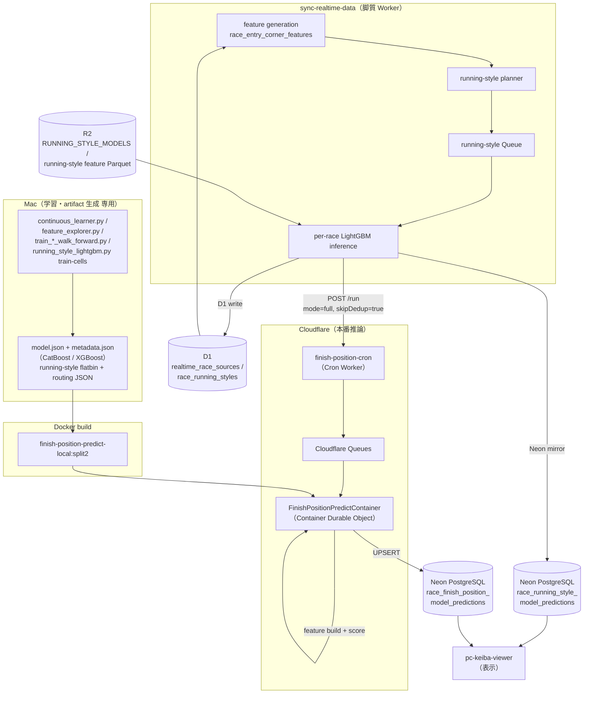
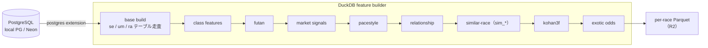
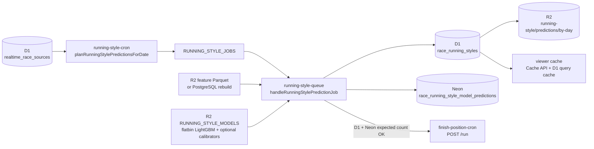
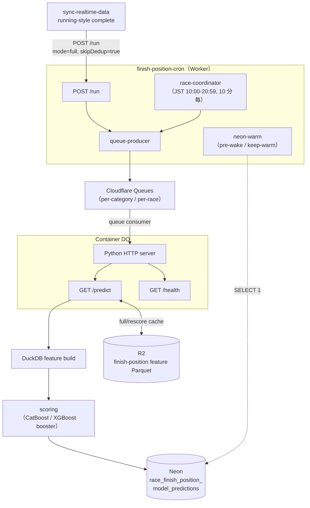
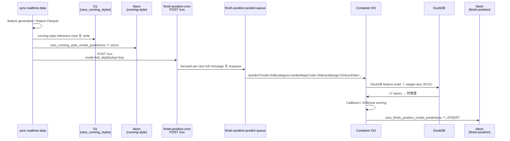
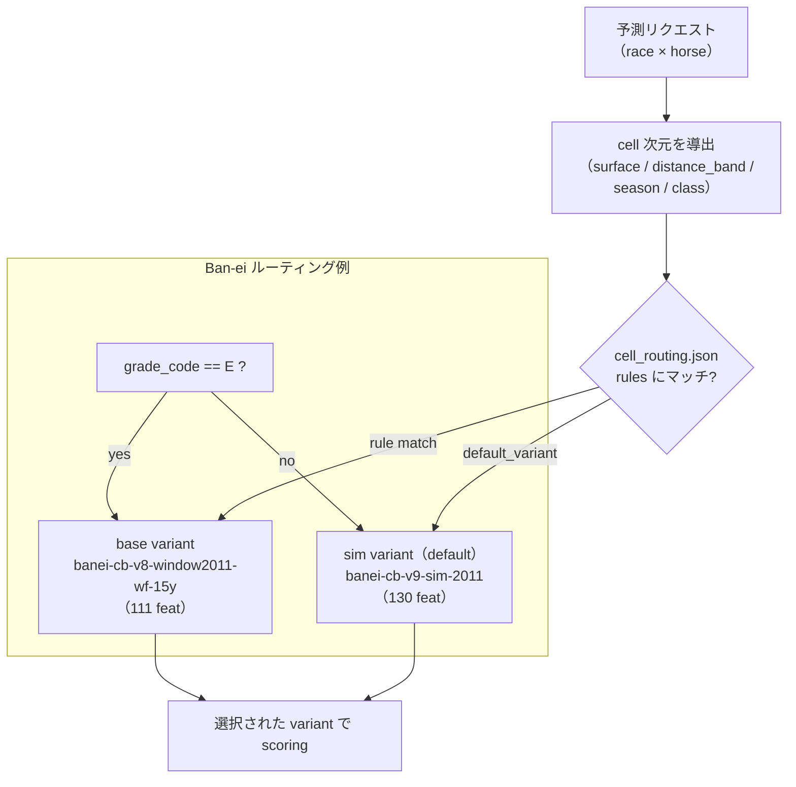
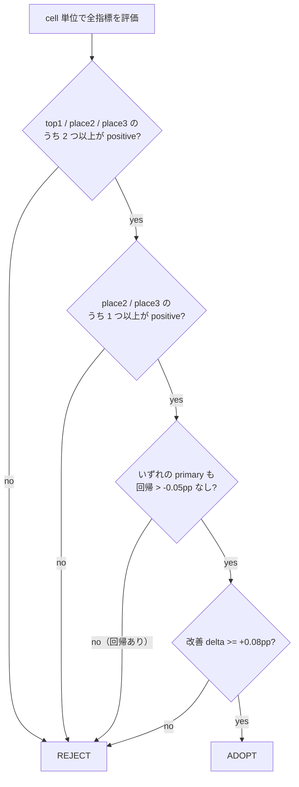
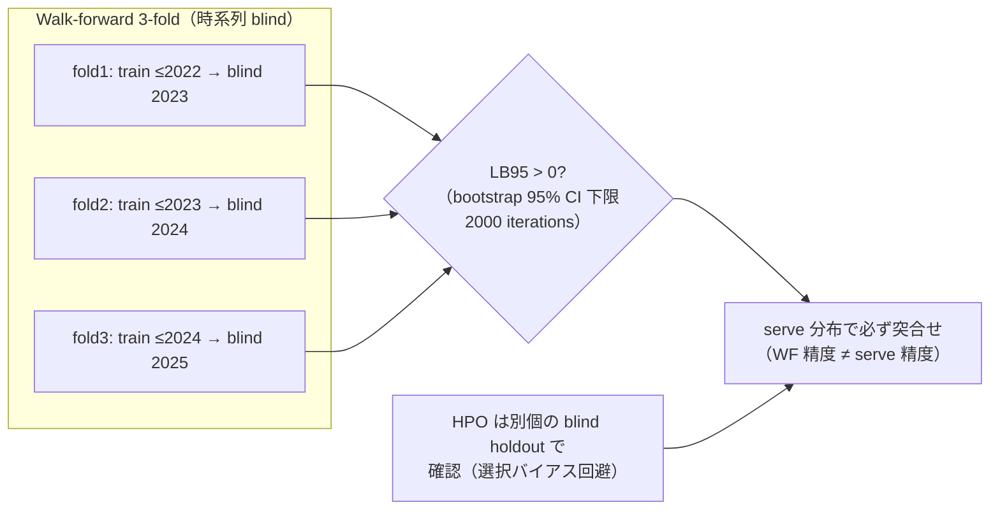
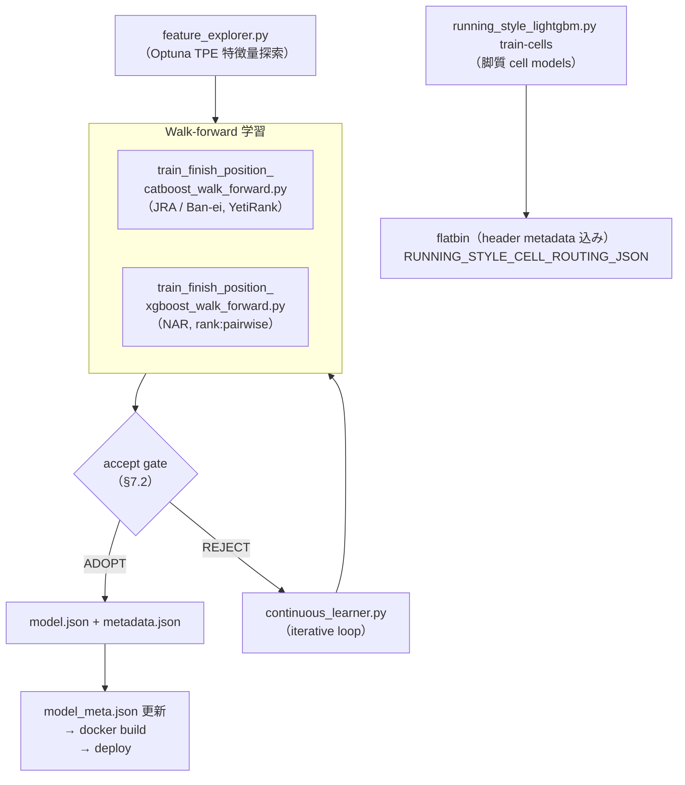
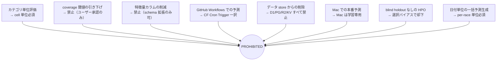

# 着順・脚質予測システム 仕様書

最終更新: 2026-06-30

本書は、競馬の着順予測システム（finish position prediction system）と、その前段で着順特徴量を供給する脚質予測システム（running-style prediction system）の全体仕様を記述する。学習基盤・特徴量パイプライン・本番推論基盤（Cloudflare Worker / Cloudflare Container）・評価方法・アンチパターンを網羅する。

---

## 1. アーキテクチャ概要

本システムは「学習」と「本番推論」を物理的に分離し、本番では **feature generation → running-style generation → finish-position full generation** の順序を守る。

- **Mac はモデル学習・モデル artifact 生成専用**である。本番の特徴量生成・脚質予測・着順予測を Mac 上で実行することは禁止する。
- **本番生成の authority は Cloudflare 側**である。Cloudflare Cron / Queue / Worker / Container が feature generation → running-style generation → finish-position full generation をレース単位で実行する。
- **本番の着順予測は Cloudflare Container 上でレース単位（per-race）で実行**する。
- **本番の脚質予測は `sync-realtime-data` Worker 上でレース単位（per-race）で実行**し、完了後に着順 full 生成を service binding 経由でトリガーする。
- 対象は 3 カテゴリ。各カテゴリは独立したモデル・学習窓・アーキテクチャを持つ。
  - **JRA（中央競馬）**
  - **NAR（地方競馬）**
  - **Ban-ei（ばんえい競馬）**



### 1.1 本番 ownership と実行順序

本番の生成責務は Cloudflare 側に閉じる。順序の authority は `sync-realtime-data` と `finish-position-cron` / Container の連携であり、ローカル端末は本番の trigger / fallback / ordering dependency を持たない。

| stage                           | production owner                                                                        | 完了条件 / output                                                                                                       |
| ------------------------------- | --------------------------------------------------------------------------------------- | ----------------------------------------------------------------------------------------------------------------------- |
| feature generation              | `sync-realtime-data` の Cloudflare cron / queue / Worker                                | D1 race source / corner feature と脚質 feature Parquet が対象 race で利用可能                                           |
| running-style generation        | `sync-realtime-data` の `running-style-cron.ts` / `running-style-queue.ts`              | D1 `race_running_styles`、Neon `race_running_style_model_predictions`、R2 daily prediction Parquet、viewer cache を更新 |
| finish-position full generation | `finish-position-cron` Worker / Cloudflare Queues / `finish-position-predict-container` | Container が per-race DuckDB feature build と scoring を実行し、Neon `race_finish_position_model_predictions` へ UPSERT |

`sync-realtime-data` は feature generation と running-style generation の完了を race scope で確認してから、`FINISH_POSITION_CRON` service binding へ `POST /run` する。`finish-position-cron` は Cloudflare Queues に focused per-race full message を enqueue し、Container が着順 feature build と scoring を完了させる。

---

## 2. 本番モデル（2026-06-29 時点）

着順本番モデルのバージョンと特徴量数は、Container 内の `apps/finish-position-predict-container/src/predict_lib/model_meta.json` を single source of truth とする。

| カテゴリ | model_version           | アーキテクチャ | 特徴量数 | 学習窓        | ランキング loss |
| -------- | ----------------------- | -------------- | -------- | ------------- | --------------- |
| JRA      | `jra-cb-v9-sim-2013`    | CatBoost       | 263      | 2013+         | YetiRank        |
| NAR      | `iter12-nar-xgb-hpo-v8` | XGBoost        | 192      | full（2006+） | rank:pairwise   |
| Ban-ei   | `banei-cb-v9-sim-2011`  | CatBoost       | 130      | 2011+         | YetiRank        |

### 2.1 脚質予測モデル

脚質予測は `apps/sync-realtime-data/` の Worker が R2 binding `RUNNING_STYLE_MODELS` から flatbin LightGBM model を読み、per-race で `nige` / `senkou` / `sashi` / `oikomi` を推論する。未設定時の既定は source 単位の latest model（`buildRunningStyleFlatModelKey(source)`, `variantId = latest`）で、既存運用と後方互換である。

cell-level routing を使う場合は `RUNNING_STYLE_CELL_ROUTING_JSON` に data-driven routing config を入れる。routing config が存在しないカテゴリ、または config 自体が未設定の場合は、必ず source 単位 latest model に fallback する。

脚質 cell model はローカルで `running_style_lightgbm.py train-cells` により学習・評価・promotion plan 生成を行う。採用された variant は header metadata 込みの flatbin を `RUNNING_STYLE_MODELS` の R2 object として promotion し、`RUNNING_STYLE_CELL_ROUTING_JSON` はその R2 key を指す。production は Cloudflare Worker / Queue / R2 / D1 / Neon のみを参照し、ローカル端末上の model path や process に依存しない。

### 2.2 学習窓が 3 カテゴリで異なる点（重要）

学習窓は ablation 検証の結果としてカテゴリごとに最適値が異なることが確定している。一律化してはならない。

- **JRA = 厳密に 2013+**。pre-2013 は非定常で希釈要因。2012+（広）も 2014+（狭）も 2013+ に劣後（DO-NOT-RETEST）。
- **NAR = full 2006+**。NAR は長い履歴を必要とし、窓を絞ると全 metric 悪化（JRA と真逆）。
- **Ban-ei = 2011+**。pre-2011 非定常で希釈、2013+/2016+ は切りすぎ。2011+ が sweet spot。

### 2.3 E-top2 override（無効）

- **JRA E-top2 override: DISABLED**。v9-sim は 263 特徴量だが、E-top2 が前提とする XGB は 244 特徴量を要求するため非互換。
- **NAR E-top2: DISABLED**。

E-top2 は「XGB の 1 着予測が CatBoost の 2 着予測と一致するレースのみ rank-1 を上書きし、exact place3 構成を保存する」place-preserving override 手法であったが、v9-sim 系モデルへの移行に伴い特徴量数が不整合となったため無効化されている。

---

## 3. 特徴量パイプライン（DuckDB feature builder）

特徴量は DuckDB ベースの builder が PostgreSQL（local PG または Neon）から構築する。

- メインビルダー: `apps/pc-keiba-viewer/src/scripts/finish_position_features_duckdb.py`
- DuckDB の postgres extension 経由で PostgreSQL を読む（Container 内は native libpq、Hyperdrive 不要）。



### 3.1 per-race モード（`--target-race`）

Container のレース単位予測のため、`--target-race keibajo_code:race_bango` で単一レースのみの特徴量を構築できる（`finish_position_features_duckdb.py:253`）。指定時は rec history scan を当該レースの馬・騎手に絞り込む。

履歴 join は `h.race_date < t.race_date` を用いるため、対象レースが未確定（未走）の段階でも window が計算可能で、対象レースの結果が leak しない（`finish_position_features_duckdb.py:219`）。

### 3.2 エンティティフィルタ（Neon max_stack_depth 対策）

- **se / um テーブル（馬単位）**: `postgres_query()` を用い、`ketto_toroku_bango`（血統登録番号）による horse-level の `IN` フィルタを push down する（`finish_position_features_duckdb.py:441`, `:490`）。
- **ra テーブル（レース単位）**: エンティティフィルタを掛けない。compound tuple の `IN` は Neon の `max_stack_depth` を超過するため。

この非対称性は意図的であり、Neon のスタック制約を回避しつつ馬単位の履歴走査を限定する設計である。

### 3.3 レイヤチェーンと特徴量数

base DuckDB build に v7 由来の enrichment レイヤを積層する。最終的な特徴量数はカテゴリごとに異なる。

| カテゴリ | 最終特徴量数 |
| -------- | ------------ |
| JRA      | 263          |
| NAR      | 192          |
| Ban-ei   | 130          |

similar-race 特徴量（`sim_*`、19 列）は JRA / Ban-ei で ADOPT（v9-sim）、NAR では REJECT。このため NAR の特徴量数（192）は sim\_\* を含まず、JRA（263）・Ban-ei（130）とレイヤ構成が異なる。

### 3.4 脚質予測の特徴量契約

脚質予測の per-race feature builder は `apps/sync-realtime-data/src/running-style-feature-sql.ts` / `running-style-feature-parquet.ts` が担う。基本方針は着順特徴量と揃え、`race_entry_corner_features` と過去履歴から馬・騎手・距離・コーナー・ペース・馬体重などを構築する。ただし target は脚質専用の `target_running_style_class`（`corner1_norm` 由来）であり、実際に scoring へ渡す列は選択された LightGBM model の `feature_names` に従う。

脚質 feature Parquet は `running-style/features-parquet/{source}/{YYYYMMDD}/{raceKey}.parquet` に置く。Worker は R2 を先に読み、miss の場合だけ PostgreSQL / Hyperdrive から再構築する。

routing と後段着順生成のため、脚質 feature rows は以下の metadata を必ず保持する。

| metadata                                                                      | 用途                                            |
| ----------------------------------------------------------------------------- | ----------------------------------------------- |
| `raceKey`, `source`, `kaisaiNen`, `kaisaiTsukihi`, `keibajoCode`, `raceBango` | race identity                                   |
| `category`                                                                    | `jra` / `nar` / `ban-ei` の routing             |
| `kyori`, `trackCode`, `gradeCode`, `shussoTosu`                               | distance / surface / class / field-size routing |
| `kyosoJokenCode`, `narSubClass`                                               | subgroup routing                                |
| `kettoTorokuBango`, `umaban`, `bamei`                                         | runner identity                                 |

この metadata は feature そのものではなく routing contract である。`kyori` / `trackCode` / `gradeCode` / `shussoTosu` / `kyosoJokenCode` / `narSubClass` を削ると、脚質 cell routing と着順 full trigger の整合性が壊れる。

---

## 4. 脚質予測システム（running-style）

脚質予測の本番 owner は `apps/sync-realtime-data/` の `running-style-cron.ts` / `running-style-queue.ts` である。`sync-realtime-data-features` は本番脚質推論の owner ではない。

### 4.1 入力・ラベル・用語

- **source**: `jra` / `nar`。`race_key` と R2 daily prediction Parquet は source で分かれる。
- **category**: `jra` / `nar` / `ban-ei`。source と `keibajo_code` から導出する routing / log 用の分類であり、source と同一ではない。Ban-ei は source=`nar` 由来の特殊カテゴリで、`add-pacestyle-features.py` の通常カテゴリではない。
- **class label**: `nige` / `senkou` / `sashi` / `oikomi`。class id は順に `0` / `1` / `2` / `3`。
- **`target_running_style_class`**: 学習用 target。historical/current-result の `corner1_norm` から作る label であり、pre-race feature から作るものではない。未走レースの scoring では target として使わない。
- **`predicted_label` / `predicted_class`**: 推論結果。`predicted_class` は `predicted_label` の class id であり、`target_running_style_class` とは別物である。
- **version 名**: `running_style_feature_version`（学習・postproc 側の脚質特徴量版）、`feature_schema_version`（per-race feature schema 版）、`model_version`（予測モデル版）は別概念であり、混同しない。

race key は用途で形式が異なる。

| 用途                                            | 形式                                                                   |
| ----------------------------------------------- | ---------------------------------------------------------------------- |
| D1 `race_running_styles.race_key` / Worker 内部 | `{source}:{YYYYMMDD}:{keibajo}:{race_bango}`                           |
| viewer cache / realtime race key                | `{source}:{YYYY}:{MMDD}:{keibajo}:{race_bango}`                        |
| `add-pacestyle-features.py` の `race_id`        | `{category}:{kaisai_nen}:{kaisai_tsukihi}:{keibajo_code}:{race_bango}` |
| finish-position `/predict` race scope           | `category` + `runDate=YYYYMMDD` + `keibajoCode` + `raceBango`          |

### 4.2 本番フロー



`planRunningStylePredictionsForDate()` は D1 の race list と既存 prediction count を見て未完了 race を enqueue する。planner 自体が corner feature の存在を hard gate するのではなく、queue handler が feature Parquet を R2 から読み、miss 時に PostgreSQL / Hyperdrive から再構築する。calibrator は R2 にあれば適用し、読めない場合は uncalibrated prediction に fallback する。

### 4.3 出力

脚質予測は同一 race の結果を複数の読み先へ配る。

| 出力先                                      | 内容                                                                                                                         |
| ------------------------------------------- | ---------------------------------------------------------------------------------------------------------------------------- |
| D1 `race_running_styles`                    | per-horse `p_nige` / `p_senkou` / `p_sashi` / `p_oikomi`、`predicted_label`、`model_version`。Worker 内の source of truth    |
| Neon `race_running_style_model_predictions` | viewer / 着順 layer が読む mirror。write は `DATABASE_URL_NEON` → `NEON_DATABASE_URL` を優先                                 |
| R2 daily prediction Parquet                 | `running-style/predictions/by-day/{YYYY}/{MM}/{DD}/{source}/{model_version}.parquet`。`add-pacestyle-features.py` の R2 path |
| viewer cache                                | `/api/races/{YYYY}/{MM}/{DD}/{keibajo}/{race}/running-styles?source=...` の Cache API と D1 query cache                      |

R2 daily prediction Parquet は source=`jra|nar` 単位で export する。1 つの現行 model version をドキュメントで固定しない。複数 `model_version` が同日に存在する場合は model version ごとの Parquet になる。

### 4.4 cell-level routing

脚質も着順と同様に cell-level routing を持つ。`RUNNING_STYLE_CELL_ROUTING_JSON` が設定されている場合、`running-style-cell-router.ts` が race metadata から cell を導出し、variant を選ぶ。未設定時、または該当カテゴリの config が無い場合は source 単位の latest model key に fallback する。

脚質 cell dimensions は以下。

| dimension                                      | 元データ / 派生                                           |
| ---------------------------------------------- | --------------------------------------------------------- |
| `category`, `source`                           | source と keibajo から導出                                |
| `venue`, `racetrack`, `keibajo_code`           | `keibajoCode`                                             |
| `surface`, `trackCode`                         | JRA `trackCode` 先頭で turf / dirt / other、NAR 系は dirt |
| `distance_band`, `kyori`                       | `<1200`, `<1600`, `<2000`, `<2400`, `>=2400`              |
| `season`                                       | `kaisaiTsukihi` の月                                      |
| `class`, `grade_code`                          | `gradeCode`                                               |
| `subgroup`, `kyoso_joken_code`, `nar_subclass` | NAR は `narSubClass`、それ以外は `kyosoJokenCode`         |
| `shusso_tosu`                                  | field size                                                |

routing のログ・summary では `cellModelKey` と `cellVariantId` を確認する。これは採用された flatbin model key と variant id であり、model の `model_version` とは別である。

`RUNNING_STYLE_CELL_ROUTING_JSON` は production routing の唯一の data-driven control plane である。構造は category（`jra` / `nar` / `ban-ei`）ごとに `defaultVariantId`、`rules`、`variants` を持つ。

```json
{
  "jra": {
    "defaultVariantId": "latest",
    "rules": [
      {
        "conditions": [{ "dimension": "venue", "values": ["05"] }],
        "variantId": "tokyo-turf"
      }
    ],
    "variants": {
      "latest": { "modelKey": "running-style/models/jra/latest.flatbin" },
      "tokyo-turf": { "modelKey": "running-style/models/jra/cells/tokyo-turf.flatbin" }
    }
  }
}
```

`variantId` は routing の識別子で、`modelKey` は `RUNNING_STYLE_MODELS` R2 binding 内の flatbin object key である。rule が一致しない場合は `defaultVariantId` を使う。category config が無い場合は `buildRunningStyleFlatModelKey(source)` の source 単位 latest に fallback する。存在しない `variantId` を rule が参照する JSON は production に入れてはならない。

### 4.5 脚質 cell 学習・評価・promotion（ローカル）

脚質 cell model の学習・評価・promotion plan はローカルの `apps/pc-keiba-viewer/src/scripts/running_style_lightgbm.py train-cells` で行う。これは model artifact を作るための作業であり、本番推論をローカルで実行するものではない。

実行単位は `source` / `category` / cell variant で、入力は脚質 feature Parquet と `target_running_style_class` を持つ labeled rows である。`target_running_style_class` は `nige=0` / `senkou=1` / `sashi=2` / `oikomi=3` の 4-class softmax target であり、着順の rank metric では評価しない。

標準の流れ:

1. `running_style_lightgbm.py train-cells` で候補 cell variant を学習し、cell ごとの validation / walk-forward prediction と metrics JSON を出力する。
2. cell 評価は `cell_training_evaluations.prediction_target = 'running_style'` として保存し、着順評価とは混ぜない。
3. `build_cell_models.py --prediction-target running_style` で baseline variant と候補 variant を同じ cell 定義・同じ holdout window で比較する。
4. 採用 cell だけを routing JSON に残す。variant には `feature_set_hash` と `feature_names` を含める。
5. `running_style_lightgbm.py train-cells --cell-feature-selection-json <routing.json>` で採用 cell ごとの `feature_names` を読み、cell ごとに最良だった特徴量セットで flatbin model を作る。未採用 cell は全体特徴量または source latest に fallback する。
6. 採用 variant の LightGBM artifact を Worker が読む header metadata 込み flatbin へ変換し、`RUNNING_STYLE_MODELS` R2 に upload する。
7. upload 済み R2 key だけを `RUNNING_STYLE_CELL_ROUTING_JSON` の `variants[*].modelKey` に反映し、Cloudflare Worker の設定として promote する。

脚質評価で使う metric は running-style 固有であり、finish-position の top1 / place2〜place6 / NDCG gate を流用しない。

| metric                             | 用途                                                                   |
| ---------------------------------- | ---------------------------------------------------------------------- |
| `accuracy`                         | 4-class predicted class と `target_running_style_class` の一致率       |
| `macro_f1`                         | `nige` / `senkou` / `sashi` / `oikomi` を同等に扱う class-balance 指標 |
| `per_class_precision` / `recall`   | class ごとの採否確認。特に `nige` は過剰 positive を監視する           |
| `per_class_support`                | cell 内で評価可能な class 分布。support が薄い cell は採用しない       |
| `precision_nige` / `recall_nige`   | 逃げ class の precision / recall。production skew の主監視対象         |
| `log_loss_nige` / `multi_log_loss` | 確率品質。calibrator や class-weight 変更時の過信を検出する            |

`cell_training_evaluations` の共有列へ保存する場合、running-style profile は `top1_accuracy = accuracy`、`place2_accuracy = top2_accuracy`、`place3_accuracy = macro_f1` として扱う。`build_cell_models.py --prediction-target running_style` は `top1_accuracy` の改善を必須とし、`top2_accuracy` または `macro_f1` のどちらかも改善した cell だけを採用対象にする。

promotion は「metrics が良い」だけでは完了しない。production で参照される object は flatbin だけであり、R2 に upload されていない local artifact、または `RUNNING_STYLE_CELL_ROUTING_JSON` に反映されていない variant は production に存在しないものとして扱う。

Cloudflare 側で確認する項目:

- `RUNNING_STYLE_MODELS` に `running-style/models/{source}/.../*.flatbin` が存在し、flatbin header の `model_version` / `feature_names` / `class_labels` が期待値と一致する。
- `RUNNING_STYLE_CELL_ROUTING_JSON` の `variants[*].modelKey` が upload 済み flatbin object key を指す。
- `generate-running-style-predictions` の summary に期待した `cellVariantId` / `cellModelKey` が出る。
- D1 `race_running_styles`、Neon `race_running_style_model_predictions`、R2 daily prediction Parquet の件数が expected horse count 以上で揃う。

### 4.6 着順予測との結合

着順特徴量は `apps/pc-keiba-viewer/src/scripts/finish-position-features/add-pacestyle-features.py` で脚質予測を読む。通常の pacestyle layer は `--category jra|nar` を対象とし、Ban-ei を通常の RS/pacestyle 対象として扱わない。

`add-pacestyle-features.py` は R2 daily prediction Parquet を優先でき、R2 が使えない場合は Neon `race_running_style_model_predictions` を読む。join は same race + `ketto_toroku_bango` で行い、missing row は `rs_p_*` / `rs_predicted_class` などの nullable `rs_*` として残る。missing running-style を reason に着順 feature build 全体を落としてはいけない。

一方、本番の per-race full trigger は脚質完了を強く要求する。`handleRunningStylePredictionJob()` は D1 write count と Neon mirror count が expected horse count 以上であることを確認してから、`FINISH_POSITION_CRON` service binding へ `POST /run` する。

### 4.7 本番 ordering guard

本番の ordering guard は `sync-realtime-data` の queue handler が担う。対象 race の feature generation が完了していない場合は脚質 prediction を完了扱いにせず、脚質 D1 write と Neon mirror が expected horse count 以上になるまで `FINISH_POSITION_CRON` への `POST /run` を発行しない。

---

## 5. 着順推論アーキテクチャ（finish-position）



### 5.1 構成要素

- **Upstream trigger（`sync-realtime-data`）**: 脚質完了後に `POST /run` で focused per-race full を起動する。脚質推論自体の詳細は §4。
- **Cron Worker（`finish-position-cron`）**: Cloudflare Queues 経由で Container をトリガーする。`apps/finish-position-cron/wrangler.jsonc` に cron / queue / container binding を定義。
- **Container DO（`FinishPositionPredictContainer`）**: Python HTTP server を内包し、DuckDB ビルドと scoring を実行する。`instance_type: standard-2`, `max_instances: 3`。
- **PredictRunCoordinator（DO）**: run の dedup / state を strong-consistency で管理（旧 KV `PREDICT_STATE` を置換）。eventual consistency の KV では二重実行を防げないため DO に移行した。

### 5.2 HTTP エンドポイント

- **`GET /predict`** — 特徴量ビルド + scoring。chunked NDJSON（`Transfer-Encoding: chunked`, `application/x-ndjson`）でストリーム返却（`serve.py:11`）。
- **`GET /health`** — ヘルスチェック。

`/predict` のクエリパラメータ（`serve.py:121-176` で parse・validate）:

| パラメータ    | 必須 | 既定               | 説明                            |
| ------------- | ---- | ------------------ | ------------------------------- |
| `category`    | 必須 | —                  | `jra` / `nar` / `ban-ei`        |
| `runDate`     | 必須 | —                  | YYYYMMDD（8 桁 ASCII 数字）     |
| `daysAhead`   | 任意 | `0`                | 非負整数                        |
| `mode`        | 任意 | `full`             | `full` / `rescore`              |
| `keibajoCode` | 任意 | `None`（全レース） | per-race scope 用の競馬場コード |
| `raceBango`   | 任意 | `None`（全レース） | per-race scope 用のレース番号   |

- 日単位バッチ例: `/predict?category=jra&runDate=20260619&daysAhead=0`
- レース単位例（per-race）: `/predict?mode=full&category=nar&runDate=20260628&keibajoCode=35&raceBango=01`
- `keibajoCode` / `raceBango` を両方指定すると単一レースに scope される。R2 特徴量キャッシュキーは `feat-cache/{category}/{runDate}/{keibajoCode}/{raceBango}/features.parquet`（`serve.py:342-349`）。

> 注: 実装上のパラメータ名は `runDate` であり、`targetDate` ではない。日付は `runDate` で渡す。

### 5.3 予測モード

- **`full`** — DuckDB でゼロから特徴量を構築して scoring する。
- **`rescore`** — R2 にキャッシュ済みの特徴量を読み込み、late-binding refresh（直前のオッズ・馬体重など遅延確定値の差し替え）を行って再 scoring する。

### 5.4 本番順序と per-race full 生成

本番 full 生成の順序は固定である。

```
feature generation -> running-style generation -> finish-position full generation
```

`sync-realtime-data` は feature generation 後に脚質予測を per-race で実行し、D1 `race_running_styles` と Neon `race_running_style_model_predictions` の書き込みを確認してから `finish-position-cron` の service binding `FINISH_POSITION_CRON` へ `POST /run` する。body は `mode: "full"`、`skipDedup: true`、`category`、`runDate`、`keibajoCode`、`raceBango` を含む。

`skipDedup: true` は「脚質完了に連動した focused per-race full」を意味する。`finish-position-cron` の queue consumer はこの message では category-level の `claimRun` / `completeRun` を通らず、category complete や category cache warm を汚さない。Container の NDJSON final line が `status:error` の場合は成功扱いせず、queue retry / DLQ に回す。



ステップ詳細:

1. `sync-realtime-data` が当該 race の脚質 feature Parquet を読み、必要なら PostgreSQL / Hyperdrive から再構築する。
2. `RUNNING_STYLE_CELL_ROUTING_JSON` に基づき脚質モデルを選び、flatbin LightGBM で per-horse prediction を D1 へ write する。
3. D1 の completed state と Neon mirror count が期待頭数以上であることを確認する。
4. `FINISH_POSITION_CRON` service binding で `POST /run` し、`mode=full` / `skipDedup=true` の per-race message を enqueue する。
5. Container が DuckDB feature build（`--target-race 35:01`）→ v7 layers → CatBoost/XGBoost scoring → Neon UPSERT を実行する。

### 5.5 JRA rescore は Worker-native

JRA の rescore は Container を起動せず Worker 内で完結する（`rescoreJraRace()`、`apps/finish-position-cron/src/scoring/rescore-consumer.ts`、`queue-consumer.ts:141` から呼び出し）。R2 にキャッシュ済みの特徴量を読み、late-binding refresh（オッズ・馬体重の差し替え）後に `scoreJraRace()`（`scoring/jra-scorer.ts`）で再 scoring する。NAR / Ban-ei は Container 経由の rescore を用いる。

### 5.6 cron スケジュール（`finish-position-cron/wrangler.jsonc`）

| cron              | JST         | 用途                                                   |
| ----------------- | ----------- | ------------------------------------------------------ |
| `55 17 * * *`     | 02:55       | Neon pre-wake（NAR/Ban-ei）                            |
| `25 0 * * *`      | 09:25       | Neon pre-wake（JRA）                                   |
| `30 0 * * *`      | 09:30       | Cloudflare-side feature generation / per-race planning |
| `*/30 1-11 * * *` | 10:00-20:59 | レース時間帯の Neon keep-warm                          |
| `*/10 1-11 * * *` | 10:00-20:59 | per-race rescore coordinator                           |

`observability.head_sampling_rate: 0.1` を設定済み（請求最適化のため新規 Worker は必須）。

脚質予測は `sync-realtime-data/wrangler.jsonc` の `*/10 0-14 * * *`（JST 09:00-23:50）cron で planner が走る。前日 prewarm / 当日 backfill は daily feature generation と running-style planning を同じ順序で呼ぶ。

### 5.7 Docker / 永続化

- Docker イメージ: `finish-position-predict-local:split2`。
- Container は予測結果を Neon の `race_finish_position_model_predictions` へ **UPSERT** で書き込む。
- 本番の authority は `sync-realtime-data` → `finish-position-cron` → Container の Cloudflare path であり、Queue retry / DLQ が失敗時の再実行境界である。
- production は Cloudflare-only である。ローカル Docker / Python / trainer process は学習・検証・artifact 生成・手元再現用であり、本番の trigger、ordering、retry、fallback、model serving の依存先にしてはならない。

### 5.8 環境変数・secrets

secret 値はドキュメントに記載しない。運用上必要な名前だけを明示する。

| 所有 Worker / component                      | 名前                                      | 用途                                                                        |
| -------------------------------------------- | ----------------------------------------- | --------------------------------------------------------------------------- |
| `sync-realtime-data`                         | `RUNNING_STYLE_D1_WRITE_ENABLED`          | 脚質 D1 write 有効化（`1`）                                                 |
| `sync-realtime-data`                         | `RUNNING_STYLE_CELL_ROUTING_JSON`         | 任意の脚質 cell routing config。未設定なら source 単位 latest model         |
| `sync-realtime-data`                         | `RUNNING_STYLE_MODELS`                    | 脚質 flatbin model / calibrator / feature Parquet 用 R2 binding             |
| `sync-realtime-data`                         | `FEATURES_ARCHIVE`                        | R2 daily prediction Parquet（`running-style/predictions/by-day/...`）出力先 |
| `sync-realtime-data`                         | `FINISH_POSITION_CRON`                    | `finish-position-cron` service binding                                      |
| `sync-realtime-data`, `finish-position-cron` | `TRIGGER_TOKEN`                           | `POST /run` 認証用。両 Worker で同じ secret を使う                          |
| `sync-realtime-data`                         | `DATABASE_URL_NEON`, `NEON_DATABASE_URL`  | 脚質 Neon mirror の writable PostgreSQL 接続先                              |
| `sync-realtime-data`                         | `HYPERDRIVE`                              | feature read pool。production Hyperdrive は read-replica oriented           |
| `finish-position-cron`                       | `NEON_DATABASE_URL`, `PREDICT_DAYS_AHEAD` | Neon warm / Container trigger                                               |

脚質 Neon write は `getFinishPositionWritePool()` が `DATABASE_URL_NEON` → `NEON_DATABASE_URL` → Hyperdrive fallback の順に選ぶ。production Hyperdrive は read-replica oriented なので、writable secret が存在する環境で Hyperdrive を write path の第一候補にしてはならない。read pool は従来通り Hyperdrive first でよい。

### 5.9 運用確認チェックリスト

- D1 `realtime_race_sources` の対象日 race count が期待値を返す。
- 脚質 feature Parquet が R2 にある、または handler が `race_entry_corner_features` / PostgreSQL から再構築できる。
- `generate-running-style-predictions` の log に `cellModelKey` / `cellVariantId` / `neonWrittenCount` が出る。
- `race_running_styles` と Neon `race_running_style_model_predictions` の件数が期待頭数以上である。
- `sync-realtime-data` から `finish-position-cron` へ `POST /run` が成功し、body に `mode=full` / `skipDedup=true` / race scope が含まれる。
- `finish-position-cron` の queue consumer が category-level `claimRun` / `completeRun` を通らず focused per-race full を Container に渡す。
- Container NDJSON の final status が成功である。`status:error` は失敗として retry される。
- Neon `race_finish_position_model_predictions` に対象 race の着順予測が UPSERT される。

2026-06-29 の本番 evidence として、`nar:20260629:35:01` の脚質 job は secret / write-pool 修正後に `cellModelKey` / `cellVariantId` と `neonWrittenCount=9` を記録した。着順 end-to-end は、Container log または `race_finish_position_model_predictions` の対象 race 行で確認できるまでは「脚質完了後 trigger まで確認済み」と保守的に扱う。

---

## 6. cell-level 評価（カテゴリ単位評価は禁止）

**精度評価は必ず cell 単位で行う。カテゴリ単位の評価は禁止する。** カテゴリ単位の集計は、特定の class / subgroup での回帰を平均で隠蔽するため。

### 6.1 cell の定義

```
cell = category × surface × distance_band × class_label × season × venue
```

永続化・採用判定・cell-weighted feature search で使う canonical key は
`{category}_{surface}_{distance_band}_{class_label}_{season}_{venue}` で統一する。
旧実装や一部ドキュメントで `subgroup` / `racetrack` と呼んでいる値は、
この文脈ではそれぞれ `distance_band` / `venue` の旧名であり、新規仕様では使わない。

派生次元は以下から導出する。

- **surface**: `track_code` から turf（JRA `1*`）/ dirt（JRA `2*`、NAR/Ban-ei は常に dirt）/ other を判定。`cell_router.py:81-89`。
- **distance_band**: sprint（< 1200m）/ mile（1200-1599m）/ intermediate（1600-1999m）/ long（2000-2399m）/ extended（>= 2400m）。`cell_router.py:91-100`。
- **season**: spring（3-5 月）/ summer（6-8 月）/ autumn（9-11 月）/ winter（12-2 月）。`cell_router.py:103-110`。
- **class**: `grade_code` から導出（A/B/C/OP/NEW/MUKATSU/other/E/P/Q/R/S/T/unknown）。`cell_router.py:113-114`。
- **venue**: `keibajo_code`（競馬場コード。05=東京、06=中山、08=京都、09=阪神 等）。

### 6.2 cell 精度ストア（`cell_training_evaluations`）

学習パイプラインの `CellAccuracyStore` が Neon PostgreSQL の `cell_training_evaluations` テーブルに cell ごとの精度を永続化する。

PRIMARY KEY: `(prediction_target, feature_set_hash, category, surface, distance_band, class_label, season, venue)`

| カラム                                 | 説明                                                                  |
| -------------------------------------- | --------------------------------------------------------------------- |
| `prediction_target`                    | `finish_position` / `running_style`。着順と脚質の cell 評価を分離する |
| `ndcg_at_3`                            | NDCG@3（relevance: 1着=3.0, 2着=2.0, 3着=1.0）                        |
| `top1_accuracy`                        | 1 着的中率                                                            |
| `place2_accuracy` 〜 `place6_accuracy` | 厳密 2〜6 着的中率                                                    |
| `top3_box_accuracy`                    | 上位 3 頭が順不同で一致した率                                         |
| `accuracy_vector`                      | 全指標を配列化したもの                                                |
| `feature_names_array`                  | 使用した特徴量名リスト                                                |
| `cell_vector`                          | cell 次元値の配列                                                     |

着順・脚質とも特徴量セットの hash は `learning.feature_selection_policy.compute_feature_set_hash()` を使う。特徴量名は重複排除・sort 後に SHA-256 化するため、local 探索、cell 評価、本番用 routing artifact で同じ組み合わせを同じ `feature_set_hash` として扱う。

cell 次元の派生（`cell_training_evaluations` を populate する際の binning。`continuous_learner.py` が `learning/subgroup_diagnostics.py` の `get_distance_band()` / `_distance_band_expr()` で導出する）:

- **surface**: `track_code` 先頭 1 文字で turf（`1*`、JRA のみ）/ dirt（`2*`）/ other。NAR・Ban-ei は常に dirt。
- **distance_band**: `subgroup_diagnostics.get_distance_band()`（`subgroup_diagnostics.py:10-13, 67-75`）。**serve 時の cell routing（`cell_router.py:91-100`、§6.1）と同一の閾値**。
  - sprint: < 1200m
  - mile: 1200〜1599m
  - intermediate: 1600〜1999m
  - long: 2000〜2399m
  - extended: ≥ 2400m
- **season**: spring（3-5 月）/ summer（6-8 月）/ autumn（9-11 月）/ winter（12-2 月）。
- **class_label**: `grade_code` 由来（A/B/C/OP/NEW/MUKATSU/other/E/P/Q/R/S/T/unknown）。
- **venue**: `keibajo_code`。

> 実装上の注意: cell の distance_band は **serve routing（`cell_router.py`）と cell 評価ストア（`subgroup_diagnostics.py`）で同一の閾値（1200 / 1600 / 2000 / 2400）** であり、cell 次元として一貫している。
>
> これとは別に、serve 精度レポート用の bucket-eval 経路（`serve_accuracy_report.py:classify_distance_band` / `aggregate_bucket_eval_duckdb.py:build_distance_band_case_sql`）は **≤1400 / ≤1800 / ≤2200 / ≤2800 / >2800** という独自の binning を用いるが、これは `cell_training_evaluations` の `distance_band` ではなく serve 精度のバケット集計レポート専用である。さらに `finish_position_features_duckdb.py` の数値特徴 `KYORI_BAND*`（sprint ≤1300 / mile ≤1700 / intermediate ≤2200）は cell 次元ではなくモデル入力特徴であり、これも別系統である。

### 6.3 cell_routing.json によるデータ駆動ルーティング

`apps/finish-position-predict-container/src/predict_lib/cell_routing.json` が data-driven なモデルルーティングを駆動する。



Ban-ei では `grade_code == "E"` のレースを `base` variant（v8 window2011）へルーティングし、それ以外は `default_variant = sim`（v9-sim）を用いる。

---

## 7. 評価指標（rank 1-6 すべて必須）

### 7.1 順位指標

順位評価は top1 / place2 / place3 だけでなく **1 着〜6 着すべて**を計測する。

- **Primary**: top1, place2, place3, place4, place5, place6
- **Supplementary**: top3_box, fukusho_2p, top3_exact, top3_winner_capture, top5_winner_capture, pair_score

place2 / place3 は exact-ordinal（厳密順位）であり、情報理論的に 40% 到達は不可能であることが確定している。一方、累積指標（fukusho_2p, top3_box 等）は既に 40% を超える。

### 7.2 accept gate



- **gate 条件**: `{top1, place2, place3}` のうち **2 つ以上が positive**、かつ `{place2, place3}` のうち **1 つ以上が positive**、かつ **回帰が -0.05pp を超えない**こと。
- **有意改善の閾値**: delta **>= +0.08pp** を実効果ありとみなす。
- per-class 評価で一部 class が改善・他 class が悪化する場合は、global reject せず serve 時の class routing で「効く class だけ」新 variant を適用してよい（class-conditional adoption）。

### 7.3 Walk-forward（WF）検証



- WF は時系列の blind fold を **3 つ**用いる（例: 2023 / 2024 / 2025 を blind year とする）。
- 各 fold は **その年より前の年で学習し、当該 fold の年で予測**する（leak-free な chronological 構成）。
- **LB95**（bootstrap 95% 信頼区間下限、2000 iterations）を採否の主指標とする。positive を主張する metric は **LB95 > 0** が必須（点推定が正でも LB95 が 0 を跨ぐ場合は採用しない）。
- **HPO は同一 fold を再利用すると選択バイアスが生じる**ため、deploy 前に**別個の blind holdout**（single-config）で confirm すること（必須、selection bias protection）。
- WF 精度は必ず serve 精度と突合せる。WF が隠した本番劣化（serve-skew）が頭打ちの中核要因となった事例がある。

---

## 8. 学習パイプライン（Mac 専用）



### 8.1 主要スクリプト

- **`continuous_learner.py`** — train → predict → verify の iterative loop。ad-hoc fit は禁止し、常に学習ループスクリプトを用いる。
- **`feature_explorer.py`** — Optuna TPE による特徴量組み合わせ探索。
- **Walk-forward 学習**:
  - `train_finish_position_catboost_walk_forward.py`（JRA / Ban-ei）
  - `train_finish_position_xgboost_walk_forward.py`（NAR）
- **`running_style_lightgbm.py train-cells`** — 脚質 cell model の local training / evaluation / promotion plan 生成。出力は running-style 固有 metric、flatbin 変換対象 artifact、`RUNNING_STYLE_CELL_ROUTING_JSON` 候補である。

### 8.2 アーキテクチャと loss

- **JRA / Ban-ei**: CatBoost + **YetiRank** loss。categorical features は **`keibajo_code` / `track_code` / `grade_code` / `umaban`**（`train_finish_position_catboost_walk_forward.py:41`、`--focus-features` でも drop されないよう固定）。
- **NAR**: XGBoost + **`rank:pairwise`**（本番既定）。代替として Lever 11 の `--objective ndcg` を選ぶと `rank:ndcg` + `lambdarank_pair_method=topk` + `lambdarank_num_pair_per_sample=3` になるが、本番 NAR は pairwise を採用。
- **LightGBM**（補助 trainer、`train_finish_position_lightgbm_walk_forward.py`）: `objective` 既定 `lambdarank`、代替 `rank_xendcg`（Lever 17 で `lambdarank_truncation_level` を調整可）。

### 8.3 学習窓（再掲・カテゴリで異なる）

- JRA: 2013+
- NAR: full 2006+
- Ban-ei: 2011+

### 8.4 サンプル重み

- **時間減衰**: 最古年 0.5 〜 最新年 1.0 の線形重み（`walk_forward_common.py:163-177`）。
- **Bucket-aware mixing**: `w_composed = w_time * (1 + alpha * is_weak_bucket_score)`。`[0.5, 1.75]` にクリップ。`alpha` 上限 0.75。

### 8.5 Walk-forward skip gate（2 段階回帰保護）

fold ごとに以下の 2 条件が同時に成立した場合、その fold をスキップする。

1. NDCG < baseline \* 0.95（5% 劣化）
2. top1 < baseline _ 0.93 **または** place3 < baseline _ 0.90

### 8.6 特徴量グループ（15 semantic groups）

`feature_explorer.py` が Optuna TPE で group-level のカテゴリカル探索を行う。

odds / jockey / pedigree / running_style / corner / speed / similar_race / weather / weight / race_condition / recent_form / career / trainer / horse_identity / other

### 8.7 NDCG 関連性マッピング

| 着順     | 関連度 |
| -------- | ------ |
| 1 着     | 3.0    |
| 2 着     | 2.0    |
| 3 着     | 1.0    |
| 4 着以下 | 0.0    |

### 8.8 主要閾値一覧

| パラメータ              | 値      | 説明                      |
| ----------------------- | ------- | ------------------------- |
| DEPLOY_THRESHOLD        | 0.005   | NDCG delta 最低基準       |
| SATURATION_LOOKBACK     | 50      | 改善なし trial → 予算削減 |
| MIN_RACES（cell）       | 200     | cell 採用の最低レース数   |
| FRESHNESS_DAYS          | 14      | 評価データの鮮度上限      |
| MIN_DELTA               | +0.08pp | 改善とみなす最低 delta    |
| NO_REG_THRESHOLD        | -0.05pp | 許容する最大回帰幅        |
| N_BOOTSTRAP             | 2000    | LB95 CI のリサンプル数    |
| NDCG_SKIP_RATIO         | 0.95    | NDCG 回帰ガード           |
| TOP1_SKIP_RATIO         | 0.93    | top1 回帰ガード           |
| PLACE3_SKIP_RATIO       | 0.90    | place3 回帰ガード         |
| TIME_DECAY_MIN_WEIGHT   | 0.5     | 古いデータの重み下限      |
| TIME_DECAY_MAX_WEIGHT   | 1.0     | 最新データの重み上限      |
| MAX_BUCKET_WEIGHT_ALPHA | 0.75    | bucket 重み mixing 上限   |

### 8.9 Walk-forward fold 構成

各 fold は時系列で train / valid を分割する（`finish_position IS NOT NULL` の行のみ対象）。

- **train**: `train_start` 〜 `(valid_year - 1)/12/31`
- **valid**: `valid_year` の暦年全体（1/1 〜 12/31）
- 関連度（NDCG）: 1 着 3.0 / 2 着 2.0 / 3 着 1.0 / その他 0.0（§8.7）

### 8.10 Continuous Learner オーケストレータ

`continuous_learner.py` は train → predict → verify の loop を統括し、2 つの永続ストアを持つ。

- **`CellAccuracyStore`**: cell ごとの精度を Neon PostgreSQL `cell_training_evaluations` に永続化（§6.2）。
- **`TrialExplorationStore`**: trial の重複排除キャッシュ（DuckDB `trial_exploration_log`、PRIMARY KEY `(feature_set_hash, category, method)`、`continuous_learner.py:225`）。mask / importance vector を `all_features` に整列して保持する。
- **saturation 検知**: 直近 `SATURATION_LOOKBACK`（50）trial で改善が無ければ trial 予算を削減する。

### 8.11 Feature Explorer（Optuna）

`feature_explorer.py` は特徴量グループ（§8.6）レベルのカテゴリカル探索を行う。

- 着順・脚質の特徴量列解決は `learning.feature_selection_policy.resolve_feature_columns_for_target()` を正とする。着順は `finish_position` target、脚質は `running_style` target を指定し、脚質では `rs_p_*` leakage 列と cell 派生列を学習特徴量から除外する。
- routing / evaluation に必要な metadata 列（`source`, `keibajo_code`, `track_code`, `kyori`, `grade_code`, `race_date` 等）は入力 DataFrame に保持するが、target-specific policy で明示的に許可されない限り学習特徴量には含めない。
- local 探索で cell ごとに最良だった特徴量セットは `feature_names_array` と `feature_set_hash` として `cell_training_evaluations` に保存する。`build_cell_models.py` は `--prediction-target finish_position|running_style` で対象を分け、採用 variant の routing JSON に `feature_names` / `feature_set_hash` を出力する。
- 脚質の `running_style_lightgbm.py train-cells` は `--cell-feature-selection-json` でこの routing JSON を読み、cell ごとの採用特徴量セットを使って model artifact を作る。着順も脚質も「local で cell 精度が良かった特徴量組み合わせ」を本番参照 artifact に反映する。
- **TPESampler**（`multivariate=True`、`feature_explorer.py:1036-1039`）で feature group の joint interaction をモデル化。startup random trial 数は 5。
- **cell-weighted NDCG@3**: canonical cell key（`category_surface_distance_class_season_venue`）ごとに逆精度重み `1 / max(accuracy, 0.01)` を mean 正規化して付与（`compute_cell_weights_from_accuracy` / `weighted_ndcg_at_3`）。弱い cell ほど重みが大きくなり、苦手領域の改善を優先する。`weighted_ndcg_at_3` は `learning.subgroup_diagnostics.assign_subgroup_keys()` を使い、cell 評価・採用と同じキーで per-race の重みを引く。

### 8.12 Cell model adoption gate（`build_cell_models.py`）

`build_cell_models.py` は候補 feature-set の cell 別精度を `cell_training_evaluations` から読み、`--prediction-target` ごとの採用プロファイルで以下の全条件を満たした cell のみ採用する。

1. **サンプル数**: `race_count >= 200`（`DEFAULT_MIN_RACES`）。
2. **鮮度**: `evaluated_at` が 14 日以内（`DEFAULT_FRESHNESS_DAYS`）。
3. **多指標改善（着順）**: primary `{top1, place2, place3}` のうち **>= 2 個**が **+0.08pp（0.0008）** 以上改善し、うち **>= 1 個が place2 / place3**（`check_multi_metric_gate`）。
4. **多指標改善（脚質）**: `top1_accuracy = accuracy` の改善を必須とし、さらに `place2_accuracy = top2_accuracy` または `place3_accuracy = macro_f1` のどちらかも改善した cell のみ採用する。
5. **no-regression**: 着順は 8 指標すべて、脚質は accuracy / top2_accuracy / macro_f1 が **-0.05pp（-0.0005）** を割り込まない。
6. **bootstrap LB95 > 0.0**（2000 resamples、`DEFAULT_N_BOOT`）。
7. **baseline 存在**: 比較対象 baseline cell が存在すること。

採用された cell をまとめて cell model を構築し、`cell_routing.json`（§6.3）の routing に反映する。

### 8.13 モデル artifact

- `model.json`（CatBoost JSON tree、または XGBoost）
- `metadata.json`

脚質の production artifact は以下。

- `model.txt` / trainer metadata: local training output。production は直接読まない。
- `*.flatbin`: Worker が `RUNNING_STYLE_MODELS` R2 binding から読む唯一の脚質 model format。header に `model_version` / `feature_names` / `class_labels` を含める。
- routing JSON: `RUNNING_STYLE_CELL_ROUTING_JSON` として Cloudflare Worker に設定する。local path ではなく R2 object key を参照する。

脚質 promotion は `bunx wrangler r2 object put ... --remote` 相当の R2 upload と Worker 設定更新が完了して初めて production 反映となる。local training output の作成だけでは production へ反映されない。

---

## 9. アンチパターン（禁止事項）

以下は本システムで明確に禁止する。



1. **カテゴリ単位評価の禁止** — 必ず cell 単位（§6）で評価する。
2. **coverage 閾値の引き下げ禁止** — `vitest.config.ts` の thresholds・`pyproject.toml` の `--cov-fail-under` を下げる変更はユーザーの明示承認時のみ。計測対象（include / source）の縮小も禁止。
3. **特徴量カラムの削減禁止** — 部分集合化 / merge / lossy 型変換は全禁止。schema 拡張のみ可。
4. **予測への GitHub Workflows 利用禁止** — スケジュール実行は Cloudflare Cron Trigger 一択。`.github/workflows/` 配下に予測 workflow を追加しない。
5. **データ削除禁止** — D1 / PG / R2 / KV いずれの store からも DELETE / TRUNCATE / DROP / retention 追加を禁止。
6. **Mac での本番予測禁止** — Mac は学習・artifact 生成専用。本番の特徴量生成・脚質予測・着順予測は Cloudflare Worker / Queue / Container。
7. **blind holdout なしの HPO 禁止** — 選択バイアスを避けるため、deploy 前に独立 holdout で confirm する。
8. **日付単位・カテゴリ一括の本番予測生成禁止** — 本番の特徴量生成・脚質予測・着順予測は常にレース単位（per-race）で実行する。日付単位やカテゴリ一括のバッチ処理を新規に構築してはならない。日次 cron であっても内部はレース単位の collect の集約として構成すること（§5.4 参照）。

---

## 10. 関連ファイル一覧

| 役割                                     | パス                                                                                                                          |
| ---------------------------------------- | ----------------------------------------------------------------------------------------------------------------------------- |
| 特徴量ビルダー                           | `apps/pc-keiba-viewer/src/scripts/finish_position_features_duckdb.py`                                                         |
| iterative 学習ループ                     | `apps/pc-keiba-viewer/src/scripts/learning/continuous_learner.py`                                                             |
| 特徴量探索                               | `apps/pc-keiba-viewer/src/scripts/learning/feature_explorer.py`                                                               |
| WF 学習（CatBoost）                      | `apps/pc-keiba-viewer/src/scripts/train_finish_position_catboost_walk_forward.py`                                             |
| WF 学習（XGBoost）                       | `apps/pc-keiba-viewer/src/scripts/train_finish_position_xgboost_walk_forward.py`                                              |
| 脚質 LightGBM 学習 / cell promotion      | `apps/pc-keiba-viewer/src/scripts/running_style_lightgbm.py`                                                                  |
| 脚質 flatbin R2 登録                     | `apps/sync-realtime-data/src/running-style-model-register.ts`                                                                 |
| 脚質 flatbin loader / evaluator          | `apps/sync-realtime-data/src/running-style-model-binary.ts`                                                                   |
| 脚質 cron / queue                        | `apps/sync-realtime-data/src/running-style-cron.ts` / `running-style-queue.ts`                                                |
| 脚質 cell routing                        | `apps/sync-realtime-data/src/running-style-cell-router.ts`                                                                    |
| 脚質 feature SQL / Parquet               | `apps/sync-realtime-data/src/running-style-feature-sql.ts` / `running-style-feature-parquet.ts`                               |
| 脚質 R2 daily prediction export          | `apps/sync-realtime-data/src/running-style-parquet-export.ts`                                                                 |
| 脚質 viewer cache                        | `apps/sync-realtime-data/src/viewer-running-style-cache.ts` / `running-style-cache.ts`                                        |
| 着順 pacestyle 結合                      | `apps/pc-keiba-viewer/src/scripts/finish-position-features/add-pacestyle-features.py`                                         |
| Cron Worker                              | `apps/finish-position-cron/`（`wrangler.jsonc`, `src/`）                                                                      |
| Container（推論）                        | `apps/finish-position-predict-container/`                                                                                     |
| 本番モデル定義                           | `apps/finish-position-predict-container/src/predict_lib/model_meta.json`                                                      |
| cell ルーティング（serve 時派生 + 判定） | `apps/finish-position-predict-container/src/predict_lib/cell_routing.json` / `cell_router.py`                                 |
| /predict サーバ                          | `apps/finish-position-predict-container/src/predict_lib/serve.py`                                                             |
| WF 学習（LightGBM、補助）                | `apps/pc-keiba-viewer/src/scripts/train_finish_position_lightgbm_walk_forward.py`                                             |
| JRA Worker-native rescore                | `apps/finish-position-cron/src/scoring/rescore-consumer.ts` / `jra-scorer.ts`                                                 |
| cell model adoption gate                 | `apps/pc-keiba-viewer/src/scripts/learning/build_cell_models.py`                                                              |
| cell 次元 binning（cell store）          | `apps/pc-keiba-viewer/src/scripts/learning/subgroup_diagnostics.py`（`get_distance_band` 他）                                 |
| trial 重複排除ストア                     | `apps/pc-keiba-viewer/src/scripts/trial_registry.py` / `learning/continuous_learner.py`（`trial_exploration_log`）            |
| serve 精度 bucket-eval（別系統 binning） | `apps/pc-keiba-viewer/src/scripts/serve_accuracy_report.py`（`classify_distance_band` 他）/ `aggregate_bucket_eval_duckdb.py` |

---

## 11. 補足: 各カテゴリのフロンティア状況

各カテゴリは現時点で経験的フロンティアに到達しており、多数の lever が ablation 検証で REJECT 済み（DO-NOT-RETEST）。直近の deployed win は以下。

- **JRA**: similar-race 特徴量（v9-sim, 263 feat）を 2026-06-26 に deploy。学習窓 2013+ は sweep 完了。
- **NAR**: iter12 XGBoost を frontier として確定。CatBoost 切替・window 絞り・venue routing はいずれも REJECT。
- **Ban-ei**: 学習窓 2011+ への変更が本物の改善（2026-06-23）、similar-race（v9-sim, 130 feat）を 2026-06-26 に deploy。grade_code=E のみ base variant へ routing。

採否判定は必ず本番 serve system（base + ensemble、正しい特徴量数）を baseline とし、cell 単位で rank 1-6 を評価すること。
