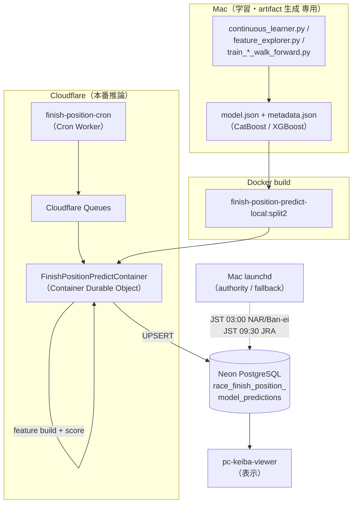
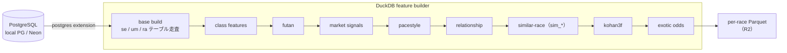
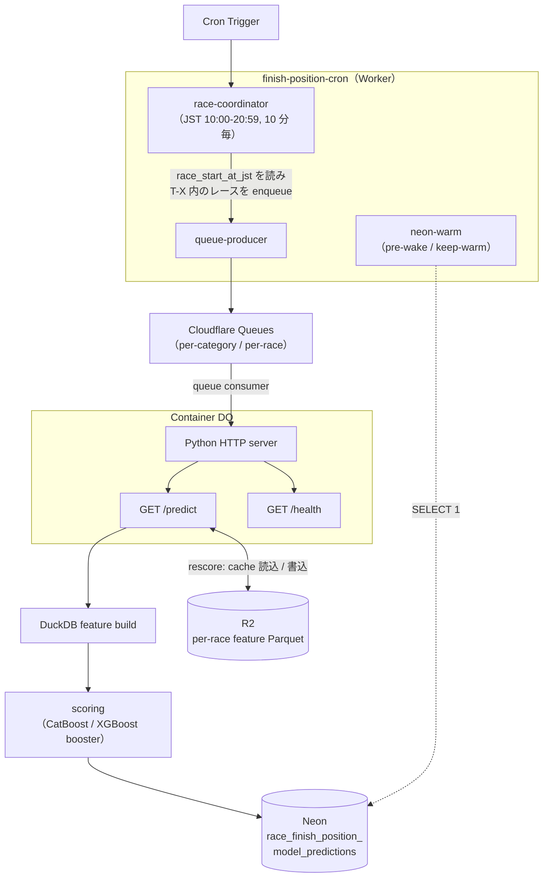
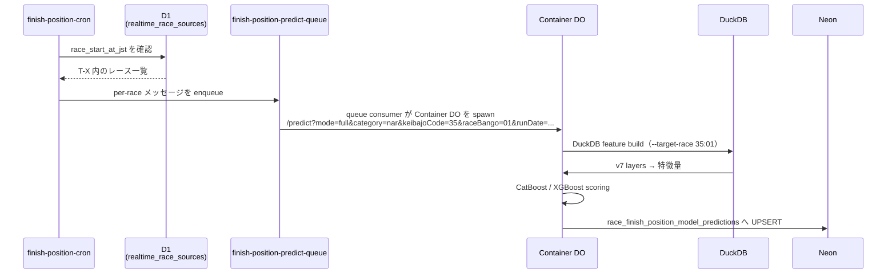
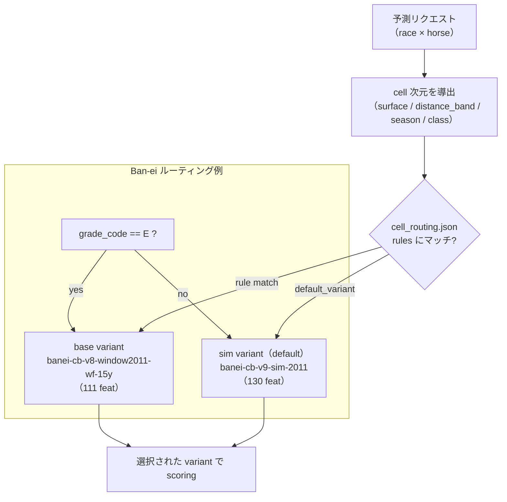
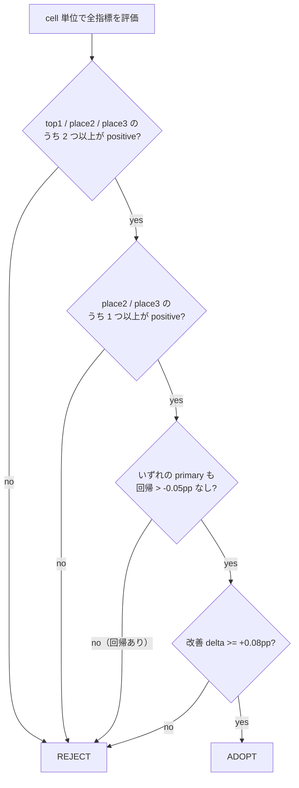
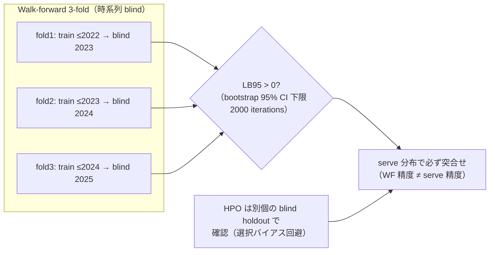
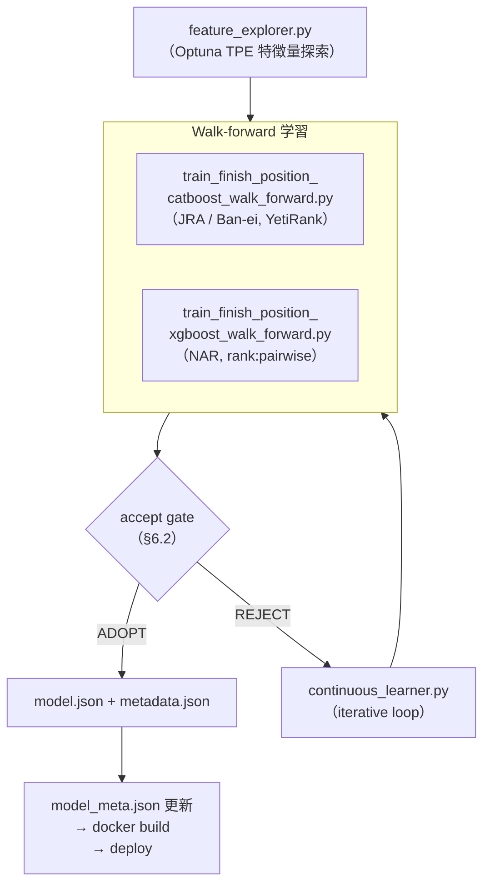
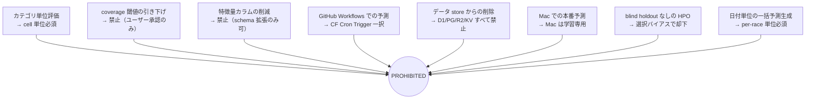

# 着順予測システム 仕様書

最終更新: 2026-06-28

本書は、競馬の着順予測システム（finish position prediction system）の全体仕様を記述する。学習基盤・特徴量パイプライン・本番推論基盤（Cloudflare Container）・評価方法・アンチパターンを網羅する。

---

## 1. アーキテクチャ概要

本システムは「学習」と「本番推論」を物理的に分離する。

- **Mac はモデル学習・モデル artifact 生成専用**である。本番の着順予測を Mac 上で実行することは禁止する（Mac は authority/fallback としての launchd 実行を持つが、その位置付けは後述）。
- **本番予測は Cloudflare Container 上でレース単位（per-race）で実行**する。
- 対象は 3 カテゴリ。各カテゴリは独立したモデル・学習窓・アーキテクチャを持つ。
  - **JRA（中央競馬）**
  - **NAR（地方競馬）**
  - **Ban-ei（ばんえい競馬）**



### 1.1 Mac launchd の位置付け

Cloudflare Containers は inbound HTTP を伴わない batch instance を約 90〜110 秒で reap するため、DuckDB の特徴量ビルド（10 分以上）を Cron 単独で完走させられない。このため、実績のある local docker pipeline を Mac launchd で日次実行し、これを **authority（権威ソース）** とする。

`scripts/launchd/com.kkk4oru.finish-position-predict.plist` が日次スケジュールを定義する。

| 起動時刻（JST）      | 対象         | 補足                                                                                        |
| -------------------- | ------------ | ------------------------------------------------------------------------------------------- |
| 03:00                | NAR + Ban-ei | JRA はこの時刻にはミラー未完了のため除外                                                    |
| 09:30                | JRA          | `jvd_se` ミラー完了後に実行（JRA ミラーは 09:03 まで未完成のため、それ以降の 09:30 に設定） |
| 毎時（hourly guard） | 全カテゴリ   | 当日レースの有無を確認し、必要なら予測をトリガーする補完ガード                              |

- Container 側は per-race rescore でこれを補完する（後述）。

---

## 2. 本番モデル（2026-06-28 時点）

本番モデルのバージョンと特徴量数は、Container 内の `apps/finish-position-predict-container/src/predict_lib/model_meta.json` を single source of truth とする。

| カテゴリ | model_version           | アーキテクチャ | 特徴量数 | 学習窓        | ランキング loss |
| -------- | ----------------------- | -------------- | -------- | ------------- | --------------- |
| JRA      | `jra-cb-v9-sim-2013`    | CatBoost       | 263      | 2013+         | YetiRank        |
| NAR      | `iter12-nar-xgb-hpo-v8` | XGBoost        | 192      | full（2006+） | rank:pairwise   |
| Ban-ei   | `banei-cb-v9-sim-2011`  | CatBoost       | 130      | 2011+         | YetiRank        |

### 2.1 学習窓が 3 カテゴリで異なる点（重要）

学習窓は ablation 検証の結果としてカテゴリごとに最適値が異なることが確定している。一律化してはならない。

- **JRA = 厳密に 2013+**。pre-2013 は非定常で希釈要因。2012+（広）も 2014+（狭）も 2013+ に劣後（DO-NOT-RETEST）。
- **NAR = full 2006+**。NAR は長い履歴を必要とし、窓を絞ると全 metric 悪化（JRA と真逆）。
- **Ban-ei = 2011+**。pre-2011 非定常で希釈、2013+/2016+ は切りすぎ。2011+ が sweet spot。

### 2.2 E-top2 override（無効）

- **JRA E-top2 override: DISABLED**。v9-sim は 263 特徴量だが、E-top2 が前提とする XGB は 244 特徴量を要求するため非互換。
- **NAR E-top2: DISABLED**。

E-top2 は「XGB の 1 着予測が CatBoost の 2 着予測と一致するレースのみ rank-1 を上書きし、exact place3 構成を保存する」place-preserving override 手法であったが、v9-sim 系モデルへの移行に伴い特徴量数が不整合となったため無効化されている。

---

## 3. 特徴量パイプライン（DuckDB feature builder）

特徴量は DuckDB ベースの builder が PostgreSQL（local PG または Neon）から構築する。

- メインビルダー: `apps/pc-keiba-viewer/src/scripts/finish_position_features_duckdb.py`
- DuckDB の postgres extension 経由で PostgreSQL を読む（Container 内は native libpq、Hyperdrive 不要）。



### 3.1 per-race モード（`--target-race`）

Container のレース単位予測のため、`--target-race keibajo_code:race_bango` で単一レースのみの特徴量を構築できる（`finish_position_features_duckdb.py:253`）。指定時は rec history scan を当該レースの馬・騎手に絞り込む。

履歴 join は `h.race_date < t.race_date` を用いるため、対象レースが未確定（未走）の段階でも window が計算可能で、対象レースの結果が leak しない（`finish_position_features_duckdb.py:219`）。

### 3.2 エンティティフィルタ（Neon max_stack_depth 対策）

- **se / um テーブル（馬単位）**: `postgres_query()` を用い、`ketto_toroku_bango`（血統登録番号）による horse-level の `IN` フィルタを push down する（`finish_position_features_duckdb.py:441`, `:490`）。
- **ra テーブル（レース単位）**: エンティティフィルタを掛けない。compound tuple の `IN` は Neon の `max_stack_depth` を超過するため。

この非対称性は意図的であり、Neon のスタック制約を回避しつつ馬単位の履歴走査を限定する設計である。

### 3.3 レイヤチェーンと特徴量数

base DuckDB build に v7 由来の enrichment レイヤを積層する。最終的な特徴量数はカテゴリごとに異なる。

| カテゴリ | 最終特徴量数 |
| -------- | ------------ |
| JRA      | 263          |
| NAR      | 192          |
| Ban-ei   | 130          |

similar-race 特徴量（`sim_*`、19 列）は JRA / Ban-ei で ADOPT（v9-sim）、NAR では REJECT。このため NAR の特徴量数（192）は sim\_\* を含まず、JRA（263）・Ban-ei（130）とレイヤ構成が異なる。

---

## 4. Cloudflare Container アーキテクチャ



### 4.1 構成要素

- **Cron Worker（`finish-position-cron`）**: Cloudflare Queues 経由で Container をトリガーする。`apps/finish-position-cron/wrangler.jsonc` に cron / queue / container binding を定義。
- **Container DO（`FinishPositionPredictContainer`）**: Python HTTP server を内包し、DuckDB ビルドと scoring を実行する。`instance_type: standard-2`, `max_instances: 3`。
- **PredictRunCoordinator（DO）**: run の dedup / state を strong-consistency で管理（旧 KV `PREDICT_STATE` を置換）。eventual consistency の KV では二重実行を防げないため DO に移行した。

### 4.2 HTTP エンドポイント

- **`GET /predict`** — 特徴量ビルド + scoring。chunked NDJSON（`Transfer-Encoding: chunked`, `application/x-ndjson`）でストリーム返却（`serve.py:11`）。
- **`GET /health`** — ヘルスチェック。

`/predict` のクエリパラメータ（`serve.py:121-176` で parse・validate）:

| パラメータ    | 必須 | 既定               | 説明                            |
| ------------- | ---- | ------------------ | ------------------------------- |
| `category`    | 必須 | —                  | `jra` / `nar` / `ban-ei`        |
| `runDate`     | 必須 | —                  | YYYYMMDD（8 桁 ASCII 数字）     |
| `daysAhead`   | 任意 | `0`                | 非負整数                        |
| `mode`        | 任意 | `full`             | `full` / `rescore`              |
| `keibajoCode` | 任意 | `None`（全レース） | per-race scope 用の競馬場コード |
| `raceBango`   | 任意 | `None`（全レース） | per-race scope 用のレース番号   |

- 日単位バッチ例: `/predict?category=jra&runDate=20260619&daysAhead=0`
- レース単位例（per-race）: `/predict?mode=full&category=nar&runDate=20260628&keibajoCode=35&raceBango=01`
- `keibajoCode` / `raceBango` を両方指定すると単一レースに scope される。R2 特徴量キャッシュキーは `feat-cache/{category}/{runDate}/{keibajoCode}/{raceBango}/features.parquet`（`serve.py:342-349`）。

> 注: 実装上のパラメータ名は `runDate` であり、`targetDate` ではない。日付は `runDate` で渡す。

### 4.3 予測モード

- **`full`** — DuckDB でゼロから特徴量を構築して scoring する。
- **`rescore`** — R2 にキャッシュ済みの特徴量を読み込み、late-binding refresh（直前のオッズ・馬体重など遅延確定値の差し替え）を行って再 scoring する。

### 4.4 per-race 予測フロー

per-race coordinator cron は 10 分毎（JST 10:00-20:59）に起動し、`realtime_race_sources.race_start_at_jst`（JST ISO 発走時刻）を参照する。発走時刻の T-X 以内に入った各レースについて、per-race メッセージを Queue へ enqueue する。



ステップ詳細:

1. Cron Worker が D1 の `realtime_race_sources.race_start_at_jst` を確認する。
2. 発走時刻 T-X window 内のレースを `finish-position-predict-queue` へ enqueue する。
3. queue consumer が Container DO を spawn し、`/predict?mode=full&category=nar&keibajoCode=35&raceBango=01&runDate=20260628` を呼ぶ。
4. Container が DuckDB feature build（`--target-race 35:01`）→ v7 layers → CatBoost/XGBoost scoring → Neon UPSERT を実行する。

### 4.5 JRA rescore は Worker-native

JRA の rescore は Container を起動せず Worker 内で完結する（`rescoreJraRace()`、`apps/finish-position-cron/src/scoring/rescore-consumer.ts`、`queue-consumer.ts:141` から呼び出し）。R2 にキャッシュ済みの特徴量を読み、late-binding refresh（オッズ・馬体重の差し替え）後に `scoreJraRace()`（`scoring/jra-scorer.ts`）で再 scoring する。NAR / Ban-ei は Container 経由の rescore を用いる。

### 4.6 cron スケジュール（`finish-position-cron/wrangler.jsonc`）

| cron              | JST         | 用途                                                      |
| ----------------- | ----------- | --------------------------------------------------------- |
| `55 17 * * *`     | 02:55       | Neon pre-wake（NAR/Ban-ei）                               |
| `25 0 * * *`      | 09:25       | Neon pre-wake（JRA）                                      |
| `30 0 * * *`      | 09:30       | Container 経由 feature build（per-race Parquet を R2 へ） |
| `*/30 1-11 * * *` | 10:00-20:59 | レース時間帯の Neon keep-warm                             |
| `*/10 1-11 * * *` | 10:00-20:59 | per-race rescore coordinator                              |

`observability.head_sampling_rate: 0.1` を設定済み（請求最適化のため新規 Worker は必須）。

### 4.7 Docker / 永続化

- Docker イメージ: `finish-position-predict-local:split2`。
- Container は予測結果を Neon の `race_finish_position_model_predictions` へ **UPSERT** で書き込む。
- Mac launchd（JST 03:00 NAR/Ban-ei, JST 09:30 JRA）が authority。Container は per-race rescore でこれを補完する。

---

## 5. cell-level 評価（カテゴリ単位評価は禁止）

**精度評価は必ず cell 単位で行う。カテゴリ単位の評価は禁止する。** カテゴリ単位の集計は、特定の class / subgroup での回帰を平均で隠蔽するため。

### 5.1 cell の定義

```
cell = カテゴリ × class × subgroup × racetrack × season × surface
```

派生次元は以下から導出する。

- **surface**: `track_code` から turf（JRA `1*`）/ dirt（JRA `2*`、NAR/Ban-ei は常に dirt）/ other を判定。`cell_router.py:81-89`。
- **distance_band**: sprint（< 1200m）/ mile（1200-1599m）/ intermediate（1600-1999m）/ long（2000-2399m）/ extended（>= 2400m）。`cell_router.py:91-100`。
- **season**: spring（3-5 月）/ summer（6-8 月）/ autumn（9-11 月）/ winter（12-2 月）。`cell_router.py:103-110`。
- **class**: `grade_code` から導出（A/B/C/OP/NEW/MUKATSU/other/E/P/Q/R/S/T/unknown）。`cell_router.py:113-114`。
- **venue**: `keibajo_code`（競馬場コード。05=東京、06=中山、08=京都、09=阪神 等）。

### 5.2 cell 精度ストア（`cell_training_evaluations`）

学習パイプラインの `CellAccuracyStore` が Neon PostgreSQL の `cell_training_evaluations` テーブルに cell ごとの精度を永続化する。

PRIMARY KEY: `(feature_set_hash, category, surface, distance_band, class_label, season, venue)`

| カラム                                 | 説明                                           |
| -------------------------------------- | ---------------------------------------------- |
| `ndcg_at_3`                            | NDCG@3（relevance: 1着=3.0, 2着=2.0, 3着=1.0） |
| `top1_accuracy`                        | 1 着的中率                                     |
| `place2_accuracy` 〜 `place6_accuracy` | 厳密 2〜6 着的中率                             |
| `top3_box_accuracy`                    | 上位 3 頭が順不同で一致した率                  |
| `accuracy_vector`                      | 全指標を配列化したもの                         |
| `feature_names_array`                  | 使用した特徴量名リスト                         |
| `cell_vector`                          | cell 次元値の配列                              |

cell 次元の派生（`cell_training_evaluations` を populate する際の binning。`continuous_learner.py` が `learning/subgroup_diagnostics.py` の `get_distance_band()` / `_distance_band_expr()` で導出する）:

- **surface**: `track_code` 先頭 1 文字で turf（`1*`、JRA のみ）/ dirt（`2*`）/ other。NAR・Ban-ei は常に dirt。
- **distance_band**: `subgroup_diagnostics.get_distance_band()`（`subgroup_diagnostics.py:10-13, 67-75`）。**serve 時の cell routing（`cell_router.py:91-100`、§5.1）と同一の閾値**。
  - sprint: < 1200m
  - mile: 1200〜1599m
  - intermediate: 1600〜1999m
  - long: 2000〜2399m
  - extended: ≥ 2400m
- **season**: spring（3-5 月）/ summer（6-8 月）/ autumn（9-11 月）/ winter（12-2 月）。
- **class_label**: `grade_code` 由来（A/B/C/OP/NEW/MUKATSU/other/E/P/Q/R/S/T/unknown）。
- **subgroup**: `field_size_band`（`shusso_tosu` で small ≤8 / medium ≤14 / large >14）等の補助次元。
- **venue**: `keibajo_code`。

> 実装上の注意: cell の distance_band は **serve routing（`cell_router.py`）と cell 評価ストア（`subgroup_diagnostics.py`）で同一の閾値（1200 / 1600 / 2000 / 2400）** であり、cell 次元として一貫している。
>
> これとは別に、serve 精度レポート用の bucket-eval 経路（`serve_accuracy_report.py:classify_distance_band` / `aggregate_bucket_eval_duckdb.py:build_distance_band_case_sql`）は **≤1400 / ≤1800 / ≤2200 / ≤2800 / >2800** という独自の binning を用いるが、これは `cell_training_evaluations` の distance*band ではなく serve 精度のバケット集計レポート専用である。さらに `finish_position_features_duckdb.py` の数値特徴 `KYORI_BAND*\*`（sprint ≤1300 / mile ≤1700 / intermediate ≤2200）は cell 次元ではなくモデル入力特徴であり、これも別系統である。

### 5.3 cell_routing.json によるデータ駆動ルーティング

`apps/finish-position-predict-container/src/predict_lib/cell_routing.json` が data-driven なモデルルーティングを駆動する。



Ban-ei では `grade_code == "E"` のレースを `base` variant（v8 window2011）へルーティングし、それ以外は `default_variant = sim`（v9-sim）を用いる。

---

## 6. 評価指標（rank 1-6 すべて必須）

### 6.1 順位指標

順位評価は top1 / place2 / place3 だけでなく **1 着〜6 着すべて**を計測する。

- **Primary**: top1, place2, place3, place4, place5, place6
- **Supplementary**: top3_box, fukusho_2p, top3_exact, top3_winner_capture, top5_winner_capture, pair_score

place2 / place3 は exact-ordinal（厳密順位）であり、情報理論的に 40% 到達は不可能であることが確定している。一方、累積指標（fukusho_2p, top3_box 等）は既に 40% を超える。

### 6.2 accept gate



- **gate 条件**: `{top1, place2, place3}` のうち **2 つ以上が positive**、かつ `{place2, place3}` のうち **1 つ以上が positive**、かつ **回帰が -0.05pp を超えない**こと。
- **有意改善の閾値**: delta **>= +0.08pp** を実効果ありとみなす。
- per-class 評価で一部 class が改善・他 class が悪化する場合は、global reject せず serve 時の class routing で「効く class だけ」新 variant を適用してよい（class-conditional adoption）。

### 6.3 Walk-forward（WF）検証



- WF は時系列の blind fold を **3 つ**用いる（例: 2023 / 2024 / 2025 を blind year とする）。
- 各 fold は **その年より前の年で学習し、当該 fold の年で予測**する（leak-free な chronological 構成）。
- **LB95**（bootstrap 95% 信頼区間下限、2000 iterations）を採否の主指標とする。positive を主張する metric は **LB95 > 0** が必須（点推定が正でも LB95 が 0 を跨ぐ場合は採用しない）。
- **HPO は同一 fold を再利用すると選択バイアスが生じる**ため、deploy 前に**別個の blind holdout**（single-config）で confirm すること（必須、selection bias protection）。
- WF 精度は必ず serve 精度と突合せる。WF が隠した本番劣化（serve-skew）が頭打ちの中核要因となった事例がある。

---

## 7. 学習パイプライン（Mac 専用）



### 7.1 主要スクリプト

- **`continuous_learner.py`** — train → predict → verify の iterative loop。ad-hoc fit は禁止し、常に学習ループスクリプトを用いる。
- **`feature_explorer.py`** — Optuna TPE による特徴量組み合わせ探索。
- **Walk-forward 学習**:
  - `train_finish_position_catboost_walk_forward.py`（JRA / Ban-ei）
  - `train_finish_position_xgboost_walk_forward.py`（NAR）

### 7.2 アーキテクチャと loss

- **JRA / Ban-ei**: CatBoost + **YetiRank** loss。categorical features は **`keibajo_code` / `track_code` / `grade_code` / `umaban`**（`train_finish_position_catboost_walk_forward.py:41`、`--focus-features` でも drop されないよう固定）。
- **NAR**: XGBoost + **`rank:pairwise`**（本番既定）。代替として Lever 11 の `--objective ndcg` を選ぶと `rank:ndcg` + `lambdarank_pair_method=topk` + `lambdarank_num_pair_per_sample=3` になるが、本番 NAR は pairwise を採用。
- **LightGBM**（補助 trainer、`train_finish_position_lightgbm_walk_forward.py`）: `objective` 既定 `lambdarank`、代替 `rank_xendcg`（Lever 17 で `lambdarank_truncation_level` を調整可）。

### 7.3 学習窓（再掲・カテゴリで異なる）

- JRA: 2013+
- NAR: full 2006+
- Ban-ei: 2011+

### 7.4 サンプル重み

- **時間減衰**: 最古年 0.5 〜 最新年 1.0 の線形重み（`walk_forward_common.py:163-177`）。
- **Bucket-aware mixing**: `w_composed = w_time * (1 + alpha * is_weak_bucket_score)`。`[0.5, 1.75]` にクリップ。`alpha` 上限 0.75。

### 7.5 Walk-forward skip gate（2 段階回帰保護）

fold ごとに以下の 2 条件が同時に成立した場合、その fold をスキップする。

1. NDCG < baseline \* 0.95（5% 劣化）
2. top1 < baseline _ 0.93 **または** place3 < baseline _ 0.90

### 7.6 特徴量グループ（15 semantic groups）

`feature_explorer.py` が Optuna TPE で group-level のカテゴリカル探索を行う。

odds / jockey / pedigree / running_style / corner / speed / similar_race / weather / weight / race_condition / recent_form / career / trainer / horse_identity / other

### 7.7 NDCG 関連性マッピング

| 着順     | 関連度 |
| -------- | ------ |
| 1 着     | 3.0    |
| 2 着     | 2.0    |
| 3 着     | 1.0    |
| 4 着以下 | 0.0    |

### 7.8 主要閾値一覧

| パラメータ              | 値      | 説明                      |
| ----------------------- | ------- | ------------------------- |
| DEPLOY_THRESHOLD        | 0.005   | NDCG delta 最低基準       |
| SATURATION_LOOKBACK     | 50      | 改善なし trial → 予算削減 |
| MIN_RACES（cell）       | 200     | cell 採用の最低レース数   |
| FRESHNESS_DAYS          | 14      | 評価データの鮮度上限      |
| MIN_DELTA               | +0.08pp | 改善とみなす最低 delta    |
| NO_REG_THRESHOLD        | -0.05pp | 許容する最大回帰幅        |
| N_BOOTSTRAP             | 2000    | LB95 CI のリサンプル数    |
| NDCG_SKIP_RATIO         | 0.95    | NDCG 回帰ガード           |
| TOP1_SKIP_RATIO         | 0.93    | top1 回帰ガード           |
| PLACE3_SKIP_RATIO       | 0.90    | place3 回帰ガード         |
| TIME_DECAY_MIN_WEIGHT   | 0.5     | 古いデータの重み下限      |
| TIME_DECAY_MAX_WEIGHT   | 1.0     | 最新データの重み上限      |
| MAX_BUCKET_WEIGHT_ALPHA | 0.75    | bucket 重み mixing 上限   |

### 7.9 Walk-forward fold 構成

各 fold は時系列で train / valid を分割する（`finish_position IS NOT NULL` の行のみ対象）。

- **train**: `train_start` 〜 `(valid_year - 1)/12/31`
- **valid**: `valid_year` の暦年全体（1/1 〜 12/31）
- 関連度（NDCG）: 1 着 3.0 / 2 着 2.0 / 3 着 1.0 / その他 0.0（§7.7）

### 7.10 Continuous Learner オーケストレータ

`continuous_learner.py` は train → predict → verify の loop を統括し、2 つの永続ストアを持つ。

- **`CellAccuracyStore`**: cell ごとの精度を Neon PostgreSQL `cell_training_evaluations` に永続化（§5.2）。
- **`TrialExplorationStore`**: trial の重複排除キャッシュ（DuckDB `trial_exploration_log`、PRIMARY KEY `(feature_set_hash, category, method)`、`continuous_learner.py:225`）。mask / importance vector を `all_features` に整列して保持する。
- **saturation 検知**: 直近 `SATURATION_LOOKBACK`（50）trial で改善が無ければ trial 予算を削減する。

### 7.11 Feature Explorer（Optuna）

`feature_explorer.py` は特徴量グループ（§7.6）レベルのカテゴリカル探索を行う。

- **TPESampler**（`multivariate=True`、`feature_explorer.py:1036-1039`）で feature group の joint interaction をモデル化。startup random trial 数は 5。
- **cell-weighted NDCG@3**: cell ごとに逆精度重み `1 / max(accuracy, 0.01)` を mean 正規化して付与（`compute_cell_weights_from_accuracy` / `weighted_ndcg_at_3`、`feature_explorer.py:274-292`）。弱い cell ほど重みが大きくなり、苦手領域の改善を優先する。

### 7.12 Cell model adoption gate（`build_cell_models.py`）

`build_cell_models.py` は候補 feature-set の cell 別精度を `cell_training_evaluations` から読み、以下の全条件を満たした cell のみ採用する。

1. **サンプル数**: `race_count >= 200`（`DEFAULT_MIN_RACES`）。
2. **鮮度**: `evaluated_at` が 14 日以内（`DEFAULT_FRESHNESS_DAYS`）。
3. **多指標改善**: primary `{top1, place2, place3}` のうち **>= 2 個**が **+0.08pp（0.0008）** 以上改善し、うち **>= 1 個が place2 / place3**（`check_multi_metric_gate`）。
4. **no-regression**: 8 指標すべてが **-0.05pp（-0.0005）** を割り込まない。
5. **bootstrap LB95 > 0.0**（2000 resamples、`DEFAULT_N_BOOT`）。
6. **baseline 存在**: 比較対象 baseline cell が存在すること。

採用された cell をまとめて cell model を構築し、`cell_routing.json`（§5.3）の routing に反映する。

### 7.13 モデル artifact

- `model.json`（CatBoost JSON tree、または XGBoost）
- `metadata.json`

---

## 8. アンチパターン（禁止事項）

以下は本システムで明確に禁止する。



1. **カテゴリ単位評価の禁止** — 必ず cell 単位（§5）で評価する。
2. **coverage 閾値の引き下げ禁止** — `vitest.config.ts` の thresholds・`pyproject.toml` の `--cov-fail-under` を下げる変更はユーザーの明示承認時のみ。計測対象（include / source）の縮小も禁止。
3. **特徴量カラムの削減禁止** — 部分集合化 / merge / lossy 型変換は全禁止。schema 拡張のみ可。
4. **予測への GitHub Workflows 利用禁止** — スケジュール実行は Cloudflare Cron Trigger 一択。`.github/workflows/` 配下に予測 workflow を追加しない。
5. **データ削除禁止** — D1 / PG / R2 / KV いずれの store からも DELETE / TRUNCATE / DROP / retention 追加を禁止。
6. **Mac での本番予測禁止** — Mac は学習・artifact 生成専用。本番予測は Cloudflare Container。
7. **blind holdout なしの HPO 禁止** — 選択バイアスを避けるため、deploy 前に独立 holdout で confirm する。
8. **日付単位・カテゴリ一括の本番予測生成禁止** — 本番の特徴量収集と着順予測は常にレース単位（per-race）で実行する。日付単位やカテゴリ一括のバッチ処理を新規に構築してはならない。日次 cron であっても内部はレース単位の collect の集約として構成すること（§4.4 参照）。

---

## 9. 関連ファイル一覧

| 役割                                     | パス                                                                                                                          |
| ---------------------------------------- | ----------------------------------------------------------------------------------------------------------------------------- |
| 特徴量ビルダー                           | `apps/pc-keiba-viewer/src/scripts/finish_position_features_duckdb.py`                                                         |
| iterative 学習ループ                     | `apps/pc-keiba-viewer/src/scripts/learning/continuous_learner.py`                                                             |
| 特徴量探索                               | `apps/pc-keiba-viewer/src/scripts/learning/feature_explorer.py`                                                               |
| WF 学習（CatBoost）                      | `apps/pc-keiba-viewer/src/scripts/train_finish_position_catboost_walk_forward.py`                                             |
| WF 学習（XGBoost）                       | `apps/pc-keiba-viewer/src/scripts/train_finish_position_xgboost_walk_forward.py`                                              |
| Cron Worker                              | `apps/finish-position-cron/`（`wrangler.jsonc`, `src/`）                                                                      |
| Container（推論）                        | `apps/finish-position-predict-container/`                                                                                     |
| 本番モデル定義                           | `apps/finish-position-predict-container/src/predict_lib/model_meta.json`                                                      |
| cell ルーティング（serve 時派生 + 判定） | `apps/finish-position-predict-container/src/predict_lib/cell_routing.json` / `cell_router.py`                                 |
| /predict サーバ                          | `apps/finish-position-predict-container/src/predict_lib/serve.py`                                                             |
| WF 学習（LightGBM、補助）                | `apps/pc-keiba-viewer/src/scripts/train_finish_position_lightgbm_walk_forward.py`                                             |
| JRA Worker-native rescore                | `apps/finish-position-cron/src/scoring/rescore-consumer.ts` / `jra-scorer.ts`                                                 |
| cell model adoption gate                 | `apps/pc-keiba-viewer/src/scripts/learning/build_cell_models.py`                                                              |
| cell 次元 binning（cell store）          | `apps/pc-keiba-viewer/src/scripts/learning/subgroup_diagnostics.py`（`get_distance_band` 他）                                 |
| trial 重複排除ストア                     | `apps/pc-keiba-viewer/src/scripts/trial_registry.py` / `learning/continuous_learner.py`（`trial_exploration_log`）            |
| serve 精度 bucket-eval（別系統 binning） | `apps/pc-keiba-viewer/src/scripts/serve_accuracy_report.py`（`classify_distance_band` 他）/ `aggregate_bucket_eval_duckdb.py` |
| Mac launchd                              | `scripts/launchd/com.kkk4oru.finish-position-predict.plist`                                                                   |

---

## 10. 補足: 各カテゴリのフロンティア状況

各カテゴリは現時点で経験的フロンティアに到達しており、多数の lever が ablation 検証で REJECT 済み（DO-NOT-RETEST）。直近の deployed win は以下。

- **JRA**: similar-race 特徴量（v9-sim, 263 feat）を 2026-06-26 に deploy。学習窓 2013+ は sweep 完了。
- **NAR**: iter12 XGBoost を frontier として確定。CatBoost 切替・window 絞り・venue routing はいずれも REJECT。
- **Ban-ei**: 学習窓 2011+ への変更が本物の改善（2026-06-23）、similar-race（v9-sim, 130 feat）を 2026-06-26 に deploy。grade_code=E のみ base variant へ routing。

採否判定は必ず本番 serve system（base + ensemble、正しい特徴量数）を baseline とし、cell 単位で rank 1-6 を評価すること。
