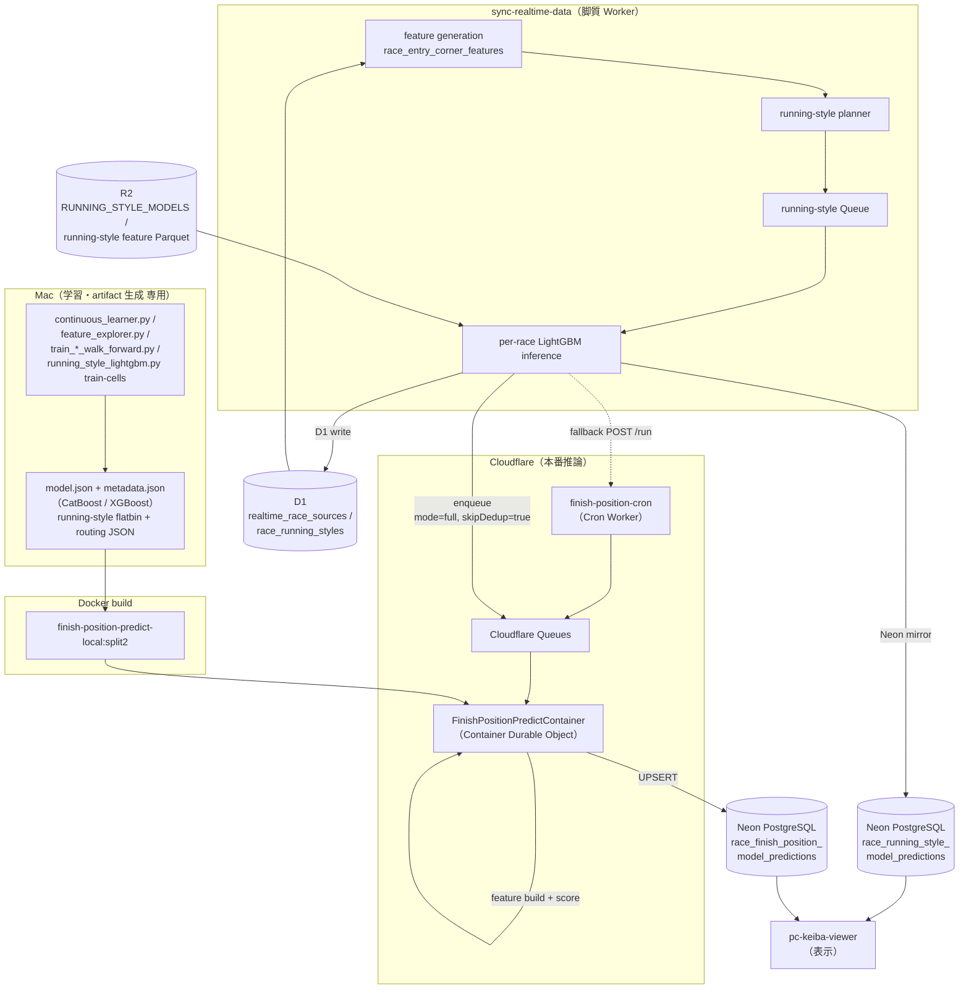
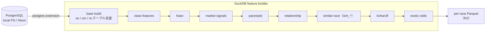
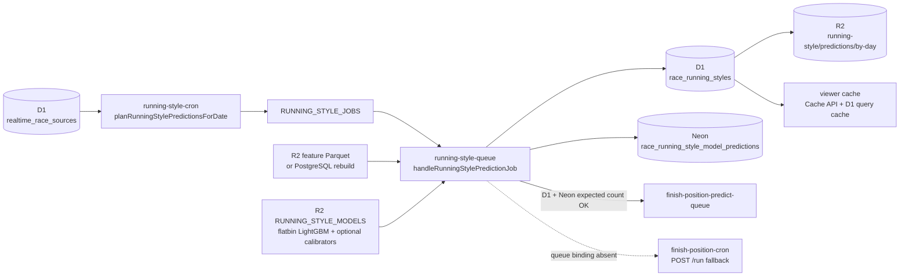
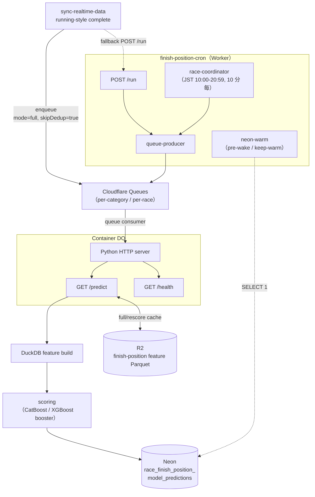
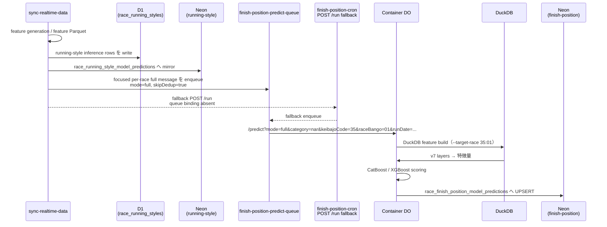
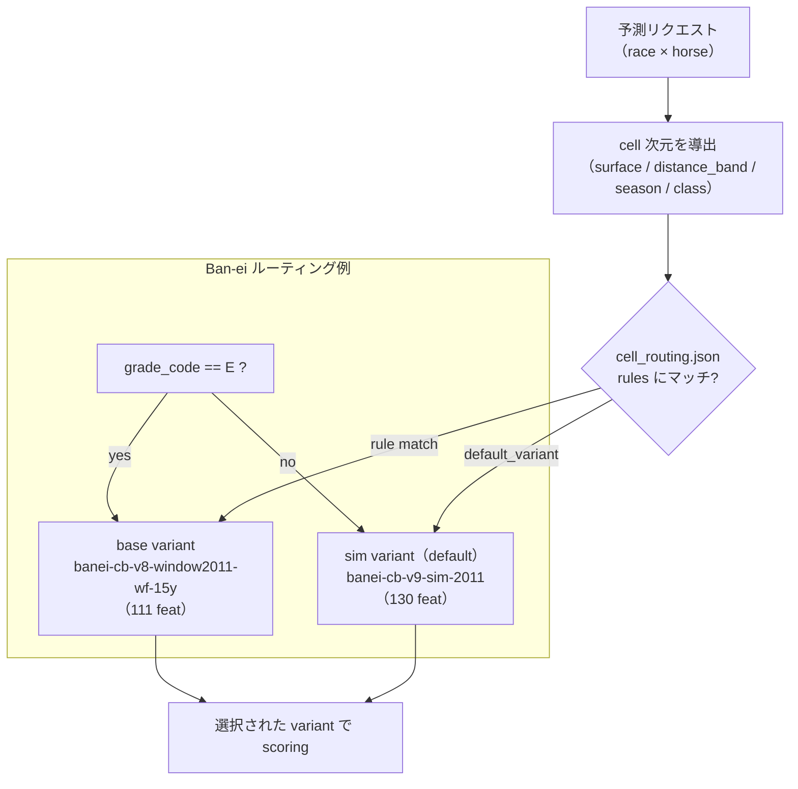
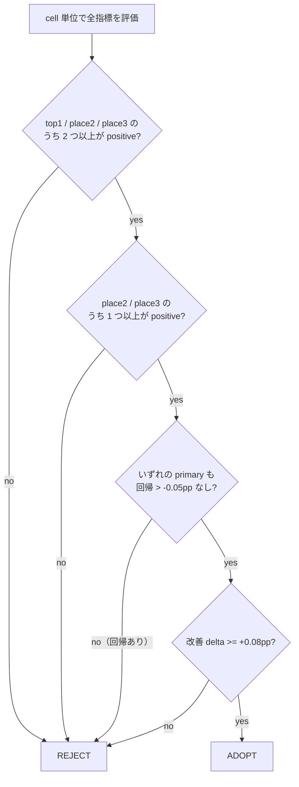
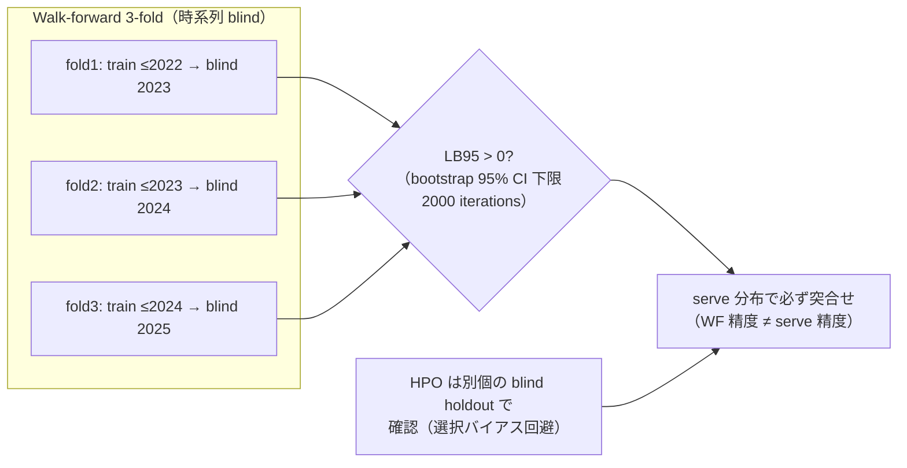
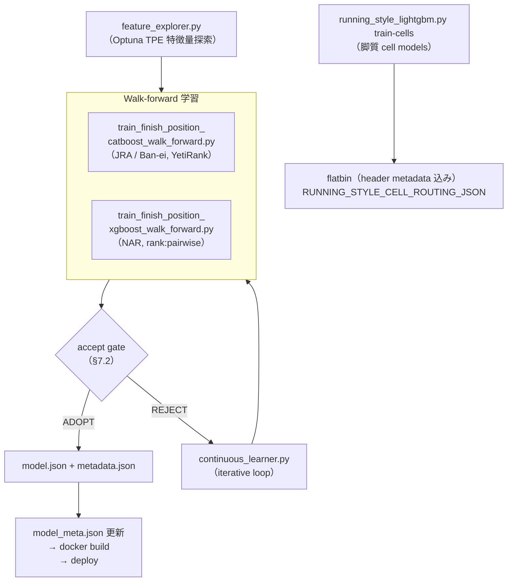
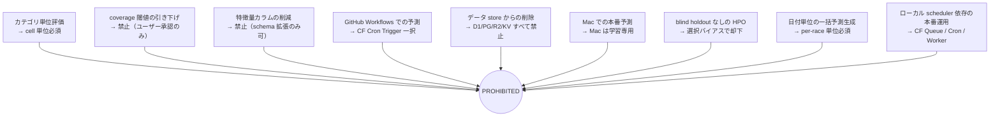

# 着順・脚質予測システム 仕様書

最終更新: 2026-07-02

本書は、競馬の着順予測システム（finish position prediction system）と、その前段で着順特徴量を供給する脚質予測システム（running-style prediction system）の全体仕様を記述する。学習基盤・特徴量パイプライン・本番推論基盤（Cloudflare Worker / Cloudflare Container）・評価方法・アンチパターンを網羅する。

---

## 1. アーキテクチャ概要

本システムは「学習」と「本番推論」を物理的に分離し、本番では **feature generation → running-style generation → finish-position full generation** の順序を守る。

- **Mac はモデル学習・モデル artifact 生成専用**である。本番の特徴量生成・脚質予測・着順予測を Mac 上で実行することは禁止する。
- **本番生成の authority は Cloudflare 側**である。Cloudflare Cron / Queue / Worker / Container が feature generation → running-style generation → finish-position full generation をレース単位で実行する。
- **ローカル常駐プロセスは本番構成要素ではない**。手元の scheduler、shell wrapper、Docker process、trainer process を本番 trigger / fallback / ordering dependency にしてはならない。
- **本番の着順予測は Cloudflare Container 上でレース単位（per-race）で実行**する。
- **本番の脚質予測は `sync-realtime-data` Worker 上でレース単位（per-race）で実行**し、完了後に `FINISH_POSITION_PREDICT_QUEUE` へ focused per-race full message を enqueue する。service binding / API は queue binding が無い環境の fallback に限る。
- 対象は 3 カテゴリ。各カテゴリは独立したモデル・学習窓・アーキテクチャを持つ。
  - **JRA（中央競馬）**
  - **NAR（地方競馬）**
  - **Ban-ei（ばんえい競馬）**


```mermaid
flowchart TB
    subgraph MAC["Mac（学習・artifact 生成 専用）"]
        TRAIN["continuous_learner.py /<br/>feature_explorer.py /<br/>train_*_walk_forward.py /<br/>running_style_lightgbm.py train-cells"]
        ARTI["model.json + metadata.json<br/>（CatBoost / XGBoost）<br/>running-style flatbin + routing JSON"]
        TRAIN --> ARTI
    end

    subgraph BUILD["Docker build"]
        IMG["finish-position-predict-local:split2"]
    end

    subgraph RT["sync-realtime-data（脚質 Worker）"]
        FEAT["feature generation<br/>race_entry_corner_features"]
        RSPLAN["running-style planner"]
        RSQUEUE["running-style Queue"]
        RSINFER["per-race LightGBM inference"]
        FEAT --> RSPLAN --> RSQUEUE --> RSINFER
    end

    subgraph CF["Cloudflare（本番推論）"]
        CRON["finish-position-cron<br/>（Cron Worker）"]
        QUEUE["Cloudflare Queues"]
        DO["FinishPositionPredictContainer<br/>（Container Durable Object）"]
        CRON --> QUEUE --> DO
    end

    D1[("D1<br/>realtime_race_sources /<br/>race_running_styles")]
    R2RS[("R2<br/>RUNNING_STYLE_MODELS /<br/>running-style feature Parquet")]
    NEONRS[("Neon PostgreSQL<br/>race_running_style_<br/>model_predictions")]
    NEON[("Neon PostgreSQL<br/>race_finish_position_<br/>model_predictions")]
    VIEWER["pc-keiba-viewer<br/>（表示）"]

    D1 --> FEAT
    R2RS --> RSINFER
    RSINFER -->|"D1 write"| D1
    RSINFER -->|"Neon mirror"| NEONRS
    RSINFER -->|"enqueue<br/>mode=full, skipDedup=true"| QUEUE
    RSINFER -.->|"fallback POST /run"| CRON
    ARTI --> IMG
    IMG --> DO
    DO -->|"feature build + score"| DO
    DO -->|"UPSERT"| NEON
    NEONRS --> VIEWER
    NEON --> VIEWER
```

### 1.1 本番 ownership と実行順序

本番の生成責務は Cloudflare 側に閉じる。順序の authority は `sync-realtime-data` と `finish-position-cron` / Container の連携であり、ローカル端末・手元 scheduler は本番の trigger / fallback / ordering dependency を持たない。

| stage                           | production owner                                                                        | 完了条件 / output                                                                                                       |
| ------------------------------- | --------------------------------------------------------------------------------------- | ----------------------------------------------------------------------------------------------------------------------- |
| feature generation              | `sync-realtime-data` の Cloudflare cron / queue / Worker                                | D1 race source / corner feature と脚質 feature Parquet が対象 race で利用可能                                           |
| running-style generation        | `sync-realtime-data` の `running-style-cron.ts` / `running-style-queue.ts`              | D1 `race_running_styles`、Neon `race_running_style_model_predictions`、R2 daily prediction Parquet、viewer cache を更新 |
| finish-position full generation | `finish-position-cron` Worker / Cloudflare Queues / `finish-position-predict-container` | Container が per-race DuckDB feature build と scoring を実行し、Neon `race_finish_position_model_predictions` へ UPSERT |

`sync-realtime-data` は feature generation と running-style generation の完了を race scope で確認してから、`FINISH_POSITION_PREDICT_QUEUE` に focused per-race full message を enqueue する。`FINISH_POSITION_CRON` service binding への `POST /run` は queue binding が無い環境の fallback であり、同じ message を `finish-position-cron` 経由で enqueue する。Container が着順 feature build と scoring を完了させる。

---

## 2. 本番モデル（2026-07-02 時点）

着順本番モデルのバージョンと特徴量数は、Container 内の `apps/finish-position-predict-container/src/predict_lib/model_meta.json` を single source of truth とする。

| カテゴリ | model_version           | アーキテクチャ | 特徴量数 | 学習窓        | ランキング loss |
| -------- | ----------------------- | -------------- | -------- | ------------- | --------------- |
| JRA      | `jra-cb-v9-sim-2013`    | CatBoost       | 263      | 2013+         | YetiRank        |
| NAR      | `iter12-nar-xgb-hpo-v8` | XGBoost        | 192      | full（2006+） | rank:pairwise   |
| Ban-ei   | `banei-cb-v9-sim-2011`  | CatBoost       | 130      | 2011+         | YetiRank        |

> **重要な留保・更新（2026-07-02 investigation → 同日中に解決、詳細は §5.9）**: 本欄は当初、「本番の per-race パイプラインが実際にこれらのモデルで着順予測を完走し Neon に書き込んだという確認済みの証跡が、テーブル観測可能な履歴の範囲（2026-05-15 以降、約 1.5 ヶ月）で 3 カテゴリいずれについても存在しない」という critical finding を記録していた。**同日中の root-cause 特定と fix（commit `2d3535be` instrumentation → commit `af1ca40e` fix）により、JRA については live smoke test で genuine な Neon 書き込みを確認済み**（`jra:2026:0628:10:01`、`race_finish_position_model_predictions` に `model_version='jra-cb-v9-sim-2013'` の 18 行、`prediction_generated_at=2026-07-02T00:09:55Z`）。NAR / Ban-ei は同一のアーキテクチャ fix が適用されているが、本セッションでは fix 後の clean smoke test で個別に再確認できていない（fix 前の instrumentation では NAR も同じ ~15-17 分 timeout パターンで完走していなかったことを確認済みなので、根本原因は共通と推定される）。詳細・残存リスクは §5.9 を参照。

### 2.1 脚質予測モデル

脚質予測は `apps/sync-realtime-data/` の Worker が R2 binding `RUNNING_STYLE_MODELS` から flatbin LightGBM model を読み、per-race で `nige` / `senkou` / `sashi` / `oikomi` を推論する。未設定時の既定は source 単位の latest model（`buildRunningStyleFlatModelKey(source)`, `variantId = latest`）で、既存運用と後方互換である。

cell-level routing を使う場合は `RUNNING_STYLE_CELL_ROUTING_JSON` に data-driven routing config を入れる。routing config が存在しないカテゴリ、または config 自体が未設定の場合は、必ず source 単位 latest model に fallback する。

脚質 cell model はローカルで `running_style_lightgbm.py train-cells` により **cell 単位で** 学習・評価・promotion plan 生成を行う。採用された variant は header metadata 込みの flatbin を `RUNNING_STYLE_MODELS` の R2 object として promotion し、`RUNNING_STYLE_CELL_ROUTING_JSON` はその R2 key を指す。production は Cloudflare Worker / Queue / R2 / D1 / Neon のみを参照し、ローカル端末上の model path や process に依存しない。

### 2.2 学習窓が 3 カテゴリで異なる点（重要）

学習窓は ablation 検証の結果としてカテゴリごとに最適値が異なることが確定している。一律化してはならない。

- **JRA = 厳密に 2013+**。pre-2013 は非定常で希釈要因。2012+（広）も 2014+（狭）も 2013+ に劣後（DO-NOT-RETEST）。
- **NAR = full 2006+**。NAR は長い履歴を必要とし、窓を絞ると全 metric 悪化（JRA と真逆）。
- **Ban-ei = 2011+**。pre-2011 非定常で希釈、2013+/2016+ は切りすぎ。2011+ が sweet spot。

### 2.3 E-top2 override（無効）

- **JRA E-top2 override: DISABLED**。v9-sim は 263 特徴量だが、E-top2 が前提とする XGB は 244 特徴量を要求するため非互換。
- **NAR E-top2: DISABLED**。

E-top2 は「XGB の 1 着予測が CatBoost の 2 着予測と一致するレースのみ rank-1 を上書きし、exact place3 構成を保存する」place-preserving override 手法であったが、v9-sim 系モデルへの移行に伴い特徴量数が不整合となったため無効化されている。

---

## 3. 特徴量パイプライン（DuckDB feature builder）

特徴量は DuckDB ベースの builder が PostgreSQL（local PG または Neon）から構築する。

- メインビルダー: `apps/pc-keiba-viewer/src/scripts/finish_position_features_duckdb.py`
- DuckDB の postgres extension 経由で PostgreSQL を読む（Container 内は native libpq、Hyperdrive 不要）。


```mermaid
flowchart LR
    PG[("PostgreSQL<br/>local PG / Neon")]
    subgraph DUCK["DuckDB feature builder"]
        BASE["base build<br/>se / um / ra テーブル走査"]
        L1["class features"]
        L2["futan"]
        L3["market signals"]
        L4["pacestyle"]
        L5["relationship"]
        L6["similar-race（sim_*）"]
        L7["kohan3f"]
        L8["exotic odds"]
        BASE --> L1 --> L2 --> L3 --> L4 --> L5 --> L6 --> L7 --> L8
    end
    PARQUET["per-race Parquet<br/>（R2）"]

    PG -->|"postgres extension"| BASE
    L8 --> PARQUET
```

### 3.1 per-race モード（`--target-race`）

Container のレース単位予測のため、`--target-race keibajo_code:race_bango` で単一レースのみの特徴量を構築できる（`finish_position_features_duckdb.py:253`）。指定時は rec history scan を当該レースの馬・騎手に絞り込む。

履歴 join は `h.race_date < t.race_date` を用いるため、対象レースが未確定（未走）の段階でも window が計算可能で、対象レースの結果が leak しない（`finish_position_features_duckdb.py:219`）。

### 3.2 エンティティフィルタ（Neon max_stack_depth 対策）

- **se / um テーブル（馬単位）**: `postgres_query()` を用い、`ketto_toroku_bango`（血統登録番号）による horse-level の `IN` フィルタを push down する（`finish_position_features_duckdb.py:441`, `:490`）。
- **ra テーブル（レース単位）**: エンティティフィルタを掛けない。compound tuple の `IN` は Neon の `max_stack_depth` を超過するため。

この非対称性は意図的であり、Neon のスタック制約を回避しつつ馬単位の履歴走査を限定する設計である。

### 3.3 レイヤチェーンと特徴量数

base DuckDB build に v7 由来の enrichment レイヤを積層する。最終的な特徴量数はカテゴリごとに異なる。

| カテゴリ | 最終特徴量数 |
| -------- | ------------ |
| JRA      | 263          |
| NAR      | 192          |
| Ban-ei   | 130          |

similar-race 特徴量（`sim_*`、19 列）は JRA / Ban-ei で ADOPT（v9-sim）、NAR では REJECT。このため NAR の特徴量数（192）は sim\_\* を含まず、JRA（263）・Ban-ei（130）とレイヤ構成が異なる。

### 3.4 脚質予測の特徴量契約

脚質予測の per-race feature builder は `apps/sync-realtime-data/src/running-style-feature-sql.ts` / `running-style-feature-parquet.ts` が担う。基本方針は着順特徴量と揃え、`race_entry_corner_features` と過去履歴から馬・騎手・距離・コーナー・ペース・馬体重などを構築する。ただし target は脚質専用の `target_running_style_class`（`corner1_norm` 由来）であり、実際に scoring へ渡す列は選択された LightGBM model の `feature_names` に従う。

脚質 feature Parquet は `running-style/features-parquet/{source}/{YYYYMMDD}/{raceKey}.parquet` に置く。Worker は R2 を先に読み、miss の場合だけ PostgreSQL / Hyperdrive から再構築する。

routing と後段着順生成のため、脚質 feature rows は以下の metadata を必ず保持する。

| metadata                                                                      | 用途                                            |
| ----------------------------------------------------------------------------- | ----------------------------------------------- |
| `raceKey`, `source`, `kaisaiNen`, `kaisaiTsukihi`, `keibajoCode`, `raceBango` | race identity                                   |
| `category`                                                                    | `jra` / `nar` / `ban-ei` の routing             |
| `kyori`, `trackCode`, `gradeCode`, `shussoTosu`                               | distance / surface / class / field-size routing |
| `kyosoJokenCode`, `narSubClass`                                               | subgroup routing                                |
| `kettoTorokuBango`, `umaban`, `bamei`                                         | runner identity                                 |

この metadata は feature そのものではなく routing contract である。`kyori` / `trackCode` / `gradeCode` / `shussoTosu` / `kyosoJokenCode` / `narSubClass` を削ると、脚質 cell routing と着順 full trigger の整合性が壊れる。

---

## 4. 脚質予測システム（running-style）

脚質予測の本番 owner は `apps/sync-realtime-data/` の `running-style-cron.ts` / `running-style-queue.ts` である。`sync-realtime-data-features` は本番脚質推論の owner ではない。

### 4.1 入力・ラベル・用語

- **source**: `jra` / `nar`。`race_key` と R2 daily prediction Parquet は source で分かれる。
- **category**: `jra` / `nar` / `ban-ei`。source と `keibajo_code` から導出する routing / log 用の分類であり、source と同一ではない。Ban-ei は source=`nar` 由来の特殊カテゴリで、`add-pacestyle-features.py` の通常カテゴリではない。
- **class label**: `nige` / `senkou` / `sashi` / `oikomi`。class id は順に `0` / `1` / `2` / `3`。
- **`target_running_style_class`**: 学習用 target。historical/current-result の `corner1_norm` から作る label であり、pre-race feature から作るものではない。未走レースの scoring では target として使わない。
- **`predicted_label` / `predicted_class`**: 推論結果。`predicted_class` は `predicted_label` の class id であり、`target_running_style_class` とは別物である。
- **version 名**: `running_style_feature_version`（学習・postproc 側の脚質特徴量版）、`feature_schema_version`（per-race feature schema 版）、`model_version`（予測モデル版）は別概念であり、混同しない。

race key は用途で形式が異なる。

| 用途                                            | 形式                                                                   |
| ----------------------------------------------- | ---------------------------------------------------------------------- |
| D1 `race_running_styles.race_key` / Worker 内部 | `{source}:{YYYYMMDD}:{keibajo}:{race_bango}`                           |
| viewer cache / realtime race key                | `{source}:{YYYY}:{MMDD}:{keibajo}:{race_bango}`                        |
| `add-pacestyle-features.py` の `race_id`        | `{category}:{kaisai_nen}:{kaisai_tsukihi}:{keibajo_code}:{race_bango}` |
| finish-position `/predict` race scope           | `category` + `runDate=YYYYMMDD` + `keibajoCode` + `raceBango`          |

### 4.2 本番フロー


```mermaid
flowchart LR
    D1R[("D1<br/>realtime_race_sources")]
    PLAN["running-style-cron<br/>planRunningStylePredictionsForDate"]
    Q["RUNNING_STYLE_JOBS"]
    H["running-style-queue<br/>handleRunningStylePredictionJob"]
    FEAT["R2 feature Parquet<br/>or PostgreSQL rebuild"]
    MODEL["R2 RUNNING_STYLE_MODELS<br/>flatbin LightGBM + optional calibrators"]
    D1RS[("D1<br/>race_running_styles")]
    NEONRS[("Neon<br/>race_running_style_model_predictions")]
    R2DAY[("R2<br/>running-style/predictions/by-day")]
    CACHE["viewer cache<br/>Cache API + D1 query cache"]
    FPQ["finish-position-predict-queue"]
    FPF["finish-position-cron<br/>POST /run fallback"]

    D1R --> PLAN --> Q --> H
    FEAT --> H
    MODEL --> H
    H --> D1RS
    H --> NEONRS
    D1RS --> R2DAY
    D1RS --> CACHE
    H -->|"D1 + Neon expected count OK"| FPQ
    H -.->|"queue binding absent"| FPF
```

`planRunningStylePredictionsForDate()` は D1 の race list と既存 prediction count を見て未完了 race を enqueue する。planner 自体が corner feature の存在を hard gate するのではなく、queue handler が feature Parquet を R2 から読み、miss 時に PostgreSQL / Hyperdrive から再構築する。calibrator は R2 にあれば適用し、読めない場合は uncalibrated prediction に fallback する。

### 4.3 出力

脚質予測は同一 race の結果を複数の読み先へ配る。

| 出力先                                      | 内容                                                                                                                                                                                                                      |
| ------------------------------------------- | ------------------------------------------------------------------------------------------------------------------------------------------------------------------------------------------------------------------------- |
| D1 `race_running_styles`                    | per-horse `p_nige` / `p_senkou` / `p_sashi` / `p_oikomi`、`predicted_label`、`model_version`、`cell_model_key`、`cell_variant_id`。Worker 内の source of truth                                                            |
| Neon `race_running_style_model_predictions` | viewer / 着順 layer が読む mirror。D1 と同じ `cell_model_key` / `cell_variant_id` を永続化し、どの cell model で予測した行かを後段・監査で追跡できるようにする。write は `DATABASE_URL_NEON` → `NEON_DATABASE_URL` を優先 |
| R2 daily prediction Parquet                 | `running-style/predictions/by-day/{YYYY}/{MM}/{DD}/{source}/{model_version}.parquet`。`add-pacestyle-features.py` の R2 path                                                                                              |
| viewer cache                                | `/api/races/{YYYY}/{MM}/{DD}/{keibajo}/{race}/running-styles?source=...` の Cache API と D1 query cache                                                                                                                   |

R2 daily prediction Parquet は source=`jra|nar` 単位で export する。1 つの現行 model version をドキュメントで固定しない。複数 `model_version` が同日に存在する場合は model version ごとの Parquet になる。

### 4.4 cell-level routing

脚質も着順と同様に cell-level routing を持つ。`RUNNING_STYLE_CELL_ROUTING_JSON` が設定されている場合、`running-style-cell-router.ts` が race metadata から cell を導出し、variant を選ぶ。未設定時、または該当カテゴリの config が無い場合は source 単位の latest model key に fallback する。

脚質 cell dimensions は以下。

| dimension                                      | 元データ / 派生                                           |
| ---------------------------------------------- | --------------------------------------------------------- |
| `category`, `source`                           | source と keibajo から導出                                |
| `venue`, `racetrack`, `keibajo_code`           | `keibajoCode`                                             |
| `surface`, `trackCode`                         | JRA `trackCode` 先頭で turf / dirt / other、NAR 系は dirt |
| `distance_band`, `kyori`                       | `<1200`, `<1600`, `<2000`, `<2400`, `>=2400`              |
| `season`                                       | `kaisaiTsukihi` の月                                      |
| `class`, `grade_code`                          | `gradeCode`                                               |
| `subgroup`, `kyoso_joken_code`, `nar_subclass` | NAR は `narSubClass`、それ以外は `kyosoJokenCode`         |
| `shusso_tosu`                                  | field size                                                |

routing のログ・summary では `cellModelKey` と `cellVariantId` を確認する。これは採用された flatbin model key と variant id であり、model の `model_version` とは別である。prediction row には snake_case の `cell_model_key` / `cell_variant_id` として D1 `race_running_styles` と Neon `race_running_style_model_predictions` の両方へ永続化する。これらをログだけに残して DB に保存しない運用は禁止する。

`RUNNING_STYLE_CELL_ROUTING_JSON` は production routing の唯一の data-driven control plane である。構造は category（`jra` / `nar` / `ban-ei`）ごとに `defaultVariantId`、`rules`、`variants` を持つ。

```json
{
  "jra": {
    "defaultVariantId": "latest",
    "rules": [
      {
        "conditions": [{ "dimension": "venue", "values": ["05"] }],
        "variantId": "tokyo-turf"
      }
    ],
    "variants": {
      "latest": { "modelKey": "running-style/models/jra/latest.flatbin" },
      "tokyo-turf": { "modelKey": "running-style/models/jra/cells/tokyo-turf.flatbin" }
    }
  }
}
```

`variantId` は routing の識別子で、`modelKey` は `RUNNING_STYLE_MODELS` R2 binding 内の flatbin object key である。rule が一致しない場合は `defaultVariantId` を使う。category config が無い場合は `buildRunningStyleFlatModelKey(source)` の source 単位 latest に fallback する。存在しない `variantId` を rule が参照する JSON は production に入れてはならない。

### 4.5 脚質 cell 学習・評価・promotion（ローカル）

脚質 cell model の学習・評価・promotion plan はローカルの `apps/pc-keiba-viewer/src/scripts/running_style_lightgbm.py train-cells` で行う。これは model artifact を作るための作業であり、本番推論をローカルで実行するものではない。学習・評価・採用判定の単位は category や source の粗い集計ではなく **cell variant 単位**であり、cell 外の平均で改善・回帰を判断してはならない。

実行単位は `source` / `category` / cell variant で、入力は脚質 feature Parquet と `target_running_style_class` を持つ labeled rows である。`target_running_style_class` は `nige=0` / `senkou=1` / `sashi=2` / `oikomi=3` の 4-class softmax target であり、着順の rank metric では評価しない。

標準の流れ:

1. `running_style_lightgbm.py train-cells` で候補 cell variant を学習し、cell ごとの `model.txt` / `metadata.json`、Worker routing 候補 JSON、`cell_metrics.json` を出力する。このコマンド自体は walk-forward prediction parquet を出力しない。
2. `cell_metrics.json` の各 `trained_cells[*].metrics` は rate だけでなく、`prediction_count`、`top2_hit_count`、`race_level`、`confusion_matrix`、`per_class_log_loss_sum/count` を含む。cell 間・期間間の集計は rate 平均ではなく raw count / sum から再計算する。
3. `trained_cells[*].cell_training_evaluation` は `cell_training_evaluations.prediction_target = 'running_style'` として保存する互換 mapping を持つ。永続化する場合は `train-cells --save-cell-metrics-to-postgres --pg-url <postgres-url>` を使い、`CellAccuracyStore` と同じ upsert 経路で保存する。`feature_set_hash` が同じ cell は `feature_names_array` と合わせて保存され、着順と脚質は `prediction_target` で分離される。
4. `build_cell_models.py --prediction-target running_style` で baseline variant と候補 variant を同じ cell 定義・同じ holdout window で比較する。
5. 採用 cell だけを feature-selection routing JSON に残す。`build_cell_models.py --prediction-target running_style` が出力する JSON は `type = running_style_cell_feature_selection_routing` / `worker_production_routing = false` のローカル学習用 control plane であり、Worker production routing JSON ではない。variant には `feature_set_hash` と `feature_names` を含める。
6. `running_style_lightgbm.py train-cells --cell-feature-selection-json <routing.json>` で採用 cell ごとの `feature_names` を読み、cell ごとに最良だった特徴量セットで local model artifact を作る。未採用 cell は全体特徴量または source latest に fallback する。
7. 採用 variant の LightGBM artifact を Worker が読む header metadata 込み flatbin へ変換し、`RUNNING_STYLE_MODELS` R2 に upload する。
8. upload 済み R2 key だけを `RUNNING_STYLE_CELL_ROUTING_JSON` の `variants[*].modelKey` に反映し、Cloudflare Worker の設定として promote する。

`train-cells` の LightGBM resource control は `--num-threads auto` が既定である。auto は macOS の load average、available memory（free / inactive / speculative / purgeable）、compressor 使用量から fit ごとの thread 数を決め、さらに `/tmp` の slot lock で同時 fit 数を制御する。明示的な固定値が必要な検証時だけ `--num-threads 1` のように指定する。

脚質 / 着順の local feature generation / bucket evaluation は固定 thread / concurrency / `work_mem` / `memory_limit` を標準既定にしない。`generate-running-style-local.ts` は Colima capacity と、その時点の macOS resource snapshot（load average、available memory = free / inactive / speculative / purgeable、compressor 使用量）から DuckDB `--threads`、`--memory-limit`、Phase A chunk concurrency、category concurrency を実行時に解決する。`generate-finish-position-local.ts` は同じ resource snapshot から DuckDB `--threads` と `--memory-limit` を解決する。Python の direct wrapper も `_resource_defaults.py` で同じ macOS pressure を見て DuckDB threads と `memory_limit` を縮退させる。`evaluate-running-style-bucket-21y.ts` の `--chunk-concurrency` / `--work-mem-mb` も既定は `auto` で、同じ resource snapshot から chunk concurrency、category concurrency、PostgreSQL session `work_mem` を解決する。macOS load が高い、free 系 memory が少ない、または compressor pressure が高い場合は、`memory_limit` と `work_mem` も現在の空きリソースに合わせて小さくする。明示指定した場合だけ固定値を使う。kernel panic / swap pressure 再発防止のため、手元の空きリソースを見ずに `8 threads` / `4 parallel` / `256MB work_mem` / `6GB memory_limit` のような固定値を標準運用に戻してはならない。

production prediction では、routing 結果の `modelKey` / `variantId` を各 prediction row の `cell_model_key` / `cell_variant_id` として D1 と Neon に保存する。D1 と Neon のどちらか片方だけに保存する、または `model_version` だけで cell variant を復元しようとする運用は禁止する。

ローカル実行 wrapper:

```bash
bun run --filter pc-keiba-viewer dev:running-style-train-cells -- \
  --csv <feature-parquet> \
  --model-version <version> \
  --output-root <output-dir> \
  --output-routing-json <output-dir>/cell_routing.json
```

脚質評価で使う metric は running-style 固有であり、finish-position の top1 / place2〜place6 / NDCG gate を流用しない。

| metric                             | 用途                                                                                                                                   |
| ---------------------------------- | -------------------------------------------------------------------------------------------------------------------------------------- |
| `accuracy`                         | 4-class predicted class と `target_running_style_class` の一致率                                                                       |
| `macro_f1`                         | `nige` / `senkou` / `sashi` / `oikomi` を4クラス固定で平均する class-balance 指標。未定義 class は 0.0 として扱う                      |
| `per_class_accuracy` / `f1`        | `nige` / `senkou` / `sashi` / `oikomi` の actual class 内での的中率と F1。true negative で水増しされる one-vs-rest accuracy は使わない |
| `per_class_precision` / `recall`   | class ごとの採否確認。特に `nige` は過剰 positive を監視する                                                                           |
| `per_class_support`                | cell 内で評価可能な class 分布。support が薄い cell は採用しない                                                                       |
| `precision_nige` / `recall_nige`   | 逃げ class の precision / recall。production skew の主監視対象                                                                         |
| `log_loss_nige` / `multi_log_loss` | 確率品質。calibrator や class-weight 変更時の過信を検出する                                                                            |
| `confusion_matrix`                 | actual class × predicted class の raw count。集計時はこの count を加算してから precision / recall / F1 を再計算する                    |
| `top2_hit_count`                   | top2 的中数。`top2_accuracy` の再集計では count を加算してから `prediction_count` で割る                                               |
| `race_level`                       | race 単位で脚質分布・脚質 count・corner passage order・finish position との整合性を見る派生 metric 群                                  |

`race_level` は generated running-style prediction を horse 単位の class 一致だけでなく、同一 race 内の並びとして評価する。`style_distribution_mae` / `style_count_mae` / `style_count_bias` / `nige_count_mae` / `front_group_count_mae` は race 内の脚質構成のずれを測る。`corner_rank_spearman` は予測 front score と `corner1_norm` の順位相関で、通過順と脚質予測の順序整合を確認する。`finish_weighted_accuracy` / `top1_finish_style_accuracy` / `top3_finish_style_accuracy` は `finish_position` で上位馬を重く見た脚質 class 一致率であり、着順 rank metric ではなく、脚質予測が最終着順上位の馬で崩れていないかを見る補助指標である。

`cell_training_evaluations` の共有列へ保存する場合、running-style profile は `top1_accuracy = accuracy`、`place2_accuracy = top2_accuracy`、`place3_accuracy = macro_f1` として扱う。`build_cell_models.py --prediction-target running_style` は `top1_accuracy` の改善を必須とし、`top2_accuracy` または `macro_f1` のどちらかも改善した cell だけを採用対象にする。

promotion は「metrics が良い」だけでは完了しない。production で参照される object は flatbin だけであり、R2 に upload されていない local artifact、または `RUNNING_STYLE_CELL_ROUTING_JSON` に反映されていない variant は production に存在しないものとして扱う。

Cloudflare 側で確認する項目:

- `RUNNING_STYLE_MODELS` に `running-style/models/{source}/.../*.flatbin` が存在し、flatbin header の `model_version` / `feature_names` / `class_labels` が期待値と一致する。
- `RUNNING_STYLE_CELL_ROUTING_JSON` の `variants[*].modelKey` が upload 済み flatbin object key を指す。
- `generate-running-style-predictions` の summary に期待した `cellVariantId` / `cellModelKey` が出る。
- D1 `race_running_styles`、Neon `race_running_style_model_predictions`、R2 daily prediction Parquet の件数が expected horse count 以上で揃う。
- D1 `race_running_styles.cell_model_key` / `cell_variant_id` と Neon `race_running_style_model_predictions.cell_model_key` / `cell_variant_id` が summary の `cellModelKey` / `cellVariantId` と一致する。

### 4.6 着順予測との結合

着順特徴量は `apps/pc-keiba-viewer/src/scripts/finish-position-features/add-pacestyle-features.py` で脚質予測を読む。通常の pacestyle layer は `--category jra|nar` を対象とし、Ban-ei を通常の RS/pacestyle 対象として扱わない。

`add-pacestyle-features.py` は R2 daily prediction Parquet を優先でき、R2 が使えない場合は Neon `race_running_style_model_predictions` を読む。join は same race + `ketto_toroku_bango` で行い、missing row は `rs_p_*` / `rs_predicted_class` などの nullable `rs_*` として残る。missing running-style を reason に着順 feature build 全体を落としてはいけない。

一方、本番の per-race full trigger は脚質完了を強く要求する。`handleRunningStylePredictionJob()` は D1 write count と Neon mirror count が expected horse count 以上であることを確認してから、まず `FINISH_POSITION_PREDICT_QUEUE` へ focused per-race full message を enqueue する。`FINISH_POSITION_CRON` service binding への `POST /run` は queue binding が無い環境の fallback である。

### 4.7 本番 ordering guard

本番の ordering guard は `sync-realtime-data` の queue handler が担う。対象 race の feature generation が完了していない場合は脚質 prediction を完了扱いにせず、脚質 D1 write と Neon mirror が expected horse count 以上になるまで `FINISH_POSITION_PREDICT_QUEUE` への enqueue を発行しない。service binding fallback でも同じ guard を通り、guard 未達の race で `FINISH_POSITION_CRON` への `POST /run` を発行しない。

この guard は Cloudflare Worker / Queue と、fallback 時の service binding の中で完結する。ローカル scheduler、手元 shell script、ローカル Docker process で feature → running-style → finish-position の順序を補完・代替してはならない。

---

## 5. 着順推論アーキテクチャ（finish-position）


```mermaid
flowchart TB
    subgraph CRONW["finish-position-cron（Worker）"]
        TRIG["POST /run"]
        COORD["race-coordinator<br/>（JST 10:00-20:59, 10 分毎）"]
        PRODUCER["queue-producer"]
        NEONWARM["neon-warm<br/>（pre-wake / keep-warm）"]
        TRIG --> PRODUCER
        COORD --> PRODUCER
    end
    QUEUE["Cloudflare Queues<br/>（per-category / per-race）"]
    subgraph DOBJ["Container DO"]
        SERVER["Python HTTP server"]
        EP1["GET /predict"]
        EP2["GET /health"]
        SERVER --> EP1
        SERVER --> EP2
    end
    DUCKBUILD["DuckDB feature build"]
    SCORE["scoring<br/>（CatBoost / XGBoost booster）"]
    FPNEON[("Neon<br/>race_finish_position_<br/>model_predictions")]
    R2FP[("R2<br/>finish-position feature Parquet")]

    UPSTREAM["sync-realtime-data<br/>running-style complete"]
    UPSTREAM -->|"enqueue<br/>mode=full, skipDedup=true"| QUEUE
    UPSTREAM -.->|"fallback POST /run"| TRIG
    PRODUCER --> QUEUE
    QUEUE -->|"queue consumer"| SERVER
    EP1 --> DUCKBUILD --> SCORE --> FPNEON
    EP1 <-->|"full/rescore cache"| R2FP
    NEONWARM -.->|"SELECT 1"| FPNEON
```

### 5.1 構成要素

- **Upstream trigger（`sync-realtime-data`）**: 脚質完了後に `FINISH_POSITION_PREDICT_QUEUE` へ focused per-race full を enqueue する。queue binding が無い環境だけ `FINISH_POSITION_CRON` service binding / API の `POST /run` に fallback する。脚質推論自体の詳細は §4。
- **Cron Worker（`finish-position-cron`）**: Cloudflare Queues 経由で Container をトリガーする。`apps/finish-position-cron/wrangler.jsonc` に cron / queue / container binding を定義。
- **Container DO（`FinishPositionPredictContainer`）**: Python HTTP server を内包し、DuckDB ビルドと scoring を実行する。`instance_type: standard-4`, `max_instances: 10`。Queue consumer からの Container DO 名は `predict-{category}` に集約する。per-race identity は `/predict` query の `keibajoCode` / `raceBango` で渡し、DO 名を race scope にしてはならない。
- **PredictRunCoordinator（DO）**: run の dedup / state を strong-consistency で管理（旧 KV `PREDICT_STATE` を置換）。eventual consistency の KV では二重実行を防げないため DO に移行した。

### 5.2 HTTP エンドポイント

- **`GET /predict`** — 特徴量ビルド + scoring。chunked NDJSON（`Transfer-Encoding: chunked`, `application/x-ndjson`）でストリーム返却（`serve.py:11`）。
- **`GET /health`** — ヘルスチェック。

`/predict` のクエリパラメータ（`serve.py:121-176` で parse・validate）:

| パラメータ    | 必須 | 既定               | 説明                            |
| ------------- | ---- | ------------------ | ------------------------------- |
| `category`    | 必須 | —                  | `jra` / `nar` / `ban-ei`        |
| `runDate`     | 必須 | —                  | YYYYMMDD（8 桁 ASCII 数字）     |
| `daysAhead`   | 任意 | `0`                | 非負整数                        |
| `mode`        | 任意 | `full`             | `full` / `rescore`              |
| `keibajoCode` | 任意 | `None`（全レース） | per-race scope 用の競馬場コード |
| `raceBango`   | 任意 | `None`（全レース） | per-race scope 用のレース番号   |

- 日単位バッチ例: `/predict?category=jra&runDate=20260619&daysAhead=0`
- レース単位例（per-race）: `/predict?mode=full&category=nar&runDate=20260628&keibajoCode=35&raceBango=01`
- `keibajoCode` / `raceBango` を両方指定すると単一レースに scope される。R2 特徴量キャッシュキーは `feat-cache/{category}/{runDate}/{keibajoCode}/{raceBango}/features.parquet`（`serve.py:342-349`）。

> 注: 実装上のパラメータ名は `runDate` であり、`targetDate` ではない。日付は `runDate` で渡す。

### 5.3 予測モード

- **`full`** — DuckDB でゼロから特徴量を構築して scoring する。
- **`rescore`** — R2 にキャッシュ済みの特徴量を読み込み、late-binding refresh（直前のオッズ・馬体重など遅延確定値の差し替え）を行って再 scoring する。

### 5.4 本番順序と per-race full 生成

本番 full 生成の順序は固定である。

```
feature generation -> running-style generation -> finish-position full generation
```

`sync-realtime-data` は feature generation 後に脚質予測を per-race で実行し、D1 `race_running_styles` と Neon `race_running_style_model_predictions` の書き込みを確認してから `FINISH_POSITION_PREDICT_QUEUE` へ message を送る。message は `mode: "full"`、`skipDedup: true`、`category`、`runDate` / `runDateIso` / `runYmd`、`keibajoCode`、`raceBango` を含む。queue binding が無い環境では、同等の body を `finish-position-cron` の service binding `FINISH_POSITION_CRON` へ `POST /run` する fallback を使う。

上記以外の順序は本番仕様ではない。finish-position full generation を feature generation より前、または running-style generation 完了前に走らせる fallback は作らない。ローカル wrapper はこの順序の authority ではなく、障害時の再実行境界も Cloudflare Queue retry / DLQ と Worker state に置く。

`skipDedup: true` は「脚質完了に連動した focused per-race full」を意味する。`finish-position-cron` の queue consumer はこの message では category-level の `claimRun` / `completeRun` を通らず、category complete や category cache warm を汚さない。Container の NDJSON final line が `status:error` の場合は成功扱いせず、queue retry / DLQ に回す。

Container の `sleepAfter` 中も Cloudflare の live instance count には残る。Queue の `max_concurrency: 1` は consumer invocation を直列化するだけで、race-scoped DO 名が作る複数の sleeping Container instance を抑制しない。NAR のように同日に多数レースがある場合、`predict-nar-{runYmd}-{keibajoCode}-{raceBango}` のような DO 名は `max_instances: 10` を超過し得るため禁止する。


```mermaid
sequenceDiagram
    participant RT as sync-realtime-data
    participant D1 as D1<br/>(race_running_styles)
    participant RSN as Neon<br/>(running-style)
    participant Q as finish-position-predict-queue
    participant CRON as finish-position-cron<br/>POST /run fallback
    participant DO as Container DO
    participant DUCK as DuckDB
    participant FPN as Neon<br/>(finish-position)

    RT->>RT: feature generation / feature Parquet
    RT->>D1: running-style inference rows を write
    RT->>RSN: race_running_style_model_predictions へ mirror
    RT->>Q: focused per-race full message を enqueue<br/>mode=full, skipDedup=true
    RT-->>CRON: fallback POST /run<br/>queue binding absent
    CRON-->>Q: fallback enqueue
    Q->>DO: /predict?mode=full&category=nar&keibajoCode=35&raceBango=01&runDate=...
    DO->>DUCK: DuckDB feature build（--target-race 35:01）
    DUCK->>DO: v7 layers → 特徴量
    DO->>DO: CatBoost / XGBoost scoring
    DO->>FPN: race_finish_position_model_predictions へ UPSERT
```

ステップ詳細:

1. `sync-realtime-data` が当該 race の脚質 feature Parquet を読み、必要なら PostgreSQL / Hyperdrive から再構築する。
2. `RUNNING_STYLE_CELL_ROUTING_JSON` に基づき脚質モデルを選び、flatbin LightGBM で per-horse prediction を D1 へ write する。
3. D1 の completed state と Neon mirror count が期待頭数以上であり、`cell_model_key` / `cell_variant_id` が両 store に保存済みであることを確認する。
4. `FINISH_POSITION_PREDICT_QUEUE` へ `mode=full` / `skipDedup=true` の per-race message を enqueue する。queue binding が無い環境だけ `FINISH_POSITION_CRON` service binding / API の `POST /run` に fallback する。
5. Container が DuckDB feature build（`--target-race 35:01`）→ v7 layers → CatBoost/XGBoost scoring → Neon UPSERT を実行する。

### 5.5 per-race rescore は Container 統一

JRA / NAR / Ban-ei の per-race rescore はすべて `finish-position-cron` から Container held `/predict` に渡す。Worker-native JRA scorer は production の model metadata / cell routing / feature contract と乖離しやすいため、queue consumer の production dispatch では使用しない。Container 側が `mode=rescore` と race scope を受け取り、同じ feature build / model routing / Neon UPSERT 経路で再 scoring する。

### 5.6 cron スケジュール（`finish-position-cron/wrangler.jsonc`）

| cron              | JST         | 用途                                                   |
| ----------------- | ----------- | ------------------------------------------------------ |
| `55 17 * * *`     | 02:55       | Neon pre-wake（NAR/Ban-ei）                            |
| `25 0 * * *`      | 09:25       | Neon pre-wake（JRA）                                   |
| `30 0 * * *`      | 09:30       | Cloudflare-side feature generation / per-race planning |
| `*/30 1-11 * * *` | 10:00-20:59 | レース時間帯の Neon keep-warm                          |
| `*/10 1-11 * * *` | 10:00-20:59 | per-race rescore coordinator                           |

`observability.head_sampling_rate: 0.1` を設定済み（請求最適化のため新規 Worker は必須）。

脚質予測は `sync-realtime-data/wrangler.jsonc` の `*/10 0-14 * * *`（JST 09:00-23:50）cron で planner が走る。前日 prewarm / 当日 backfill は daily feature generation と running-style planning を同じ順序で呼ぶ。

### 5.7 Docker / 永続化

- Cloudflare Container image: `apps/finish-position-predict-container/Dockerfile`（build context は repo root）。
- Container は予測結果を Neon の `race_finish_position_model_predictions` へ **UPSERT** で書き込む。
- Container の DuckDB base build は race scope ごとに `--temp-dir /tmp/predict-upcoming/duckdb-spill/{category}-{runDate}-{keibajoCode}-{raceBango}` を渡し、`target_race` 未指定時は末尾を `all` にする。DuckDB の `temp_directory` と table spill はこの run/race 専用ディレクトリに閉じ、並列 per-race full 生成で共有 `/tmp/duckdb-spill` を奪い合わない。
- 本番の authority は `sync-realtime-data` → `FINISH_POSITION_PREDICT_QUEUE` → `finish-position-cron` queue consumer → Container の Cloudflare path であり、Queue retry / DLQ が失敗時の再実行境界である。`FINISH_POSITION_CRON` service binding / API は queue binding が無い環境の fallback に限る。
- production は Cloudflare-only である。ローカル Docker / Python / trainer process は学習・検証・artifact 生成・手元再現用であり、本番の trigger、ordering、retry、fallback、model serving の依存先にしてはならない。local/manual の immediate fallback は、ローカル PostgreSQL を source として Neon へ書く明示的な再同期・backfill に限り、本番 ordering の代替にしない。
- Container は `PREDICT_SERVE_MODE=http` を Worker から明示して HTTP server mode で起動する。Dockerfile の ENV だけを本番挙動の根拠にしない。

### 5.8 環境変数・secrets

secret 値はドキュメントに記載しない。運用上必要な名前だけを明示する。

| 所有 Worker / component                      | 名前                                      | 用途                                                                                                               |
| -------------------------------------------- | ----------------------------------------- | ------------------------------------------------------------------------------------------------------------------ |
| `sync-realtime-data`                         | `RUNNING_STYLE_D1_WRITE_ENABLED`          | 脚質 D1 write 有効化（`1`）                                                                                        |
| `sync-realtime-data`                         | `RUNNING_STYLE_CELL_ROUTING_JSON`         | 任意の脚質 cell routing config。未設定なら source 単位 latest model                                                |
| `sync-realtime-data`                         | `RUNNING_STYLE_MODELS`                    | 脚質 flatbin model / calibrator / feature Parquet 用 R2 binding                                                    |
| `sync-realtime-data`                         | `FEATURES_ARCHIVE`                        | R2 daily prediction Parquet（`running-style/predictions/by-day/...`）出力先                                        |
| `sync-realtime-data`                         | `FINISH_POSITION_PREDICT_QUEUE`           | `finish-position-predict-queue` producer binding。脚質完了後の per-race full trigger の primary path               |
| `sync-realtime-data`                         | `FINISH_POSITION_CRON`                    | `finish-position-cron` service binding。queue binding が無い環境の `POST /run` fallback と internal rescore API 用 |
| `sync-realtime-data`, `finish-position-cron` | `TRIGGER_TOKEN`                           | service binding / API fallback の `POST /run` / internal API 認証用。queue primary path では使わない               |
| `sync-realtime-data`                         | `DATABASE_URL_NEON`, `NEON_DATABASE_URL`  | 脚質 Neon mirror の writable PostgreSQL 接続先                                                                     |
| `sync-realtime-data`                         | `HYPERDRIVE`                              | feature read pool。production Hyperdrive は read-replica oriented                                                  |
| `finish-position-cron`                       | `NEON_DATABASE_URL`, `PREDICT_DAYS_AHEAD` | Neon warm / Container trigger                                                                                      |

脚質 Neon write は `getFinishPositionWritePool()` が `DATABASE_URL_NEON` → `NEON_DATABASE_URL` → Hyperdrive fallback の順に選ぶ。production Hyperdrive は read-replica oriented なので、writable secret が存在する環境で Hyperdrive を write path の第一候補にしてはならない。read pool は従来通り Hyperdrive first でよい。

### 5.9 運用確認チェックリスト

- D1 `daily_race_entries` / `realtime_race_sources` の対象日 race count が期待値を返す。
- 脚質 feature Parquet が R2 にある、または handler が `race_entry_corner_features` / PostgreSQL から再構築できる。
- `generate-running-style-predictions` の log に `cellModelKey` / `cellVariantId` / `neonWrittenCount` が出る。
- D1 `running_style_inference_state` が対象 race の planning / inference 完了状態を保持し、D1 `fetch_logs` に feature generation / running-style / finish-position trigger の成功または失敗 reason が残る。
- D1 `race_running_styles` と Neon `race_running_style_model_predictions` の件数が期待頭数以上であり、`cell_model_key` / `cell_variant_id` が同じ routing 結果を保持している。
- `sync-realtime-data` から `FINISH_POSITION_PREDICT_QUEUE` へ `mode=full` / `skipDedup=true` / race scope を含む message が enqueue される。service binding / API fallback の場合だけ `finish-position-cron` への `POST /run` 成功を確認する。
- `finish-position-cron` の queue consumer が category-level `claimRun` / `completeRun` を通らず focused per-race full を Container に渡す。
- focused per-race full / rescore の Container DO 名が `predict-{category}` に集約され、race scope は `/predict` query の `keibajoCode` / `raceBango` にだけ残る。Cloudflare Containers の live instance が `max_instances` で詰まっていないことを確認する。
- Container NDJSON の final status が成功である。`status:error` は失敗として retry される。
- Neon `race_finish_position_model_predictions` に対象 race の着順予測が UPSERT される。

production verification evidence は、Cloudflare 側の D1 `daily_race_entries` / `running_style_inference_state` / `fetch_logs`、D1 `race_running_styles`、Neon `race_running_style_model_predictions`、Neon `race_finish_position_model_predictions` から取得する。手元 scheduler / ローカル Docker process の起動有無を本番完了の証跡にしてはならない。

2026-06-29 の本番 evidence として、`nar:20260629:35:01` の脚質 job は secret / write-pool 修正後に `cellModelKey` / `cellVariantId` と `neonWrittenCount=9` を記録した。着順 end-to-end は、Container log または `race_finish_position_model_predictions` の対象 race 行で確認できるまでは「脚質完了後 trigger まで確認済み」と保守的に扱う。

**2026-07-02 investigation: 着順 end-to-end が全カテゴリで未確認と確定 → 同日中に root-cause 特定・fix・JRA で live 確認済み（RESOLVED、残タスクは末尾参照）**

前回セッションが「`jra-cb-v9-sim-2013`（2026-06-26 deploy）で Neon `race_finish_position_model_predictions` の行が 0 件」とフラグした件を本セッションで徹底調査し、以下を確認した。

1. **「レースが無かった」ではない**: D1 `realtime_race_sources` で 06-26 deploy 後の JRA レース実施を確認済み（2026-06-27・2026-06-28、各日 3 場 × 12R = 72 レース、いずれも `result_complete_at` 設定済み）。ギャップは「レース未実施」では説明できない、実在する運用障害である。
2. **想定より遥かに広範囲**: Neon を直接 query したところ、`race_finish_position_model_predictions` の直近 30 日以上（テーブルの観測可能な履歴のほぼ全体、2026-05-15 以降）の row-group はすべて単一時刻・単一時間帯への書き込みクラスタという「one-off の research / backtest script 一括実行」の特徴を示していた。例えば NAR 本番モデル `iter12-nar-xgb-hpo-v8` は 2026-07-01 に 8 レース分 94 行が 10 秒以内に書き込まれており、同じ狭い時間窓に `iter30-nar-cb-ensemble-*` / `iter36-nar-lgb-ensemble-C-v8` という明らかに非本番の model version も同居していた。テーブル全履歴中、書き込みが 4 時間帯以上に分散している日は 2026-05-17 の 1 日のみで、その日も 150 万行という規模から多時間にわたる historical bulk load であり、per-race serving ではない。**結論: 本テーブルが可視化する期間（1.5 ヶ月以上）を通じて、live per-race 本番パイプライン（`sync-realtime-data` → `FINISH_POSITION_PREDICT_QUEUE` → `finish-position-cron` queue consumer → Container `/predict` → Neon UPSERT）が JRA / NAR / Ban-ei のいずれか 1 カテゴリでも genuine な live prediction を完走・書き込みした確証は無い。** Ban-ei 本番モデル `banei-cb-v9-sim-2011` も JRA 同様に行数ゼロのままである。
3. **根本原因、live smoke test で確認**: 実際の `finish-position-cron` Worker `/run` エンドポイント（`https://finish-position-cron.kaoru.workers.dev/run`）へ focused per-race full message（`category=jra, runDate=20260628, keibajoCode=02, raceBango=01, mode=full, skipDedup=true`）を POST し、Cloudflare GraphQL Analytics API（`finish-position-predict-queue` の `queueMessageOperationsAdaptiveGroups`）で message の生涯を追跡した。`WriteMessage`（enqueue 成功）→ queue consumer による `ReadMessage` → **ack/error 一切無いまま約 17 分後に同一 message が再度 `ReadMessage`**（consumer の held `stub.fetch()` が完了せず、Cloudflare が無言で再配送）→ 約 15 分後に 3 回目の read → `max_retries: 3` を使い切り `DeleteMessage outcome=dlq`（合計約 32 分、Neon 行は一度も書かれず）。同時刻の `wrangler containers info` は failed instance 0・エラー無しで、application-level 例外ではなく Cloudflare プラットフォーム側が held queue-consumer invocation を外部から timeout/kill している挙動と整合する。同じ read/retry/DLQ の約 15-17 分サイクルは、このテスト以前（2026-07-01T15:53 UTC 以降）の同一 queue でも 6 時間以上繰り返し観測されており、テスト message 固有の問題ではなく既存の systemic issue である。
4. **推定される寄与要因（未確証）**: JRA の per-race `full` DuckDB layer chain（`apps/finish-position-predict-container/src/predict_lib/pipeline_args.py::LAYER_CHAIN["jra"]`）は 16 個の逐次 subprocess まで増えており、各々が DuckDB postgres extension 経由で個別に Neon へ接続する。直近の `KOHAN3F_GOING_SCRIPT` / `SIMILAR_RACE_SCRIPT` / `SIRE_VENUE_BIAS_SCRIPT`（2026-06-26 v9-sim deploy）で層が追加され続けてきた。`SIMILAR_RACE_SCRIPT` を持つ Ban-ei（7 layers）も同じ「行数ゼロのまま」の症状を示す。`apps/finish-position-predict-container/src/predict_lib/serve.py` のコメントは「end-to-end 3-8 分」と記載しているが、現在のレイヤ数と Cloudflare 側の実際の queue-consumer processing-duration 上限（今回の read/retry cadence から見て実質 15-17 分程度）に対して、この見積もりは stale である可能性が高い。
5. **本セッションで安全な mitigation を 2 件 deploy 済み（commit `db41b6fd` "fix(finish-position): raise queue max_concurrency + pre-cache DuckDB postgres ext"）**:
   - `apps/finish-position-cron/wrangler.jsonc`: queue consumer の `max_concurrency` を `1` → `3` に引き上げ。DO 名は commit `09dd0755` 以降 `predict-{category}` に集約済みのため、JRA/Ban-ei の遅い/hung なパイプラインが NAR の message を塞き止めなくなる（3 カテゴリ同時でも `max_instances: 10` を十分下回る）。
   - `apps/finish-position-predict-container/Dockerfile`: DuckDB `postgres` extension を image build 時に事前インストールし、cold start ごとの回避可能な network fetch を 1 件削減。
   - 両方とも本番で確認済み（新規 Worker deploy version `017198a3`、新規 Container image tag `017198a3`、`wrangler queues consumer list` で `max_concurrency: 3` を確認）。
6. **これらの修正では根本問題は解決していない**: 修正 deploy 後に同じ live smoke test を再実行（同一 `/run` trigger、`keibajoCode=03, raceBango=01`、同日付）したところ、T+0 read → 約 15 分後に再配送 → 約 30 分後に再配送（`max_retries: 3` により DLQ）という**同一の失敗パターンが再現**した。したがって **JRA（および恐らく Ban-ei）の per-race full パイプラインが Cloudflare の queue-consumer processing window を超過している根本原因は未解決のまま**であり、専用のパフォーマンスプロファイリングが必要である。本セッションでは Container レベルのログ / SSH アクセスが得られなかった（`wrangler containers ssh` は "Web socket error: Unexpected server response: 400" で失敗、`wrangler tail` は親 Worker の DO "Alarm" housekeeping イベントのみを表示し `/predict` 処理の詳細は出ない——`head_sampling_rate: 0.1` が大半の trace event を drop している可能性が高い。Cloudflare dashboard は対話的ログインが必要で本セッションでは完了できなかった）。
   - **推奨フォローアップ**: (a) Container-level ログ可視化を得る（dashboard access、または `pipeline_runner.py` が既に持つ per-layer `step=layer index=.../16 status=done ... elapsed_seconds=...` の timing log を、Worker が `console.log` / `wrangler tail` 経由で既に surface している NDJSON progress stream に載せ、dashboard 無しでボトルネック layer を特定できるようにする）。(b) ボトルネック layer を特定した上で最適化するか、Container の実際の予測完了と Cloudflare Queue の processing-time window を分離する方向でパイプラインを再構成する。
7. **ユーザー影響は無症状（silent degradation）**: `apps/pc-keiba-viewer` は `race_finish_position_model_predictions` を直接読み（`src/db/queries.ts::getFinishPositionLambdarankPredictions`、~2895 行）、行が存在しない場合は orphan な未使用テーブル `race_entry_finish_model_predictions`（repo 内に writer が存在しない）へ fallback し、それも無ければ gracefully degrade する。`apps/pc-keiba-viewer/src/lib/finish-position-prediction.ts` の `getModelCandidates`（~525 行）は model-prediction 行が 0 件の場合、model score の寄与（通常 `modelWeight` ≈ 0.06〜0.08 の小さな重み）を単純に省略し、表示される予測は odds / popularity / jockey / trainer / same-day-jockey シグナルのみの heuristic blend になる。そのため、この観測可能な期間全体を通じて、エンドユーザーは可視エラー無しに model-informed でない劣化した予測を見せられていた——これが今回の調査まで本ギャップが検出されなかった理由である。
8. **根本原因を確定（同日中、commit `2d3535be` の一時計測で確認）**: 上記 4 の推測（layer 数増加が寄与）を、Neon 上の一時テーブル `_debug_finish_position_layer_timing`（writer は `apps/finish-position-predict-container/src/pipeline_runner.py::record_layer_timing_row`）による live per-layer 実測で定量的に確定した。実レース `jra:2026:0628:10:01` で **JRA は base build 96 秒 + 16 layers 累計 1639.6 秒（合計 約 27.5 分）**、NAR は 10 layers 累計 989.8 秒（**約 16.5 分**）を要していた。これは queue consumer が held `stub.fetch()` を維持できる実質上限（read/redelivery/DLQ cadence から観測、約 15-17 分）を確実に超える。パイプライン自体は壊れても hang してもおらず、**Cloudflare が単一の held invocation に許す時間より単純に遅い**ことが、これまで genuine な書き込みが一度も無かった理由だと確定した。
9. **Fix を deploy 済み（commit `af1ca40e` "fix(finish-position): decouple queue consumer hold time from pipeline completion"）**: focused per-race full request に限り、Container `/predict`（`apps/finish-position-predict-container/src/predict_lib/serve.py`）はパイプラインをバックグラウンドスレッドで起動し、即座（秒単位）に NDJSON `status="accepted"` を返して `stub.fetch()` を release する。queue consumer（`apps/finish-position-cron/src/queue-consumer.ts`）は `"accepted"` を受け取ると ack/error にせず `delaySeconds: 150` で再配送し、既存の Neon ベース完了チェック `isFocusedFullPredictionComplete()`（`apps/finish-position-cron/src/focused-full-completion.ts`）を再配送ごとの completion poll として再利用する。`apps/finish-position-cron/wrangler.jsonc` の consumer `max_retries` を `3` → `12` に引き上げ（150 秒 × 12 ≈ 30 分の総 retry 予算、実測 JRA 最悪ケース約 27.5 分を余裕を持って包含）。`container-class.ts` の `sleepAfter` を `30s` → `30m` に引き上げ、Container idle-timeout でバックグラウンドスレッドが kill されないようにした。同一 container process 内で 2 つの focused-full パイプラインが互いの DuckDB work directory（category 単位でキーされ race 単位ではない）を壊さないよう、`serve.py` に process-scoped の single-slot guard を追加した。
10. **Live production smoke test で JRA の genuine 書き込みを確認**（本セッション、deploy 後）: 実際の `finish-position-cron` Worker `POST /run` で JRA `keibajoCode=10, raceBango=01, runDate=20260628` を trigger し、Neon を直接 query して確認した。**`race_finish_position_model_predictions` に本番モデル `model_version='jra-cb-v9-sim-2013'` の行が 18 件**（この model の genuine な書き込みとして初確認）、`prediction_generated_at=2026-07-02T00:09:55Z`（16 番目・最終 layer 完了の約 3 秒後）で存在し、`predicted_score` / `predicted_rank` / `umaban` は妥当な順位付き値だった。NAR / Ban-ei はアーキテクチャ上同じ fix が適用されるが、本セッションでは fix 後の clean smoke test で個別に再確認できていない（`keibajoCode=02, raceBango=02` の 2 本目の smoke test は本タスク時点で layer 1/16 まで進行中だった）。
11. **既知の残存リスク（未解決、フォローアップ推奨）**: 既に完了済みのレースに対する重複・overlap した再配送が、container に到達して layer 途中で失敗するケースを 1 件観測した（同一レース `10:01` の 2 回目の attempt が、1 回目の最終 layer 完了の約 9 秒後に開始し layer 3/16 で失敗）。これは無駄な再処理であり正しさを損なうものではない——1 回目の結果は既に Neon に書かれており、`isFocusedFullPredictionComplete()` の pre-check が Neon の完了を反映すれば以降の再配送は fast-ack されるはずである（実際、既に完了済みレースへの再配送で `DeleteMessage outcome=success` を 2 秒未満で観測済み）。ただし現在の guard は per-process（race-scoped ではない）ため、重複起動を防ぎきれない window が残る。**推奨フォローアップ**: guard を race-scoped にする、または新規 launch 前に completion check を挟む。
12. **Cleanup TODO（未実施、次セッション）**: 本 investigation で導入した一時計測 `_debug_finish_position_layer_timing`（Neon テーブル）と writer `record_layer_timing_row`（`apps/finish-position-predict-container/src/pipeline_runner.py`、commit `2d3535be`）は root-cause 特定・fix 確認に不可欠だったが、diagnostic-only の一時コードであり、次回のクリーンアップ session で削除すること。本 docs-only session では削除しない。

---

## 6. cell-level 評価（カテゴリ単位評価は禁止）

**精度評価は必ず cell 単位で行う。カテゴリ単位の評価は禁止する。** カテゴリ単位の集計は、特定の class / subgroup での回帰を平均で隠蔽するため。

このルールは着順モデルだけでなく脚質モデルにも適用する。脚質予測では `running_style` target の accuracy / top2_accuracy / macro_f1 / race_level 指標を cell 単位で評価し、採用 variant も cell 単位で決める。source 単位 latest model は fallback であり、cell variant の改善・回帰判定を source/category 集計だけで置き換えてはならない。

### 6.1 cell の定義

```
cell = category × surface × distance_band × class_label × season × venue
```

永続化・採用判定・cell-weighted feature search で使う canonical key は
`{category}_{surface}_{distance_band}_{class_label}_{season}_{venue}` で統一する。
旧実装や一部ドキュメントで `subgroup` / `racetrack` と呼んでいる値は、
この文脈ではそれぞれ `distance_band` / `venue` の旧名であり、新規仕様では使わない。

派生次元は以下から導出する。

- **surface**: `track_code` から turf（JRA `1*`）/ dirt（JRA `2*`、NAR/Ban-ei は常に dirt）/ other を判定。`cell_router.py:81-89`。
- **distance_band**: sprint（< 1200m）/ mile（1200-1599m）/ intermediate（1600-1999m）/ long（2000-2399m）/ extended（>= 2400m）。`cell_router.py:91-100`。
- **season**: spring（3-5 月）/ summer（6-8 月）/ autumn（9-11 月）/ winter（12-2 月）。`cell_router.py:103-110`。
- **class**: `grade_code` から導出（A/B/C/OP/NEW/MUKATSU/other/E/P/Q/R/S/T/unknown）。`cell_router.py:113-114`。
- **venue**: `keibajo_code`（競馬場コード。05=東京、06=中山、08=京都、09=阪神 等）。

### 6.2 cell 精度ストア（`cell_training_evaluations`）

学習パイプラインの `CellAccuracyStore` が Neon PostgreSQL の `cell_training_evaluations` テーブルに cell ごとの精度を永続化する。

PRIMARY KEY: `(prediction_target, feature_set_hash, category, surface, distance_band, class_label, season, venue)`

| カラム                                 | 説明                                                                  |
| -------------------------------------- | --------------------------------------------------------------------- |
| `prediction_target`                    | `finish_position` / `running_style`。着順と脚質の cell 評価を分離する |
| `ndcg_at_3`                            | NDCG@3（relevance: 1着=3.0, 2着=2.0, 3着=1.0）                        |
| `top1_accuracy`                        | 1 着的中率                                                            |
| `place2_accuracy` 〜 `place6_accuracy` | 厳密 2〜6 着的中率                                                    |
| `top3_box_accuracy`                    | 上位 3 頭が順不同で一致した率                                         |
| `accuracy_vector`                      | 全指標を配列化したもの                                                |
| `feature_names_array`                  | 使用した特徴量名リスト                                                |
| `cell_vector`                          | cell 次元値の配列                                                     |

着順・脚質とも特徴量セットの hash は `learning.feature_selection_policy.compute_feature_set_hash()` を使う。特徴量名は重複排除・sort 後に SHA-256 化するため、local 探索、cell 評価、本番用 routing artifact で同じ組み合わせを同じ `feature_set_hash` として扱う。

脚質 `train-cells --save-cell-metrics-to-postgres` は `CellAccuracyStore` の DDL / migration / upsert を再利用する。ローカル PostgreSQL では `apps/local-postgresql/sql/20260701000000_add_prediction_target_to_cell_training_evaluations.sql` が既存の target 非対応 primary key を `prediction_target` 付き key に昇格し、target-aware index を追加する。

cell 次元の派生（`cell_training_evaluations` を populate する際の binning。`continuous_learner.py` が `learning/subgroup_diagnostics.py` の `get_distance_band()` / `_distance_band_expr()` で導出する）:

- **surface**: `track_code` 先頭 1 文字で turf（`1*`、JRA のみ）/ dirt（`2*`）/ other。NAR・Ban-ei は常に dirt。
- **distance_band**: `subgroup_diagnostics.get_distance_band()`（`subgroup_diagnostics.py:10-13, 67-75`）。**serve 時の cell routing（`cell_router.py:91-100`、§6.1）と同一の閾値**。
  - sprint: < 1200m
  - mile: 1200〜1599m
  - intermediate: 1600〜1999m
  - long: 2000〜2399m
  - extended: ≥ 2400m
- **season**: spring（3-5 月）/ summer（6-8 月）/ autumn（9-11 月）/ winter（12-2 月）。
- **class_label**: `grade_code` 由来（A/B/C/OP/NEW/MUKATSU/other/E/P/Q/R/S/T/unknown）。
- **venue**: `keibajo_code`。

> 実装上の注意: cell の distance_band は **serve routing（`cell_router.py`）と cell 評価ストア（`subgroup_diagnostics.py`）で同一の閾値（1200 / 1600 / 2000 / 2400）** であり、cell 次元として一貫している。
>
> これとは別に、serve 精度レポート用の bucket-eval 経路（`serve_accuracy_report.py:classify_distance_band` / `aggregate_bucket_eval_duckdb.py:build_distance_band_case_sql`）は **≤1400 / ≤1800 / ≤2200 / ≤2800 / >2800** という独自の binning を用いるが、これは `cell_training_evaluations` の `distance_band` ではなく serve 精度のバケット集計レポート専用である。さらに `finish_position_features_duckdb.py` の数値特徴 `KYORI_BAND*`（sprint ≤1300 / mile ≤1700 / intermediate ≤2200）は cell 次元ではなくモデル入力特徴であり、これも別系統である。

serve 精度レポート用の durable bucket evaluation は `running_style_model_bucket_evaluations` に raw count / sum を保存する。generated running-style predictions は bucket / race 内で actual の通過順・最終着順と照合し、horse pair ごとに予測順序が合っているかを score 化する。永続列は rate ではなく、`corner1_pair_score_sum/count`、`corner3_pair_score_sum/count`、`corner4_pair_score_sum/count`、`finish_pair_score_sum/count` である。集計・比較時は保存済み rate を平均せず、各 bucket の sum / count を加算してから `sum / count` を再計算する。

### 6.3 cell_routing.json によるデータ駆動ルーティング

`apps/finish-position-predict-container/src/predict_lib/cell_routing.json` が data-driven なモデルルーティングを駆動する。


```mermaid
flowchart TB
    REQ["予測リクエスト<br/>（race × horse）"]
    DERIVE["cell 次元を導出<br/>（surface / distance_band /<br/>season / class）"]
    LOOKUP{"cell_routing.json<br/>rules にマッチ?"}
    subgraph BANEI["Ban-ei ルーティング例"]
        RULE["grade_code == E ?"]
        BASE["base variant<br/>banei-cb-v8-window2011-wf-15y<br/>（111 feat）"]
        SIM["sim variant（default）<br/>banei-cb-v9-sim-2011<br/>（130 feat）"]
        RULE -->|"yes"| BASE
        RULE -->|"no"| SIM
    end
    SCORE["選択された variant で scoring"]

    REQ --> DERIVE --> LOOKUP
    LOOKUP -->|"rule match"| BASE
    LOOKUP -->|"default_variant"| SIM
    BASE --> SCORE
    SIM --> SCORE
```

Ban-ei では `grade_code == "E"` のレースを `base` variant（v8 window2011）へルーティングし、それ以外は `default_variant = sim`（v9-sim）を用いる。

---

## 7. 評価指標（rank 1-6 すべて必須）

### 7.1 順位指標

順位評価は top1 / place2 / place3 だけでなく **1 着〜6 着すべて**を計測する。

- **Primary**: top1, place2, place3, place4, place5, place6
- **Supplementary**: top3_box, fukusho_2p, top3_exact, top3_winner_capture, top5_winner_capture, pair_score

place2 / place3 は exact-ordinal（厳密順位）であり、情報理論的に 40% 到達は不可能であることが確定している。一方、累積指標（fukusho_2p, top3_box 等）は既に 40% を超える。

### 7.2 accept gate


```mermaid
flowchart TB
    EVAL["cell 単位で全指標を評価"]
    G1{"top1 / place2 / place3 の<br/>うち 2 つ以上が positive?"}
    G2{"place2 / place3 の<br/>うち 1 つ以上が positive?"}
    G3{"いずれの primary も<br/>回帰 > -0.05pp なし?"}
    DELTA{"改善 delta >= +0.08pp?"}
    ADOPT["ADOPT"]
    REJECT["REJECT"]

    EVAL --> G1
    G1 -->|"no"| REJECT
    G1 -->|"yes"| G2
    G2 -->|"no"| REJECT
    G2 -->|"yes"| G3
    G3 -->|"no（回帰あり）"| REJECT
    G3 -->|"yes"| DELTA
    DELTA -->|"no"| REJECT
    DELTA -->|"yes"| ADOPT
```

- **gate 条件**: `{top1, place2, place3}` のうち **2 つ以上が positive**、かつ `{place2, place3}` のうち **1 つ以上が positive**、かつ **回帰が -0.05pp を超えない**こと。
- **有意改善の閾値**: delta **>= +0.08pp** を実効果ありとみなす。
- per-class 評価で一部 class が改善・他 class が悪化する場合は、global reject せず serve 時の class routing で「効く class だけ」新 variant を適用してよい（class-conditional adoption）。

### 7.3 Walk-forward（WF）検証


```mermaid
flowchart LR
    subgraph WF["Walk-forward 3-fold（時系列 blind）"]
        F1["fold1: train ≤2022 → blind 2023"]
        F2["fold2: train ≤2023 → blind 2024"]
        F3["fold3: train ≤2024 → blind 2025"]
    end
    LB95{"LB95 > 0?<br/>（bootstrap 95% CI 下限<br/>2000 iterations）"}
    HPO["HPO は別個の blind holdout で<br/>確認（選択バイアス回避）"]
    SERVE["serve 分布で必ず突合せ<br/>（WF 精度 ≠ serve 精度）"]

    F1 --> LB95
    F2 --> LB95
    F3 --> LB95
    LB95 --> SERVE
    HPO --> SERVE
```

- WF は時系列の blind fold を **3 つ**用いる（例: 2023 / 2024 / 2025 を blind year とする）。
- 各 fold は **その年より前の年で学習し、当該 fold の年で予測**する（leak-free な chronological 構成）。
- **LB95**（bootstrap 95% 信頼区間下限、2000 iterations）を採否の主指標とする。positive を主張する metric は **LB95 > 0** が必須（点推定が正でも LB95 が 0 を跨ぐ場合は採用しない）。
- **HPO は同一 fold を再利用すると選択バイアスが生じる**ため、deploy 前に**別個の blind holdout**（single-config）で confirm すること（必須、selection bias protection）。
- WF 精度は必ず serve 精度と突合せる。WF が隠した本番劣化（serve-skew）が頭打ちの中核要因となった事例がある。

---

## 8. 学習パイプライン（Mac 専用）


```mermaid
flowchart TB
    LOOP["continuous_learner.py<br/>（iterative loop）"]
    EXPLORE["feature_explorer.py<br/>（Optuna TPE 特徴量探索）"]
    subgraph WFTRAIN["Walk-forward 学習"]
        CB["train_finish_position_<br/>catboost_walk_forward.py<br/>（JRA / Ban-ei, YetiRank）"]
        XGB["train_finish_position_<br/>xgboost_walk_forward.py<br/>（NAR, rank:pairwise）"]
    end
    GATE{"accept gate<br/>（§7.2）"}
    ARTI["model.json + metadata.json"]
    RSTRAIN["running_style_lightgbm.py train-cells<br/>（脚質 cell models）"]
    RSARTI["flatbin（header metadata 込み）<br/>RUNNING_STYLE_CELL_ROUTING_JSON"]
    DEPLOY["model_meta.json 更新<br/>→ docker build<br/>→ deploy"]

    LOOP --> WFTRAIN
    EXPLORE --> WFTRAIN
    WFTRAIN --> GATE
    GATE -->|"ADOPT"| ARTI --> DEPLOY
    GATE -->|"REJECT"| LOOP
    RSTRAIN --> RSARTI
```

### 8.1 主要スクリプト

- **`continuous_learner.py`** — train → predict → verify の iterative loop。ad-hoc fit は禁止し、常に学習ループスクリプトを用いる。
- **`feature_explorer.py`** — Optuna TPE による特徴量組み合わせ探索。
- **Walk-forward 学習**:
  - `train_finish_position_catboost_walk_forward.py`（JRA / Ban-ei）
  - `train_finish_position_xgboost_walk_forward.py`（NAR）— 任意で `--predictions-output-root <root>` を渡すと、fold ごとの per-race `valid_predictions`（`race_id` / `keibajo_code` / `kyori` / `grade_code` / `kaisai_nen` / `kaisai_tsukihi` / `race_bango` / `ketto_toroku_bango` / `finish_position` / `predicted_rank` / `predicted_score` を含む passthrough 列つき）を `<root>/<category>/fold-<fold_year>/predictions.parquet` に書き出す。post-hoc な cell 単位 WF candidate 評価を、passthrough 列を破棄せず再利用できるようにする既存インフラ（未指定時は挙動変更なし）。
- **`running_style_lightgbm.py train-cells`** — 脚質 cell model の local training / evaluation / promotion plan 生成。出力は running-style 固有 metric、flatbin 変換対象 artifact、`RUNNING_STYLE_CELL_ROUTING_JSON` 候補である。

### 8.2 アーキテクチャと loss

- **JRA / Ban-ei**: CatBoost + **YetiRank** loss。categorical features は **`keibajo_code` / `track_code` / `grade_code` / `umaban`**（`train_finish_position_catboost_walk_forward.py:41`、`--focus-features` でも drop されないよう固定）。
- **NAR**: XGBoost + **`rank:pairwise`**（本番既定）。代替として Lever 11 の `--objective ndcg` を選ぶと `rank:ndcg` + `lambdarank_pair_method=topk` + `lambdarank_num_pair_per_sample=3` になるが、本番 NAR は pairwise を採用。
- **LightGBM**（補助 trainer、`train_finish_position_lightgbm_walk_forward.py`）: `objective` 既定 `lambdarank`、代替 `rank_xendcg`（Lever 17 で `lambdarank_truncation_level` を調整可）。

### 8.3 学習窓（再掲・カテゴリで異なる）

- JRA: 2013+
- NAR: full 2006+
- Ban-ei: 2011+

### 8.4 サンプル重み

- **時間減衰**: 最古年 0.5 〜 最新年 1.0 の線形重み（`walk_forward_common.py:163-177`）。
- **Bucket-aware mixing**: `w_composed = w_time * (1 + alpha * is_weak_bucket_score)`。`[0.5, 1.75]` にクリップ。`alpha` 上限 0.75。

### 8.5 Walk-forward skip gate（2 段階回帰保護）

fold ごとに以下の 2 条件が同時に成立した場合、その fold をスキップする。

1. NDCG < baseline \* 0.95（5% 劣化）
2. top1 < baseline _ 0.93 **または** place3 < baseline _ 0.90

### 8.6 特徴量グループ（15 semantic groups）

`feature_explorer.py` が Optuna TPE で group-level のカテゴリカル探索を行う。

odds / jockey / pedigree / running_style / corner / speed / similar_race / weather / weight / race_condition / recent_form / career / trainer / horse_identity / other

### 8.7 NDCG 関連性マッピング

| 着順     | 関連度 |
| -------- | ------ |
| 1 着     | 3.0    |
| 2 着     | 2.0    |
| 3 着     | 1.0    |
| 4 着以下 | 0.0    |

### 8.8 主要閾値一覧

| パラメータ              | 値      | 説明                      |
| ----------------------- | ------- | ------------------------- |
| DEPLOY_THRESHOLD        | 0.005   | NDCG delta 最低基準       |
| SATURATION_LOOKBACK     | 50      | 改善なし trial → 予算削減 |
| MIN_RACES（cell）       | 200     | cell 採用の最低レース数   |
| FRESHNESS_DAYS          | 14      | 評価データの鮮度上限      |
| MIN_DELTA               | +0.08pp | 改善とみなす最低 delta    |
| NO_REG_THRESHOLD        | -0.05pp | 許容する最大回帰幅        |
| N_BOOTSTRAP             | 2000    | LB95 CI のリサンプル数    |
| NDCG_SKIP_RATIO         | 0.95    | NDCG 回帰ガード           |
| TOP1_SKIP_RATIO         | 0.93    | top1 回帰ガード           |
| PLACE3_SKIP_RATIO       | 0.90    | place3 回帰ガード         |
| TIME_DECAY_MIN_WEIGHT   | 0.5     | 古いデータの重み下限      |
| TIME_DECAY_MAX_WEIGHT   | 1.0     | 最新データの重み上限      |
| MAX_BUCKET_WEIGHT_ALPHA | 0.75    | bucket 重み mixing 上限   |

### 8.9 Walk-forward fold 構成

各 fold は時系列で train / valid を分割する（`finish_position IS NOT NULL` の行のみ対象）。

- **train**: `train_start` 〜 `(valid_year - 1)/12/31`
- **valid**: `valid_year` の暦年全体（1/1 〜 12/31）
- 関連度（NDCG）: 1 着 3.0 / 2 着 2.0 / 3 着 1.0 / その他 0.0（§8.7）

### 8.10 Continuous Learner オーケストレータ

`continuous_learner.py` は train → predict → verify の loop を統括し、2 つの永続ストアを持つ。

- **`CellAccuracyStore`**: cell ごとの精度を Neon PostgreSQL `cell_training_evaluations` に永続化（§6.2）。
- **`TrialExplorationStore`**: trial の重複排除キャッシュ（DuckDB `trial_exploration_log`、PRIMARY KEY `(feature_set_hash, category, method)`、`continuous_learner.py:225`）。mask / importance vector を `all_features` に整列して保持する。
- **saturation 検知**: 直近 `SATURATION_LOOKBACK`（50）trial で改善が無ければ trial 予算を削減する。

### 8.11 Feature Explorer（Optuna）

`feature_explorer.py` は特徴量グループ（§8.6）レベルのカテゴリカル探索を行う。

- 着順・脚質の特徴量列解決は `learning.feature_selection_policy.resolve_feature_columns_for_target()` を正とする。着順は `finish_position` target、脚質は `running_style` target を指定し、脚質では `rs_p_*` leakage 列と cell 派生列を学習特徴量から除外する。
- routing / evaluation に必要な metadata 列（`source`, `keibajo_code`, `track_code`, `kyori`, `grade_code`, `race_date` 等）は入力 DataFrame に保持するが、target-specific policy で明示的に許可されない限り学習特徴量には含めない。
- local 探索で cell ごとに最良だった特徴量セットは `feature_names_array` と `feature_set_hash` として `cell_training_evaluations` に保存する。`build_cell_models.py` は `--prediction-target finish_position|running_style` で対象を分け、採用 variant の routing JSON に `feature_names` / `feature_set_hash` を出力する。
- 脚質の `running_style_lightgbm.py train-cells` は `--cell-feature-selection-json` でこの routing JSON を読み、cell ごとの採用特徴量セットを使って model artifact を作る。着順も脚質も「local で cell 精度が良かった特徴量組み合わせ」を本番参照 artifact に反映する。
- **TPESampler**（`multivariate=True`、`feature_explorer.py:1036-1039`）で feature group の joint interaction をモデル化。startup random trial 数は 5。
- **cell-weighted NDCG@3**: canonical cell key（`category_surface_distance_class_season_venue`）ごとに逆精度重み `1 / max(accuracy, 0.01)` を mean 正規化して付与（`compute_cell_weights_from_accuracy` / `weighted_ndcg_at_3`）。弱い cell ほど重みが大きくなり、苦手領域の改善を優先する。`weighted_ndcg_at_3` は `learning.subgroup_diagnostics.assign_subgroup_keys()` を使い、cell 評価・採用と同じキーで per-race の重みを引く。

### 8.12 Cell model adoption gate（`build_cell_models.py`）

`build_cell_models.py` は候補 feature-set の cell 別精度を `cell_training_evaluations` から読み、`--prediction-target` ごとの採用プロファイルで以下の全条件を満たした cell のみ採用する。

1. **サンプル数**: `race_count >= 200`（`DEFAULT_MIN_RACES`）。
2. **鮮度**: `evaluated_at` が 14 日以内（`DEFAULT_FRESHNESS_DAYS`）。
3. **多指標改善（着順）**: primary `{top1, place2, place3}` のうち **>= 2 個**が **+0.08pp（0.0008）** 以上改善し、うち **>= 1 個が place2 / place3**（`check_multi_metric_gate`）。
4. **多指標改善（脚質）**: `top1_accuracy = accuracy` の改善を必須とし、さらに `place2_accuracy = top2_accuracy` または `place3_accuracy = macro_f1` のどちらかも改善した cell のみ採用する。
5. **no-regression**: 着順は 8 指標すべて、脚質は accuracy / top2_accuracy / macro_f1 が **-0.05pp（-0.0005）** を割り込まない。
6. **bootstrap LB95 > 0.0**（2000 resamples、`DEFAULT_N_BOOT`）。
7. **baseline 存在**: 比較対象 baseline cell が存在すること。

採用された cell をまとめて cell model を構築し、`cell_routing.json`（§6.3）の routing に反映する。

### 8.13 モデル artifact

- `model.json`（CatBoost JSON tree、または XGBoost）
- `metadata.json`

脚質の production artifact は以下。

- `model.txt` / trainer metadata: local training output。production は直接読まない。
- `*.flatbin`: Worker が `RUNNING_STYLE_MODELS` R2 binding から読む唯一の脚質 model format。header に `model_version` / `feature_names` / `class_labels` を含める。
- routing JSON: `RUNNING_STYLE_CELL_ROUTING_JSON` として Cloudflare Worker に設定する。local path ではなく R2 object key を参照する。

脚質 promotion は `bunx wrangler r2 object put ... --remote` 相当の R2 upload と Worker 設定更新が完了して初めて production 反映となる。local training output の作成だけでは production へ反映されない。

---

## 9. アンチパターン（禁止事項）

以下は本システムで明確に禁止する。


```mermaid
flowchart TB
    A["カテゴリ単位評価<br/>→ cell 単位必須"]
    B["coverage 閾値の引き下げ<br/>→ 禁止（ユーザー承認のみ）"]
    C["特徴量カラムの削減<br/>→ 禁止（schema 拡張のみ可）"]
    D["GitHub Workflows での予測<br/>→ CF Cron Trigger 一択"]
    E["データ store からの削除<br/>→ D1/PG/R2/KV すべて禁止"]
    F["Mac での本番予測<br/>→ Mac は学習専用"]
    G["blind holdout なしの HPO<br/>→ 選択バイアスで却下"]
    H["日付単位の一括予測生成<br/>→ per-race 単位必須"]
    I["ローカル scheduler 依存の本番運用<br/>→ CF Queue / Cron / Worker"]

    PROHIBITED(("PROHIBITED"))
    A --> PROHIBITED
    B --> PROHIBITED
    C --> PROHIBITED
    D --> PROHIBITED
    E --> PROHIBITED
    F --> PROHIBITED
    G --> PROHIBITED
    H --> PROHIBITED
    I --> PROHIBITED
```

1. **カテゴリ単位評価の禁止** — 必ず cell 単位（§6）で評価する。
2. **coverage 閾値の引き下げ禁止** — `vitest.config.ts` の thresholds・`pyproject.toml` の `--cov-fail-under` を下げる変更はユーザーの明示承認時のみ。計測対象（include / source）の縮小も禁止。
3. **特徴量カラムの削減禁止** — 部分集合化 / merge / lossy 型変換は全禁止。schema 拡張のみ可。
4. **予測への GitHub Workflows 利用禁止** — スケジュール実行は Cloudflare Cron Trigger 一択。`.github/workflows/` 配下に予測 workflow を追加しない。
5. **データ削除禁止** — D1 / PG / R2 / KV いずれの store からも DELETE / TRUNCATE / DROP / retention 追加を禁止。
6. **Mac での本番予測禁止** — Mac は学習・artifact 生成専用。本番の特徴量生成・脚質予測・着順予測は Cloudflare Worker / Queue / Container。
7. **blind holdout なしの HPO 禁止** — 選択バイアスを避けるため、deploy 前に独立 holdout で confirm する。
8. **日付単位・カテゴリ一括の本番予測生成禁止** — 本番の特徴量生成・脚質予測・着順予測は常にレース単位（per-race）で実行する。日付単位やカテゴリ一括のバッチ処理を新規に構築してはならない。日次 cron であっても内部はレース単位の collect の集約として構成すること（§5.4 参照）。
9. **ローカル scheduler 依存の本番運用禁止** — ローカル scheduler、手元 shell script を本番 trigger / ordering / retry / fallback に使わない。本番順序は Cloudflare Cron / Queue / Worker / Container で担保し、service binding / API は queue primary path が使えない環境の fallback に限る。

---

## 10. 関連ファイル一覧

| 役割                                     | パス                                                                                                                          |
| ---------------------------------------- | ----------------------------------------------------------------------------------------------------------------------------- |
| 特徴量ビルダー                           | `apps/pc-keiba-viewer/src/scripts/finish_position_features_duckdb.py`                                                         |
| iterative 学習ループ                     | `apps/pc-keiba-viewer/src/scripts/learning/continuous_learner.py`                                                             |
| 特徴量探索                               | `apps/pc-keiba-viewer/src/scripts/learning/feature_explorer.py`                                                               |
| WF 学習（CatBoost）                      | `apps/pc-keiba-viewer/src/scripts/train_finish_position_catboost_walk_forward.py`                                             |
| WF 学習（XGBoost）                       | `apps/pc-keiba-viewer/src/scripts/train_finish_position_xgboost_walk_forward.py`                                              |
| 脚質 LightGBM 学習 / cell promotion      | `apps/pc-keiba-viewer/src/scripts/running_style_lightgbm.py`                                                                  |
| 脚質 flatbin R2 登録                     | `apps/sync-realtime-data/src/running-style-model-register.ts`                                                                 |
| 脚質 flatbin loader / evaluator          | `apps/sync-realtime-data/src/running-style-model-binary.ts`                                                                   |
| 脚質 cron / queue                        | `apps/sync-realtime-data/src/running-style-cron.ts` / `running-style-queue.ts`                                                |
| 脚質 cell routing                        | `apps/sync-realtime-data/src/running-style-cell-router.ts`                                                                    |
| 脚質 feature SQL / Parquet               | `apps/sync-realtime-data/src/running-style-feature-sql.ts` / `running-style-feature-parquet.ts`                               |
| 脚質 R2 daily prediction export          | `apps/sync-realtime-data/src/running-style-parquet-export.ts`                                                                 |
| 脚質 viewer cache                        | `apps/sync-realtime-data/src/viewer-running-style-cache.ts` / `running-style-cache.ts`                                        |
| 着順 pacestyle 結合                      | `apps/pc-keiba-viewer/src/scripts/finish-position-features/add-pacestyle-features.py`                                         |
| Cron Worker                              | `apps/finish-position-cron/`（`wrangler.jsonc`, `src/`）                                                                      |
| Container（推論）                        | `apps/finish-position-predict-container/`                                                                                     |
| 本番モデル定義                           | `apps/finish-position-predict-container/src/predict_lib/model_meta.json`                                                      |
| cell ルーティング（serve 時派生 + 判定） | `apps/finish-position-predict-container/src/predict_lib/cell_routing.json` / `cell_router.py`                                 |
| /predict サーバ                          | `apps/finish-position-predict-container/src/predict_lib/serve.py`                                                             |
| WF 学習（LightGBM、補助）                | `apps/pc-keiba-viewer/src/scripts/train_finish_position_lightgbm_walk_forward.py`                                             |
| per-race rescore dispatch                | `apps/finish-position-cron/src/queue-consumer.ts`（JRA / NAR / Ban-ei すべて Container held `/predict`）                      |
| cell model adoption gate                 | `apps/pc-keiba-viewer/src/scripts/learning/build_cell_models.py`                                                              |
| cell 次元 binning（cell store）          | `apps/pc-keiba-viewer/src/scripts/learning/subgroup_diagnostics.py`（`get_distance_band` 他）                                 |
| trial 重複排除ストア                     | `apps/pc-keiba-viewer/src/scripts/trial_registry.py` / `learning/continuous_learner.py`（`trial_exploration_log`）            |
| serve 精度 bucket-eval（別系統 binning） | `apps/pc-keiba-viewer/src/scripts/serve_accuracy_report.py`（`classify_distance_band` 他）/ `aggregate_bucket_eval_duckdb.py` |

---

## 11. 補足: 各カテゴリのフロンティア状況

各カテゴリは現時点で経験的フロンティアに到達しており、多数の lever が ablation 検証で REJECT 済み（DO-NOT-RETEST）。直近の deployed win は以下。

- **JRA**: similar-race 特徴量（v9-sim, 263 feat）を 2026-06-26 に deploy。学習窓 2013+ は sweep 完了。
  - **弱 cell 3 件（`jra_dirt_mile_unknown_winter_07` Chukyo / `jra_turf_intermediate_unknown_summer_04` Niigata / `jra_turf_mile_unknown_autumn_03` Fukushima）2 lever 深掘り REJECT（2026-07-02、DO-NOT-RETEST）** — 系統的 per-cell scan（`iter14-jra-cb-pacestyle-course-v8` 予測を proxy として jvd_se/jvd_ra 実結果に join、`learning.subgroup_diagnostics` の canonical binning で独立再確認、3 cell とも race_count/delta 完全一致: Chukyo race_count=452 top1Δ-7.56pp/place2Δ-4.55pp/place3Δ-5.62pp、Niigata race_count=453 top1Δ-5.20pp/place2Δ-3.92pp/place3Δ-1.67pp、Fukushima race_count=261 top1Δ-3.52pp/place2Δ-1.50pp/place3Δ-3.98pp）で発見。market oracle 比較（favorite＝tansho_ninkijun==1 の的中率）は cell ごとに異質: Niigata は市場が cat avg より好調（fav_top1 34.00% vs cat 32.48%）なのにモデルは崩れる（model edge が通常+7.82ppから+1.10ppへ収縮）——唯一 real gap の可能性がある cell。Fukushima は市場も cat avg より悪い（fav_top1 27.20%、Δ-5.28pp）のにモデルの edge はむしろ拡大（+9.58pp）——ほぼ irreducible。Chukyo は中間（edge +3.54pp）。3 cell とも学習窓 2013+ 内の代表率はバラバラ（Chukyo 96%・Niigata 67%・Fukushima 60%）で under-representation と深刻度の相関なし（データ不足仮説を棄却）。3 cell とも avg field size が cat avg（14.6）より高い（15.5〜16.0）——既 REJECT の `project_jra_field_difficulty_reject_2026_06_23`（xl(>16) top1 36.8% vs small 50.4%）と同根の可能性が高い。
    2 lever を `train_finish_position_catboost_walk_forward.py` の 3-fold WF（train≤2022/2023/2024→blind2023/2024/2025、bootstrap LB95 2000 iterations、production の 263 feature_names のうち 254 列が一致する `tmp/candidate-eval-jra/augmented-fixed` store を使用、baseline も同一 harness で再現）で検証、両方 REJECT。
    - **lever (a) — 対象 3 cell のみ `--alpha-bucket-weight` upweight**（NAR venue45/30 upweight の adaptation、対象は全レースの 2.0%=898/45,151 races と NAR の約12%よりはるかに狭い母集団）: CatBoost が全 fold で `"Pairwise losses don't support object weights."` を出す（YetiRank は per-object weight 非対応、NAR の XGBoost `rank:pairwise` とは異なる既知の制約——過去の bucket-upweight lever が NAR でしか試されていない理由と整合。ただし model.json は baseline と非同一・md5 相違で完全 no-op ではない）。alpha=0.75（許容上限）で実 A/B（pooled 3-fold, target cell n=217）: multi-metric gate FAIL（primary 改善 1/3）、target no-regression FAIL（place3 **-3.23pp** / place4 **-1.38pp**）、rest-of-JRA（n=10,148）no-regression も FAIL（place6 -0.38pp / top3_box -0.18pp）、LB95 primary 0/3。上限 alpha で既に負なので低 alpha は既存効果を薄めるだけで符号反転しない。NAR の 2 失敗モード（restrict=fragmentation／upweight=dilution）とは別の第 3 の失敗モード：YetiRank の row-reweight は exact-ordinal 指標に構造的に不向き。DO-NOT-RETEST（JRA/Ban-ei の CatBoost+YetiRank 全般に適用、group_weight へ切り替えない限り）。
    - **lever (b) — 新規特徴量: calendar-month cyclical encoding（`race_month_sin`/`race_month_cos`）を global model に追加**: 本番 263 `feature_names` を監査し season/month 相当の入力が皆無であることを確認（`weather_normalized`/`current_baba_condition` は当日実測値であり暦日情報ではない）——既 REJECT の天気 12 列・kohan3f-going・field-difficulty・barei とは異なる角度。実 A/B（pooled 3-fold, target n=217）: multi-metric gate は一見 PASS（top1+2.30pp/place2+2.76pp）だが target no-regression FAIL（place3 **-3.23pp**/place5-0.46pp/top3_box-0.92pp）、rest-of-JRA（n=10,148）no-regression も広範囲 FAIL（top1-0.07pp/place3-0.08pp/place4-0.39pp/place5-0.35pp/place6-0.34pp/top3_box-0.51pp）、LB95 place3 target -6.91pp。同日並行の Ban-ei season_band 調査（本節上記参照）でも同型の calendar-season 特徴量が同じ理由（GBDT が weather/baba-condition 相関特徴経由で season 相当を既に吸収済み）で REJECT されており、JRA でも同一メカニズムの再現と解釈できる。DO-NOT-RETEST。
    - **総括**: 2 lever とも REJECT、本番 `jra-cb-v9-sim-2013` 無変更。Niigata のみ market 比較上 real gap の可能性が残るが、既存 4 campaign（weather/field-difficulty/kohan3f-going/barei）に続く corroborating failure であり、DO-NOT-RETEST とする。唯一残る未検証 open idea: レース運営側のメタデータ（コース設定・rail position 等、現行データソースに存在しない）を新規に取り込む場合のみ再検討の余地がある。
  - **弱 cell 4 件目: `jra_turf_mile_unknown_autumn_08`（Kyoto）2 lever 深掘り REJECT（2026-07-02、DO-NOT-RETEST）** — 独立再確認: race_count=330、top1Δ-5.45pp/place2Δ+0.62pp/place3Δ-1.69pp/top3_boxΔ-1.29pp で完全一致。market oracle 比較: fav_top1 31.21%（cat avg比 Δ-1.27pp、市場はやや弱い程度）に対しモデル top1 Δ-5.45pp——model edge が+7.82pp（cat avg）から+3.63pp へ縮小、real gap。既 3 cell と異なり avg field size は 14.61（cat avg 14.64 とほぼ同一）で field-difficulty 機序（`project_jra_field_difficulty_reject_2026_06_23`）は非該当。京都競馬場は 2021-2022 年に実在する約 2 年間の改修工事クローズ（ローカル jvd_ra ミラーで keibajo_code=08 の kaisai_nen 2021/2022 が 0 レースと確認、2023 年 4 月 22 日に再開）を経ているが `track_code`（17/18）は改修前後で変化なし——モデルはコース変更を示す入力を一切持たない。年別内訳（n=11-24/年、ノイズ大）は改修前（2007-2020 累積 n=281、top1 11.1-57.1%）に対し改修後（2023-2025、n=49）top1 36.8/30.8/17.6%（平均約28.4%、示唆的だが統計的に頑健ではない）。track condition は cell 内 non-firm turf 比率 23.6% vs category 19.9%（+3.7pp、modest）。
    2 lever を `train_finish_position_catboost_walk_forward.py` の同一 3-fold WF harness（train≤2022/2023/2024→blind2023/2024/2025、bootstrap 2000 resamples、254/263 特徴量一致 store）で検証。**重要な制約**: このcellは3 blind年以内でrace_count=49 しかなく（`MIN_RACES=200` 未達、`min_races_ok: false`）、cell 単独では統計的に頑健な結論に到達できない——先行 3 cell（Chukyo 452/Niigata 453/Fukushima 261、いずれも pooled で >=200）より遥かに希少。
    - **lever (a) — `venue_hiatus_days`（venue非依存の汎用グローバル特徴量、Kyotoハードコードなし）**: 全 JRA venue・全期間（1950年代〜）の実レースカレンダーから「このvenueの前回開催日からの経過日数」を leak-free に算出（2023-04-22 の京都再開レースで確認通り 400日上限に到達、閉鎖が実際に検出可能）。Kyoto cell 単独（n=49、min_races_ok=false）: top1Δ-2.04pp/place6Δ-2.04pp、LB95 全指標負（top1 -6.12pp/place3 -4.08pp）。rest-of-JRA（n=10,148）no-regression も FAIL（top1 -0.21pp/place4 -0.49pp/place5 -0.27pp/place6 -0.18pp）。先行 3 cell プールでも同様 REJECT（target no-regression fail: place3 -2.30pp/place4 -1.38pp、LB95 primary 0/3）。DO-NOT-RETEST。
    - **lever (b) — `baba_x_mile_turf`（track-condition × distance-band interaction、グローバル特徴量）**: `current_baba_condition`（1=良〜4=不良）を turf mile（1200-1599m）でのみ有効化、他は0。multi-metric gate は primary 0/3 改善で即 FAIL、Kyoto cell（n=49）no-regression は top1 -2.04pp/place2 -2.04pp/place3 -4.08pp と 3 primary 全て悪化、rest-of-JRA（n=10,148）も place3/place4/place6 で regression。既 REJECT の天気・kohan3f-going と同型（CatBoost depth=8 は `current_baba_condition`×`kyori` の native tree split で同等の interaction を既に再構成済みで、明示的な積特徴量は redundant noise）。DO-NOT-RETEST。
    - **総括**: 2 lever とも REJECT、本番 `jra-cb-v9-sim-2013` 無変更。Kyoto は market 比較上 real gap の可能性があり、renovation/hiatus 仮説も構造的に妥当だが、3 blind 年以内の race_count=49 という根本的サンプルサイズ制約により、このcell規模でのWF検証は原理的に検出力不足——今回の REJECT は「効果なし」と「検出できない」の両方を反映する。既存 4 campaign（weather/field-difficulty/kohan3f-going/barei）+ 前回 3-cell 深掘りに続く corroborating failure。DO-NOT-RETEST。
- **NAR**: iter12 XGBoost を frontier として確定。CatBoost 切替・window 絞り・venue routing はいずれも REJECT。
  - venue routing REJECT の内訳（失敗モードが異なる 2 系統、いずれも DO-NOT-RETEST）:
    - **venue-restricted specialist（43/44）** — venue 単体に絞った孤立学習は、その venue 自身の精度でも global model に劣後（fragmentation）。
    - **venue upweighting（bucket-aware mixing, non-restrictive, 45/30、2026-07-02）** — 43/44 の fragmentation を避けるため restrict ではなく `--alpha-bucket-weight 0.75` で venue 45/30 を 2006+ full cross-venue 学習内で upweight する別系統の lever を検証。40,710 race の実 bootstrap paired 評価（`build_cell_models.py` の `compute_deltas` / `check_multi_metric_gate` / `check_no_regression` / `bootstrap_lb95`、2000 resamples）で venue45 Δtop1 -0.75pp（LB95 -3.61）・venue30 Δtop1 +0.03pp（LB95 -2.43）、いずれも primary metric ≥2 改善に届かず gate FAIL。決定打は他 88% の NAR venue（35,469 race）で no-regression 指標が 7/7 悪化（LB95 top1 -0.85pp）——upweight が損失関数の注意を他 venue から奪う、43/44 の fragmentation とは別の失敗モード。venue 45/30 の bucket-aware upweighting は DO-NOT-RETEST。
    - **未検証の open idea（DO-NOT-RETEST 対象外）**: venue 30 は oracle top1 が全 NAR venue 中最高（41.23%）かつ locally-anchored-horse rate も高い（0.803）という異常な組合せを持つ。venue 30 で NULL になる pacestyle / corner-history 特徴量（`past_nige_rate_self` / `past_corner_1_norm_avg_5` 等）を venue-specific class/distance priors で埋める `H-RS-KEIBAJO-IMPUTE` は、sample-weight や restrict とは異なる特徴量レベルの修正として未着手・未検証のまま残る。将来 session の候補として記録するのみで、今回は着手していない。
  - **small-field（`shusso_tosu<=8`、NAR レースの約 20%）CatBoost routing REJECT（2026-07-02 再検証、DO-NOT-RETEST）** — 2026-06-24 に非公式（ephemeral memory のみ、未commit）に top1 +1.02pp / place2 +0.72pp と記録されていた候補を、`train_finish_position_catboost_walk_forward.py` / `train_finish_position_xgboost_walk_forward.py`（XGBoost 側 hyperparameter は `iter12-nar-xgb-hpo-v8` の `metadata.json` から verbatim 移植）で現行 192 特徴量契約に対し正式な 3-fold WF blind test（train ≤2022→blind 2023 / ≤2023→blind 2024 / ≤2024→blind 2025、bootstrap LB95 2000 iterations）で再検証したところ再現しなかった。pooled（n=8,306 races、2023-2025）で top1 delta 0.00pp（LB95 -0.46）、place2 +0.10pp（LB95 -0.53）、place3 -0.81pp（LB95 -1.45、3 fold 全てで単独負: 2023 -0.67 / 2024 -1.13 / 2025 -0.60pp）。§7.2 accept gate の 2 条件（primary の 2/3 が LB95>0、no-regression -0.05pp 以内）を両方外れる明確な REJECT。cell（surface × distance_band × class × season × venue）内訳でも LB95>0 の頑健な positive pocket なし。2026-06-24 の非公式な positive 読みは、現行 192 特徴量契約より少ない（138 または 142 特徴量、旧 feature-store 世代）CatBoost 構成での ad-hoc 評価であったためと考えられる。small-field CatBoost routing は DO-NOT-RETEST。
  - **nvd_nu 血統パイプライン修正の再学習効果 REJECT（2026-07-02、DO-NOT-RETEST）** — `pedigree_staging.py` / `finish_position_features_duckdb.py` が NAR/Ban-ei 血統を `nvd_um`（JV-Data mirror）のみで解決し、2023 年以降 `nvd_um` カバレッジが崩壊（2022=98%→2023=83%→2024=52%→2025=30%→2026=21%）していた一方、`nvd_nu`（N-Data native、121,663 行）は全年 100% カバレッジという実在するデータバグを確認（`nvd_nu` 統合修正自体は commit f8db119d/3f97d0f6/12569219 で既に 2026-06-23 に committed 済み）。iter12 本番モデル（192 feat、2026-06-04 学習）はこの修正**前**の血統データで学習されており、`sire_distance_win_rate` 等の NULL 率が 2024 年 39.1%／2025 年 63.9%／2026 年 76.6% に達していた。同一 192 特徴量・同一ハイパーパラメータ（`iter12-nar-xgb-hpo-v8` の `metadata.json` から verbatim）で、血統由来の約 15 列（`sire_distance_win_rate` 系 10 列 + `pedigree_score_for_race` 系 4 列 + `sire_x_field_pace_score` + `rs_sire_style_match`）だけを現行修正済みパイプラインで再計算し他は一切変更しない厳密な controlled ablation を実施（`sire_baba_*` 系 5 列は対象外、conservative な過小評価）。修正後は NULL 率 2024/2025/2026 とも 3%未満に改善（データ修正自体は確認済み、genuine）。3-fold WF blind test（bootstrap LB95 2000 iterations、pooled n=40,710 races）で top1 diff +0.049pp（LB95 -0.093）、place2 +0.103pp（LB95 -0.093）、place3 +0.029pp（LB95 -0.174）、place4〜6 も全て LB95<=0。primary 3 指標のうち LB95>0 は 0/3 で §7.2 accept gate 不成立、cell 単位（surface×distance_band×class×season×venue、n>=200）でも 22 cell 中 ADOPT 0 件。結論: データバグ自体は本物だが、モデル精度への実効果はゼロ（iter12 は既存の NULL/informative-absence を吸収済み、または血統シグナルが他 177 特徴と冗長）——2026-06-12 の G-1/F1 near-miss 再学習 REJECT（`project_nar_g1f1_combined_adopt_2026_06_12`）と同型の教訓。本番 iter12 は無変更。パイプライン修正（`nvd_um`→`nvd_nu` fallback）自体は correctness fix として既に committed 済みで維持（regression なし）。血統再学習は DO-NOT-RETEST。副産物として `finish_position_xgboost.py` の `train_xgboost_ranker` が `xgboost>=3.2.0` の ranking group 検証（per-row weight 非対応）で crash する既存バグを発見・修正（commit 5bf13197、`group_weights_from_row_weights` で race 単位に reduce）——sample weight を付ける今後の NAR/JRA XGBoost WF 学習すべてに影響する独立した修正。
- **Ban-ei**: 学習窓 2011+ への変更が本物の改善（2026-06-23）、similar-race（v9-sim, 130 feat）を 2026-06-26 に deploy。grade_code=E のみ base variant へ routing。cell 単位 season スキャン + 3 lever 深掘り（2026-07-02）は全て REJECT——distance_band は全レース sprint 固定、class_label は約 90% が unknown で E 以外の grade_code（P/Q/R/T）は season-slice あたり race_count が 1-14 で MIN_RACES=200 gate 未達のため、評価可能な cell 次元は実質 season のみ。
  - **cell ランキング（season, class_label=unknown, race_count>=200、Ban-ei pooled 平均比 delta、pooled 3-fold WF: train≤2022→2023 / ≤2023→2024 / ≤2024→2025、n=5,232）** — pooled baseline top1 35.11% / place2 20.93% / place3 15.33% / place4 13.47% / place5 13.46% / place6 12.90% / top3_box 11.49% / fukusho_2p 78.04%。winter（n=1,327）top1 31.05%（Δ-4.06pp、Δplace2 -2.47pp、Δplace3 -1.16pp、Δfukusho_2p -2.83pp、per-fold top1 33.55/28.35/31.19 で 3/3 fold 弱い）、autumn（n=1,265）top1 32.96%（Δ-2.15pp、Δplace2 +1.28pp、Δplace3 -0.55pp、Δfukusho_2p -2.86pp、per-fold 30.73/33.10/35.08 で 3/3 fold 弱い）、summer（n=1,303）top1 35.92%（Δ+0.81pp、0/3 fold 弱い）、spring（n=852）top1 39.08%（Δ+3.97pp、0/3 fold 弱い）。独立 rest-of-category bootstrap（2000 resamples、全 class_label 込み cell-top1 vs rest-of-Ban-ei-top1）でも winter LB95 -7.20pp（n=1,456）・autumn LB95 -4.67pp（n=1,400）は頑健に負、summer LB95 -0.29pp（n=1,428、有意でない）、spring LB95 +1.48pp（n=948、頑健に強い）。grade_code=='E'（n=386、全 lever で不変の既存 routing）top1=39.90%。
  - **lever 1: sim variant 学習窓 2016→2011 拡張 REJECT（DO-NOT-RETEST）** — pooled top1 Δ+0.06pp（LB95 -1.80）、place2 Δ-0.11pp（LB95 -1.72）、place3 Δ0.00pp（LB95 -1.34）、top3_box Δ-0.54pp（LB95 -1.70）、fukusho_2p Δ-0.02pp（LB95 -1.57）——primary 0/3 が gate 通過、no-regression は 2023/2024 fold で fail・2025 も僅かに fail（place2/place5/top3_box）、winter/autumn を含む season cell 4 種すべてで no-regression fail。副次的に `banei-cb-v9-sim-2011` の `metadata.json` 記載 `train_date_range` が名称と異なり実際は 2016-01-01 始まりであることを確認したが（`tmp/feat-banei-v9-sim` parquet に 2011-2015 分 76,833 行が実在しデータ欠如ではないと確認済み）、本 lever が REJECT となったことで現行 2016 開始は命名との齟齬ではなく経験的に最適な設定と裏付けられた。根本原因: sim\_\* 系特徴量は 2011-2015 の履歴 lookback window が浅く warm-up カバレッジが薄いため、sim 特徴を含む構成では追加 5 年がむしろ希釈方向に働く（sim を含まない v8/base 特徴量での 2011 窓採用とは逆）。DO-NOT-RETEST。
  - **lever 2: season bucket-aware upweighting（winter+autumn 対象、alpha=0.75、non-restrictive full-history）REJECT（DO-NOT-RETEST）** — NAR venue45/30 upweighting と同一系統の `--bucket-membership-parquet` lever を season に適用（対象比率は Ban-ei 全体の約 53.6%、18,638/34,743 レースと NAR の約 12% より大幅に広い）。pooled top1 Δ+0.13pp（LB95 -1.64、有意でない）、no-regression は pooled でも fail（place4 -0.23pp / place5 -0.42pp / top3_box -0.38pp）、対象である winter cell 自身の内部でも fail（place2 -0.53pp / place3 -0.60pp / place4 -1.06pp / place5 -0.75pp / top3_box -0.83pp）——upweight 対象自身にすら robust な改善をもたらさない。NAR venue45/30 upweight REJECT と同型の失敗モード（損失関数の注意を再配分するだけで純増なし）。DO-NOT-RETEST。
  - **lever 3: `season_band` 特徴量追加 REJECT（DO-NOT-RETEST）** — `finish_position_features_duckdb.py`（~2515-2522 行、`kyori_band` と並び算出済み）に既存だが本番 130/111 特徴量契約（metadata.json の feature_names）からは漏れていた calendar-season ordinal を additive に追加。2026-06-24 REJECT 済みの天気 12 列（day-of-race の noisy な実測値、DO-NOT-RETEST）とは機構的に別物（season_band はラベルそのものでノイズなし）として検証。pooled top1 Δ-0.04pp（LB95 -1.82）、primary 1/3（place3 +0.13pp）のみ改善で gate 未達（2/3 必要）、no-regression fail（place5 -0.06pp / top3_box -0.33pp）。cell 別でも winter（place2 +0.53pp / place3 +0.30pp だが place4 -0.90pp / place5 -0.38pp / top3_box -0.83pp で fail）・autumn（top1 +0.40pp だが他指標で fail）・summer（top1 -0.38pp / place2 -0.61pp / top3_box -0.46pp）・spring（top1 -0.82pp）全て no-regression fail。CatBoost は `weather_normalized` / `track_condition_normalized` / `current_baba_condition` / `kohan3f_avg_5` 等の相関特徴から season 相当の情報を既に吸収済みという、JRA/NAR で確認済みの教訓（GBDT は相関シグナルを既に捕捉）が天候特徴とは別機構の特徴でも再現。DO-NOT-RETEST。
  - **総括**: 3 lever 全て REJECT、本番構成（`banei-cb-v9-sim-2011` sim デフォルト + `grade_code=='E'` の `banei-cb-v8-window2011-wf-15y` routing）は無変更。winter/autumn の約 2-4pp top1 劣後は cross-fold 一貫性と独立 rest-of-category bootstrap の両方で real と確認されたが、機構的に異なる 3 lever（学習窓拡張・non-restrictive upweighting・season 識別特徴追加）いずれでも是正不能——JRA の kohan3f-going/field-difficulty REJECT と同型（real だが actionable でない weak subgroup）。本調査は `train_finish_position_catboost_walk_forward.py --predictions-output-root`（commit 56b94937、XGBoost 側 4adaaa39 の flag を踏襲）で得た実 per-race 予測を bootstrap に使用し、`synthesize_hit_vector` の Bernoulli 再構成フォールバックには依らなかった。

採否判定は必ず本番 serve system（base + ensemble、正しい特徴量数）を baseline とし、cell 単位で rank 1-6 を評価すること。
