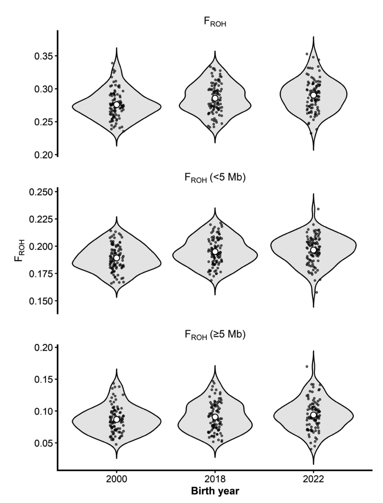
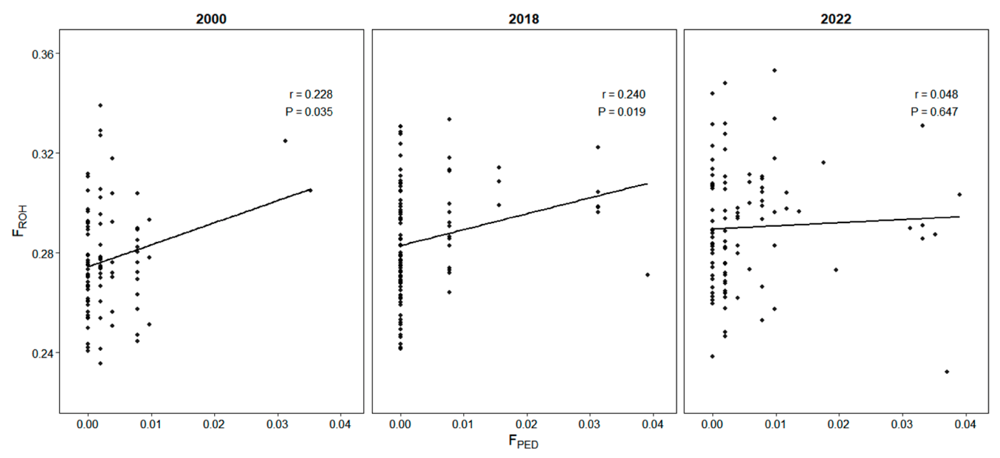

# Genetic diversity and genomic inbreeding trends in the Japanese Thoroughbred population

## Metadata

| Field                          | Value                                                                                                 |
| ------------------------------ | ----------------------------------------------------------------------------------------------------- |
| Journal                        | J. Equine Sci. **37**(3): 77–84, 2026                                                                 |
| docid                          | `37_2607`                                                                                             |
| Article type                   | Full Paper                                                                                            |
| Authors                        | Taichiro ISHIGE¹\*, Koki KAWATE¹, Mio KIKUCHI¹, Risako FURUKAWA¹, Teruaki TOZAKI¹ and Hironaga KAKOI¹ |
| Affiliations                   | ¹Genetic Analysis Department, Laboratory of Racing Chemistry, Tochigi 320-0851, Japan                 |
| Received / Accepted / Released | 2026-02-12 / 2026-05-01 / —                                                                           |
| Corresponding author           | Taichiro ISHIGE; t-ishige@lrc.or.jp                                                                   |
| Keywords                       | genetic diversity, genomic inbreeding, runs of homozygosity, SNP array, Thoroughbred                  |
| PDF                            | https://www.jstage.jst.go.jp/article/jes/37/3/37_2607/_pdf/-char/en                                   |
| Source file                    | `37_2607.pdf` (8 pages)                                                                               |
| Copyright                      | ©2026 Japanese Society of Equine Science                                                              |
| License                        | CC-BY-NC-ND 4.0: https://creativecommons.org/licenses/by-nc-nd/4.0/                                   |

<!-- Full-text transcription from the supplied PDF. Only layout, line wrapping, and typographic markup are normalized. Figures are reproduced from the PDF; tables and references are transcribed in full. No summary or independent interpretation is added. -->

## Abstract (verbatim)

> Thoroughbreds are maintained under a closed studbook and have undergone intense selection for racing performance, potentially reducing genetic diversity and increasing inbreeding. As inbreeding can adversely affect fitness, monitoring inbreeding levels and conserving genetic diversity are essential. In this study, we assessed the temporal changes in genomic diversity and genomic inbreeding in Japanese Thoroughbreds using high-density single nucleotide polymorphism (SNP) genotyping. We genotyped 96 foals born in each of the years 2000, 2018, and 2022 using a 670 K Axiom Equine Genotyping Array, excluding two samples due to insufficient genotypic information. After quality control, we retained 363,301 autosomal SNPs for downstream analysis. Per-locus expected heterozygosity (mean ± standard deviation [SD]) revealed only a slight decline across the cohorts: 0.309 ± 0.156, 0.305 ± 0.158, and 0.304 ± 0.159 for 2000, 2018, and 2022, respectively, with a statistically significant but negligible effect size (η²=0.00019). Runs of homozygosity (ROH) covered approximately 27.5%, 28.5%, and 29.0% of the autosomal genome in the three cohorts. Genomic inbreeding, estimated from the mean ROH-based inbreeding, increased from 0.276 ± 0.021 in 2000 to 0.286 ± 0.023 and 0.290 ± 0.024 in 2018 and 2022, respectively. The per-generation increase (assuming an 11-year generation interval) was higher in 2018–2022 (1.10 percentage points/generation) than in 2000–2018 (0.611 percentage points/generation), driven mainly by increased long ROH (≥5 Mb) length. Our results indicate a modest reduction in genome-wide diversity and recently accelerated genomic inbreeding in the Japanese Thoroughbred population, supporting the need for continued SNP genotyping-based monitoring.

## Introduction

Thoroughbreds have been intensively improved through selective breeding, with racing performance as a major selection criterion. Consequently, selection has often favored the retention of bloodlines from high-performing and popular sires [17]. In certain cases, mates are intentionally selected so that multiple ancestors are duplicated within recent generations to concentrate favorable alleles [17]. Consistent with this breeding structure, genome-wide SNP data demonstrated that the genetic diversity of modern Thoroughbreds is relatively low [19]. Such selection reduces the effective number of founders relative to randomly mating populations [4, 17] and could reduce the effective population size (Ne) [2, 8]. Inbreeding enhances the probability of recessive deleterious alleles becoming homozygous and causing inbreeding depression, thereby reducing individual fitness [5, 12]. In livestock, such as cattle and sheep, each 1% increase in pedigree-based inbreeding is estimated to reduce the mean of the selected traits by approximately 0.13% [5]. Therefore, maintaining genetic diversity without excessively increasing inbreeding is essential for sustainable breeding and management of this species. Although inbreeding is occasionally used for homozygosity enhancement and favorable allele fixing while facilitating the purging of deleterious variants, a rapid rise in inbreeding could overwhelm purging and increase the burden of deleterious recessive alleles [7, 10]. The origin and evolution of deleterious mutations in horses under domestication and selective breeding have already been reviewed [18]. Accordingly, monitoring the level and rate of inbreeding is important [2, 8].

Recently, genomic surveys have been applied to monitor the inbreeding and genetic diversity of Thoroughbred horse populations in multiple countries [12, 17]. These studies have described reduced mean heterozygosity and increased inbreeding coefficients derived from a large number of single nucleotide polymorphism (SNP) markers. In addition, runs of homozygosity (ROH) have been used to quantify individual- and population-level inbreeding in higher detail and characterize recent increases in genomic inbreeding within populations.

ROH are contiguous homozygous segments inherited identically by descent from common ancestors, distributed across the genome, and correlated with inbreeding. In large populations, ROH tend to be shorter and less frequent, whereas in isolated populations with smaller Ne or higher inbreeding levels, they are longer and more numerous [19]. In livestock, ROH have also been associated with livestock production traits [6, 9, 20]. Pedigree-based inbreeding coefficients (FPED) estimate the expected probability of identity by descent (IBD) from known ancestors, although they do not directly capture actual genomic homozygosity. In contrast, ROH-based inbreeding coefficients (FROH) directly quantify observed homozygous regions across the genome. However, ROH may include both IBD and identity-by-state segments, and FROH estimates vary depending on the parameter settings used to define ROH. Despite these limitations, FROH remains widely used as a practical measure of genomic inbreeding in Thoroughbred populations [17]. As ROH length distributions contain information about the timing of inbreeding (ancient vs. recent), FROH is widely used to evaluate inbreeding and demographic history.

In Japan, the Thoroughbred population reportedly displays reduced mean heterozygosity based on a 16–17-locus short tandem repeat parentage panel [15]. Although previous studies in Japanese Thoroughbreds have analyzed genetic diversity using FPED and FROH inbreeding measures [14], the temporal dynamics of genomic inbreeding and associated changes in Ne have not been comprehensively evaluated.

In this study, we performed high-density SNP analyses of Japanese Thoroughbred cohorts born in 2000 and more recently (2018) to assess the temporal changes in heterozygosity and ROH-based inbreeding rates. Moreover, we evaluated a contemporary cohort born in 2022 to provide baseline information for maintaining future genetic diversity.

## Materials and Methods

### Animals

This study comprised 288 Thoroughbred foals, with 96 foals sampled from each cohort in 2000, 2018, and 2022, respectively. For each cohort, the animals were randomly selected from horses stabled at the Japan Racing Association (JRA) training centers (n=1,826, 4,296, and 4,571 for the 2000, 2018, and 2022 cohorts, respectively). Random sampling was performed to ensure equal numbers of males and females in each cohort using the RAND function in Microsoft Excel (Microsoft Inc., Redmond, WA, USA). For the selected animals, residual blood samples remaining after routine physical examination and genetic testing were collected. Blood sampling was performed by experienced equine veterinarians. All procedures involving animals in the present study were approved by the Committee for Animal Research and Welfare of the Laboratory of Racing Chemistry (20-04). This study followed the Animal Research: Reporting of In Vivo Experiments (ARRIVE) guidelines (https://arriveguidelines.org/arrive-guidelines).

### Pedigree-based inbreeding coefficients

The FPED was calculated using five-generation pedigree information provided by the Japan Association for International Racing and Stud Book (JAIRS). Pedigree data were processed using the R package kinship2 (v1.9.6.2) [22, 24], and the pedigree-based kinship matrix was used to estimate inbreeding coefficients as F=2Kii − 1, where Kii represents the diagonal element of the kinship matrix for each individual. Individuals with unknown parents were treated as having missing parental information.

Analyses were restricted to focal individuals within each cohort (n=1,826, 4,296, and 4,571 for the 2000, 2018, and 2022 cohorts, respectively). Of these individuals, 96 individuals per cohort were SNP-genotyped, whereas the remaining individuals were non-genotyped (n=1,730, 4,200, and 4,475 for the 2000, 2018, and 2022 cohorts, respectively). To assess potential sampling bias, individuals were classified as SNP-genotyped or non-genotyped based on the availability of SNP array data, and FPED values were compared between these groups. Group differences were assessed using Welch’s t-test, and the Wilcoxon rank-sum test was used as a non-parametric alternative. A two-sided significance level of α=0.05 was used.

### Genotyping

Genomic DNA for high-density SNP genotyping was extracted from whole-blood samples from 288 foals using a QIAcube Connect instrument and DNeasy Blood & Tissue Kit (Qiagen, Hilden, Germany). DNA integrity was assessed using agarose gel electrophoresis. DNA concentration was measured using a Qubit fluorometer (Thermo Fisher Scientific, Waltham, MA, USA), and the samples were diluted to a concentration of 10 ng/µl. Genome-wide SNP genotyping was performed using the Axiom Equine Genotyping Array (Thermo Fisher Scientific, Waltham, MA, USA), which assays approximately 670,000 SNPs.

### Genotyping SNP selection and quality control

SNP data from the 2000, 2018, and 2022 cohorts were processed using the Axiom Analysis Suite (Thermo Fisher Scientific, Waltham, MA, USA) to retain only the autosomal SNPs. SNPs with minor allele frequencies <1% and SNPs/samples with genotype call rates <99% were excluded from the analyses. After quality control, a total of 363,301 SNPs were retained for subsequent analyses.

### Heterozygosity and ROH-based inbreeding analyses

The observed (Ho) and expected (He) heterozygosities were calculated from the filtered genotypes using PLINK v1.90b (–hardy) [21]. Differences in the mean and variance of per-locus heterozygosity among cohorts were assessed using one-way ANOVA and Levene’s (mean-centered) and Brown–Forsythe (median-centered) tests. The effect size (η²) was calculated based on the ANOVA sum of squares. These statistical analyses were performed using the R software (v4.3.1) [22]. Levene’s and Brown–Forsythe tests were conducted using the car (Companion to Applied Regression) package.

To facilitate comparison with published data, ROH were detected using the approach described by Hill et al. [12]. ROH were called using PLINK v1.90b (–homozyg) with a minimum length of 300 kb and the following parameters: –homozyg-window-snp 30, –homozyg-snp 30, –homozyg-kb 300, –homozyg-gap 150, –homozyg-density 100, –homozyg-window-missing 1, and –homozyg-window-het 1. FROH was calculated as the sum of the ROH lengths divided by the autosomal genome length (2,281 Mb). FROH\_short and FROH\_long were calculated as the proportion of the autosomal genome covered by ROH segments <5 Mb and ≥5 Mb, respectively. The 5 Mb cutoff was selected to ensure consistency with the study of Hill et al. [12], thus facilitating direct comparison between studies. This threshold also allows differentiation between ROH likely derived from recent versus more ancient common ancestors. The variance differences in FROH, FROH\_short, and FROH\_long among the cohorts were evaluated using Levene’s and Brown–Forsythe tests. For interval-based evaluation, the per-generation rate of increase in inbreeding (ΔFgen,% per generation) was calculated for each period as ΔFgen=((F2 − F1)/(t2 − t1)) × L × 100, where F1 and F2 are the mean FROH values at times t1 and t2 (in years), respectively, and L is the generation interval. Because (t2 − t1) represents the time interval in years, multiplication by L converts the rate to a per-generation basis. In Japanese Thoroughbreds, the generation interval is typically 10.5–11.5 years [26]; therefore, L was assumed to be 11 years in this study. These statistical analyses were performed in Python v3.11 using the SciPy library. Ne was approximated from the per-generation increase in genomic inbreeding as Ne=1 / (2ΔFgen).

## Results

### Pedigree-based inbreeding coefficients

In the 2000, 2018, and 2022 cohorts, the mean FPED values for the entire population were 0.00334, 0.00315, and 0.00455, while those for SNP-genotyped individuals were 0.00298, 0.00378, and 0.00576, respectively. We observed no significant differences in FPED between SNP-genotyped and non-genotyped individuals in any cohort (Welch’s t-test and Wilcoxon rank-sum test, all P>0.05).

### Heterozygosity

Based on the quality control criteria established in this study, we excluded two horses, one from the 2000 cohort and one from the 2022 cohort, from subsequent analyses owing to low SNP genotype call rates (<99%). The mean per-locus expected heterozygosity (He) (± SD) across autosomal loci was 0.309 ± 0.156 in the 2000 cohort (n=95; 48 males and 47 females), 0.305 ± 0.158 in the 2018 cohort (n=96; 48 males and 48 females), and 0.304 ± 0.159 in the 2022 cohort (n=95; 48 males and 47 females), indicating a slight decline in expected heterozygosity. In contrast, the variance of per-locus heterozygosity differed significantly among the years both in Levene’s and Brown–Forsythe tests (both P<0.001). One-way ANOVA also detected a significant difference in means (P<0.001). However, the effect size remained particularly small (η²=0.00019).

### ROH

The mean ROH length was approximately 1.5 Mb in the 2000, 2018, and 2022 cohorts, with maximum ROH lengths of 40.2, 32.8, and 56.1 Mb, respectively. ROH collectively covered approximately 27.5%, 28.5%, and 29.0% of the autosomal genome in the three cohorts, being comparable with the values reported for Australian/New Zealand and European Thoroughbred populations [12]. ROH_short (<5 Mb) comprised 94.4%, 94.2%, and 94.1% of the total number of ROH segments in the 2000, 2018, and 2022 cohorts, respectively, and the mean ROH_short lengths were 1.08, 1.10, and 1.10 Mb, displaying little change between the cohorts. In contrast, ROH_long (≥5 Mb) accounted for 5.6%, 5.8%, and 5.9% of the total number of ROH segments and increased slightly from 2000 to 2022. The mean ROH_long lengths were 8.36, 8.33, and 8.43 Mb, respectively. These patterns indicate an increased relative contribution of long ROH in the 2022 cohort.

### FROH and Ne

The mean FROH values were 0.276, 0.286, and 0.290 for the 2000, 2018, and 2022 cohorts, respectively (Fig. 1; Table 1). Although the standard deviations increased slightly over time (0.021, 0.023, and 0.024, respectively), neither Levene’s nor Brown–Forsythe tests supported significant differences in variance among cohorts (Levene, F=1.33, P=0.27; Brown–Forsythe, F=1.38, P=0.25). Similarly, the variance differences were not significant for FROH\_short or FROH\_long (P>0.30). Assuming an 11-year generation interval, ΔFgen was 0.611% per generation for 2000–2018, 1.100% per generation for 2018–2022, and 0.700% per generation for 2000–2022 (Table 2), indicating a decline in the Ne. Based on Supplementary Fig. S4 of Hill et al. [12], we estimated the mean FROH values to be approximately 0.278 and 0.287 for Australian/New Zealand cohorts born in 2000 and 2018, respectively, and approximately 0.272 and 0.292 for European cohorts, with corresponding per-generation increases of 0.550% and 1.220%, respectively (Table 2). The estimated Ne values were 81.8 for 2000–2018, 45.5 for 2018–2022, and 71.4 for 2000–2022.

**Fig. 1.** Distribution of genomic inbreeding coefficients estimated from runs of homozygosity (FROH) across three birth cohorts (2000, 2018, and 2022).

The top, middle, and bottom panels depict total FROH, FROH derived from short ROH segments (<5 Mb), and FROH derived from long ROH segments (≥5 Mb), respectively. Violin plots illustrate the distribution of values within each cohort, and individual data points are overlaid. White circles indicate mean values.

### FROH\_short and FROH\_long

The FROH\_short values were 0.189, 0.195, and 0.197 in the 2000, 2018, and 2022 cohorts, whereas the FROH\_long values were 0.087, 0.091, and 0.094, respectively (Table 1). Although the standard deviations increased slightly with birth year for both FROH\_short (0.012, 0.013, and 0.013) and FROH\_long (0.021, 0.023, and 0.024), variance differences remained non-significant across the cohorts (FROH\_short, Levene F=0.157, P=0.855; Brown–Forsythe F=0.138, P=0.871; FROH\_long, Levene F=1.155, P=0.316; Brown–Forsythe F=1.131, P=0.324). ΔFgen for FROH\_short was 0.367% (2000–2018), 0.275% (2018–2022), and 0.350% (2000–2022), whereas ΔFgen for FROH\_long was 0.244%, 0.825%, and 0.350% for the same periods (Table 2).

Based on Supplementary Fig. S4 of Hill et al. [12], we estimated the mean FROH\_short values to be approximately 0.198 and 0.196 in the Australian/New Zealand cohorts and 0.192 and 0.197 in the European cohorts for 2000 and 2018 births, respectively. The corresponding mean FROH\_long values were approximately 0.080 and 0.090 and 0.081 and 0.098 for the Australian/New Zealand and Europe cohorts, respectively. For 2000–2018, ΔFgen was −0.092% for FROH\_short and 0.611% for FROH\_long in the Australian/New Zealand cohorts, respectively, whereas the corresponding values in the European cohorts were 0.306% and 1.010% (Table 2). Taken together, both FROH\_short and FROH\_long revealed increasing trends across multiple regions, with the Japanese Thoroughbred population exhibiting a trend similar to that of other populations.

**Table 1.** FROH, FROH\_short, and FROH\_long in foal cohorts born in 2000, 2018, and 2022

| Birth year (n) | FROH Mean | FROH SD | FROH\_short (<5 Mb) Mean | FROH\_short (<5 Mb) SD | FROH\_long (≥5 Mb) Mean | FROH\_long (≥5 Mb) SD |
| -------------- | -------------------- | ------------------ | ----------------------------------- | --------------------------------- | ---------------------------------- | -------------------------------- |
| 2000 (95)      | 0.276                | 0.021              | 0.189                               | 0.012                             | 0.087                              | 0.021                            |
| 2018 (96)      | 0.286                | 0.023              | 0.195                               | 0.013                             | 0.091                              | 0.023                            |
| 2022 (95)      | 0.290                | 0.024              | 0.197                               | 0.013                             | 0.094                              | 0.024                            |

**Table 2.** Per-generation increases in FROH (ΔFgen) for 2000–2018, 2018–2022, and 2000–2022

| Population             | 2000–2018 FROH | 2000–2018 FROH\_short | 2000–2018 FROH\_long | 2018–2022 FROH | 2018–2022 FROH\_short | 2018–2022 FROH\_long | 2000–2022 FROH | 2000–2022 FROH\_short | 2000–2022 FROH\_long |
| ---------------------- | ------------------------- | -------------------------------- | ------------------------------- | ------------------------- | -------------------------------- | ------------------------------- | ------------------------- | -------------------------------- | ------------------------------- |
| Japan                  | 0.611%                    | 0.367%                           | 0.244%                          | 1.100%                    | 0.275%                           | 0.825%                          | 0.700%                    | 0.350%                           | 0.350%                          |
| Australian/New Zealand | 0.550%                    | −0.092%                          | 0.611%                          | ND                        | ND                               | ND                              | ND                        | ND                               | ND                              |
| Europe                 | 1.220%                    | 0.306%                           | 1.010%                          | ND                        | ND                               | ND                              | ND                        | ND                               | ND                              |

Generation interval (Thoroughbred population): 11 years (mean, 10.5–11.5 years). ND: No data. Values for Australian/New Zealand and Europe were estimated from Supplementary Fig. S4 in Hill et al. [12].

### Relationship between FPED and FROH

We evaluated the relationship between FPED and FROH among SNP-genotyped individuals. We observed weak but significant positive correlations in the 2000 and 2018 cohorts (2000, r=0.228, P=0.035; 2018, r=0.240, P=0.019), whereas we noted no significant correlation in the 2022 cohort (r=0.048, P=0.647; Fig. 2).

**Fig. 2.** Inbreeding estimates for each individual based on five-generation pedigree (x-axis) compared with those estimated from genome-wide ROH (y-axis).

## Discussion

In this study, we genotyped 288 Japanese Thoroughbred foals born in 2000, 2018, and 2022 using high-density single nucleotide polymorphism (SNP) arrays. Comparing mean heterozygosity and ROH-based inbreeding coefficients across cohorts revealed (i) a slight but consistent reduction in mean heterozygosity (2000 >2018 >2022), (ii) an increase in mean FROH over the same period without a detectable variance change, and (iii) a relative enrichment of ROH_long in the 2022 cohort.

The slight reduction in per-locus heterozygosity observed in our study is consistent with previous studies demonstrating that Thoroughbreds, a closed-studbook breed, exhibit relatively low genetic diversity due to limited founder variation and restricted gene flow [12, 17]. However, the effect size for differences in mean per-locus heterozygosity among cohorts was extremely small in our study (η²=0.00019), indicating that the statistical significance reflects a negligible proportion of explained variance. Although statistically significant, the effect size was negligible, indicating that the magnitude of change in genome-wide heterozygosity across cohorts is minimal. However, this effect size is not directly related to the estimation of Ne, which was inferred independently from the rate of increase in genomic inbreeding (ΔFgen).

Ne serves as a widely used indicator of genetic diversity, allowing comparisons among populations. In the present study, we estimated Ne from the rate of increase in genomic inbreeding based on FROH, yielding values of 81.8 (2000–2018), 45.5 (2018–2022), and 71.4 (2000–2022). Notably, as ΔFgen captures recent changes over relatively short time intervals, the resulting Ne estimates reflect short-term realized Ne rather than long-term historical estimates. Our estimates are lower than or comparable to previously reported Ne values for Thoroughbred populations (typically 80–300), derived from pedigree- or LD-based approaches [3, 4, 17]. However, our estimates represent recent realized Ne inferred from interval-specific changes in genomic inbreeding, whereas LD-based estimates reflect longer historical timescales. Therefore, direct quantitative comparisons between these approaches should be interpreted with caution. Overall, these findings support the conclusion that genetic diversity has only modestly declined over the study period. Notably, this interpretation is independent of the inferred reduction in Ne, which stems from the observed increase in FROH. In parallel, the increase in mean FROH, occurring primarily as a shift in the population mean, suggests that autozygosity may be gradually accumulating across individuals rather than concentrating in a small number of highly inbred foals. This pattern is compatible with the widespread sharing of common ancestors within a closed population.

In particular, ROH_long increased in the 2022 cohort. In general, long ROH are more strongly influenced by recent common ancestors than short ROH. Therefore, the relative increase in ROH_long suggests that recent shared ancestry contributed disproportionately to autozygosity in the most recent cohort of individuals [19, 23]. In Thoroughbreds, increased recent autozygosity has been attributed to the repeated use of few influential sire lines and continued selection for racing-related traits [17]. In Japan, pedigree-based analyses have indicated that a limited number of major ancestors contribute substantially to recent inbreeding trends. Consistent with this, the repeated use of popular sires and specific bloodlines is likely to shape recent ROH_long patterns [25, 26].

One important implication of the observed autozygosity increase involves the potential for inbreeding depression in fitness-related traits. In European and Australasian/New Zealand Thoroughbreds, higher ROH-based inbreeding has been associated with a reduced probability of ever racing, an effect that appears to be driven disproportionately by recent inbreeding, as captured by long ROH [12]. In North American Thoroughbreds, ROH-based inbreeding has been associated with reduced durability, reflected by fewer race starts [13]. Although we did not directly test associations between ROH metrics and racing-related phenotypes in this study, the accelerating increase in ROH_long from 2018 to 2022 underscores the importance of continued genome-wide monitoring as similar relationships could emerge in the Japanese population.

Beyond racing traits, the observed increase in recent autozygosity might have implications for reproductive efficiency and pregnancy maintenance. In a UK Thoroughbred study, pregnancies lost in mid- and late gestation revealed significantly higher inbreeding metrics than those in the controls, with an increased proportion of long ROH, whereas early pregnancy losses did not exhibit such differences [16]. This finding supports the broader interpretation that long ROH, reflecting recent inbreeding, could increase the risk of homozygosity for deleterious recessive alleles that might compromise fetal viability later in gestation. Taken together, these lines of evidence suggest that, while selection for desirable athletic traits (e.g., loci affecting speed and distance aptitude such as MSTN) continues [11], there is an increasing need in a closed-studbook population to manage harmful genetic effects that are more likely to manifest under increased recent autozygosity levels.

The relatively low FPED values compared with FROH, as well as the weak correlations between these measures, are likely attributable to the limited depth of the five-generation pedigrees used in this study. Such pedigree-based estimates capture only recent inbreeding and tend to underestimate overall genomic autozygosity [1].

We acknowledge that this study has several limitations. First, our sampling was limited to three birth years, thereby limiting our temporal resolution. The sampled horses were obtained from JRA training centers and may therefore represent a performance-biased subset of the population. This could introduce potential ascertainment bias, potentially leading to under- or overestimation of genomic inbreeding levels, particularly if elite lineages are overrepresented in the sampled population; this bias should be considered when interpreting the results. Despite the limited sample size per cohort, the absence of significant differences in FPED between SNP-genotyped and non-genotyped individuals suggests that the sampled individuals are broadly representative in terms of inbreeding. This evidence supports the validity of using the SNP-genotyped subset to infer population-level inbreeding patterns. Second, cross-study comparisons should be interpreted cautiously, as study designs differ (e.g., sample ascertainment, marker density, and analysis settings). ROH inference could depend on marker density and the chosen ROH-calling parameters. However, ROH-based inbreeding estimates derived from high-density SNP arrays have generally indicated strong concordance with whole genome sequencing–based estimates [1]. Finally, while we discussed potential implications for fitness-related traits, we did not directly test the associations between ROH metrics and specific fitness-related phenotypes (e.g., racing performance, durability, and reproductive outcomes). Future studies integrating genome-wide ROH metrics with detailed phenotypes and pedigree/lineage information would be important for designing sustainable breeding strategies in Japanese Thoroughbreds that balance genetic improvement for racing traits and long-term population health.

## Acknowledgments

We thank Tomomi Oya, Miyuki Sakai, Eri Saito, and Masako Nakatani for their assistance with this study. We thank JAIRS for kindly providing the pedigree data of Japanese Thoroughbreds. This study was supported by grants from the Japan Racing Association.

## References

1. Bailey, E., Finno, C.J., Cullen, J.N., Kalbfleisch, T., and Petersen, J.L. 2024. Analyses of whole-genome sequences from 185 North American Thoroughbred horses, spanning 5 generations. Sci. Rep. 14: 22930. [Medline] [CrossRef]
2. Cervantes, I., Goyache, F., Molina, A., Valera, M., and Gutiérrez, J.P. 2008. Application of individual increase in inbreeding to estimate realized effective sizes from real pedigrees. J. Anim. Breed. Genet. 125: 301–310. [Medline] [CrossRef]
3. Corbin, L.J., Blott, S.C., Swinburne, J.E., Vaudin, M., Bishop, S.C., and Woolliams, J.A. 2010. Linkage disequilibrium and historical effective population size in the Thoroughbred horse. Anim. Genet. 41 Suppl 2: 8–15. [Medline] [CrossRef]
4. Cunningham, E.P., Dooley, J.J., Splan, R.K., and Bradley, D.G. 2001. Microsatellite diversity, pedigree relatedness and the contributions of founder lineages to thoroughbred horses. Anim. Genet. 32: 360–364. [Medline] [CrossRef]
5. Doekes, H.P., Bijma, P., and Windig, J.J. 2021. How depressing is inbreeding? A meta-analysis of 30 years of research on the effects of inbreeding in livestock. Genes (Basel) 12: 926. [Medline] [CrossRef]
6. Ferenčaković, M., Sölkner, J., Kapš, M., and Curik, I. 2017. Genome-wide mapping and estimation of inbreeding depression of semen quality traits in a cattle population. J. Dairy Sci. 100: 4721–4730. [Medline] [CrossRef]
7. García-Dorado, A. 2012. Understanding and predicting the fitness decline of shrunk populations: inbreeding, purging, mutation, and standard selection. Genetics 190: 1461–1476. [Medline] [CrossRef]
8. Gutiérrez, J.P., Cervantes, I., Molina, A., Valera, M., and Goyache, F. 2008. Individual increase in inbreeding allows estimating effective sizes from pedigrees. Genet. Sel. Evol. 40: 359–378. [Medline] [CrossRef]
9. Hashemi, M., and Ghavi Hossein-Zadeh, N. 2020. Population genetic structure analysis of Shall sheep using pedigree information and effects of inbreeding on growth traits. Ital. J. Anim. Sci. 19: 1195–1203. [CrossRef]
10. Hedrick, P.W., and Garcia-Dorado, A. 2016. Understanding inbreeding depression, purging, and genetic rescue. Trends Ecol. Evol. 31: 940–952. [Medline] [CrossRef]
11. Hill, E.W., Gu, J., Eivers, S.S., Fonseca, R.G., McGivney, B.A., Govindarajan, P., Orr, N., Katz, L.M., and MacHugh, D.E. 2010. A sequence polymorphism in MSTN predicts sprinting ability and racing stamina in thoroughbred horses. PLoS One 5: e8645. [Medline] [CrossRef]
12. Hill, E.W., Stoffel, M.A., McGivney, B.A., MacHugh, D.E., and Pemberton, J.M. 2022. Inbreeding depression and the probability of racing in the Thoroughbred horse. Proc. Biol. Sci. 289: 20220487. [Medline]
13. Hill, E.W., McGivney, B.A., and MacHugh, D.E. 2023. Inbreeding depression and durability in the North American Thoroughbred horse. Anim. Genet. 54: 408–411. [Medline] [CrossRef]
14. Fawcett, J.A., Sato, F., Sakamoto, T., Iwasaki, W.M., Tozaki, T., and Innan, H. 2019. Genome-wide SNP analysis of Japanese Thoroughbred racehorses. PLoS One 14: e0218407. [Medline] [CrossRef]
15. Kakoi, H., Kikuchi, M., Tozaki, T., Hirota, K.I., and Nagata, S.I. 2019. Evaluation of recent changes in genetic variability in Japanese Thoroughbred population based on a short tandem repeat parentage panel. Anim. Sci. J. 90: 151–157. [Medline] [CrossRef]
16. Lawson, J.M., Shilton, C.A., Lindsay-McGee, V., Psifidi, A., Wathes, D.C., Raudsepp, T., and de Mestre, A.M. 2024. Does inbreeding contribute to pregnancy loss in Thoroughbred horses? Equine Vet. J. 56: 711–718. [Medline] [CrossRef]
17. McGivney, B.A., Han, H., Corduff, L.R., Katz, L.M., Tozaki, T., MacHugh, D.E., and Hill, E.W. 2020. Genomic inbreeding trends, influential sire lines and selection in the global Thoroughbred horse population. Sci. Rep. 10: 466. [Medline] [CrossRef]
18. Orlando, L., and Librado, P. 2019. Origin and evolution of deleterious mutations in horses. Genes (Basel) 10: 649. [Medline] [CrossRef]
19. Petersen, J.L., Mickelson, J.R., Cothran, E.G., Andersson, L.S., Axelsson, J., Bailey, E., Bannasch, D., Binns, M.M., Borges, A.S., Brama, P., da Câmara Machado, A., Distl, O., Felicetti, M., Fox-Clipsham, L., Graves, K.T., Guérin, G., Haase, B., Hasegawa, T., Hemmann, K., Hill, E.W., Leeb, T., Lindgren, G., Lohi, H., Lopes, M.S., McGivney, B.A., Mikko, S., Orr, N., Penedo, M.C.T., Piercy, R.J., Raekallio, M., Rieder, S., Røed, K.H., Silvestrelli, M., Swinburne, J., Tozaki, T., Vaudin, M., M Wade, C., and McCue, M.E. 2013. Genetic diversity in the modern horse illustrated from genome-wide SNP data. PLoS One 8: e54997. [Medline] [CrossRef]
20. Pryce, J.E., Haile-Mariam, M., Goddard, M.E., and Hayes, B.J. 2014. Identification of genomic regions associated with inbreeding depression in Holstein and Jersey dairy cattle. Genet. Sel. Evol. 46: 71. [Medline] [CrossRef]
21. Purcell, S., Neale, B., Todd-Brown, K., Thomas, L., Ferreira, M.A.R., Bender, D., Maller, J., Sklar, P., de Bakker, P.I.W., Daly, M.J., and Sham, P.C. 2007. PLINK: a tool set for whole-genome association and population-based linkage analyses. Am. J. Hum. Genet. 81: 559–575. [Medline] [CrossRef]
22. R Core Team. 2024. R: A Language and Environment for Statistical Computing. R Foundation for Statistical Computing, Vienna. https://www.R-project.org/.
23. Sumreddee, P., Hay, E.H., Toghiani, S., Roberts, A., Aggrey, S.E., and Rekaya, R. 2021. Grid search approach to discriminate between old and recent inbreeding using phenotypic, pedigree and genomic information. BMC Genomics 22: 538. [Medline] [CrossRef]
24. Sinnwell, J.P., Therneau, T.M., and Schaid, D.J. 2014. The kinship2 R package for pedigree data. Hum. Hered. 78: 91–93. [Medline] [CrossRef]
25. Watanabe, M., Sato, F., and Innan, H. 2024. Rising trends of inbreeding in Japanese Thoroughbred horses. J. Equine Sci. 35: 57–61. [Medline] [CrossRef]
26. Yamashita, J., Oki, H., Hasegawa, T., Honda, T., and Nomura, T. 2010. Demographic analysis of breeding structure in Japanese Thoroughbred population. J. Equine Sci. 21: 11–16. [Medline] [CrossRef]

## License notice (verbatim)

This is an open-access article distributed under the terms of the Creative Commons Attribution Non-Commercial No Derivatives (by-nc-nd) License. (CC-BY-NC-ND 4.0: https://creativecommons.org/licenses/by-nc-nd/4.0/)
