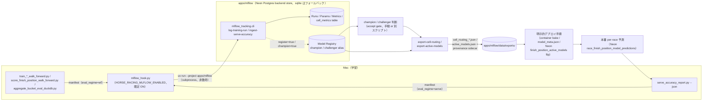

# MLflow トラッキング基盤 仕様書

最終更新: 2026-07-08

本書は、着順予測（finish-position）と脚質予測（running-style）モデルを cell 単位（`category × class × venue × distance_band × season_band × surface × field_size_band`）で管理・評価するための MLflow 基盤（`apps/mlflow` / `apps/mlflow-ui`）の仕様を記述する。

> **実装ステータスに関する注記**: `apps/mlflow` と `apps/mlflow-ui` は本書と並行して実装中である。CLI のサブコマンド名・引数・戻り値の正確な仕様は各パッケージの実装コードを source of truth とし、本書の記述と食い違う場合は実装を正とする。実装完了後、必要に応じて本書を追記修正すること。

---

## 0. 30 秒サマリ

- **目的**: 着順予測・脚質予測モデルの学習 run / cell 単位の評価結果 / model artifact 参照を、cell 粒度（`category × class × venue × distance_band × season_band × surface × field_size_band`）で一元管理する。
- **`apps/mlflow`**: `mlflow-skinny[db]` を使った tracking client library + CLI（`uv run python -m mlflow_tracking.cli ...`）。`mlflow server` プロセスは不要。
- **Backend store**: 2026-07-08 に Neon Postgres（既存 `NEON_PRIMARY_URL` と同一プロジェクト/branch の専用 `mlflow` database）へ移行済み。sqlite（`apps/mlflow/data/mlflow.db`、WAL）は未設定時のフォールバック/開発用として残す。詳細は §2.1 / §9。
- **`apps/mlflow-ui`**: `mlflow server` launcher CLI（`uv run python -m mlflow_ui.cli start|stop|status|plist`）。既定バインドは `127.0.0.1:5252`（macOS の AirPlay Receiver が既定ポート 5000 を占有するため回避）。launchd plist 生成にも対応する。
- **Artifact store**: 現状は local（`apps/mlflow/data/mlartifacts/`）が稼働中の唯一の artifact store。2026-07-08 に Cloudflare R2（バケット `mlflow-artifacts`、prefix `mlflow`、S3 互換 API 経由）への移行を試みたが、既存 R2 credential のバケットスコープ外で `PERMISSION_DENIED` となり同日中に local へロールバック済み（STAGED-BUT-BLOCKED、53 ファイル 28MB は R2 上に up 済みのまま）。詳細は §3。
- **Model Registry**: `{jra,nar,banei}-finish-position`（3）+ `{jra,nar}-running-style`（2）の計 5 registered model。命名規則自体は `{jra,nar,banei}-running-style` の 6 通りをサポートするが、`banei-running-style` は意図的に未登録（Ban-ei に脚質モデルが存在しないため。running-style の対象カテゴリはそもそも jra/nar のみ、`registry.py` の `RS_CATEGORIES` 参照)。alias は `champion`（現行 serving） / `challenger`（staged）の 2 種のみ、legacy stage は使わない。
- **非侵襲設計**: ingestion は既存パイプラインの出力ファイル（metadata.json / manifest / duckdb / json）を読むだけで、Neon への直接接続や既存の学習・推論コードへの変更は不要。

---

## 1. 目的

着順予測・脚質予測は JRA / NAR / Ban-ei の 3 カテゴリで独立したモデル・学習窓・アーキテクチャを持ち（詳細は [`docs/finish-position-prediction-system.md`](./finish-position-prediction-system.md) を参照）、評価は cell 単位（`category × class × venue × distance_band × season_band × surface × field_size_band`）で行う運用が定着している。これまで各 cell の accept/reject 判断は walk-forward 結果の JSON / DuckDB registry（`trial_registry_{category}.duckdb`）や `docs/` 配下の履歴記述に散在しており、run 間の比較や model artifact の由来追跡が手作業に依存していた。

MLflow を導入し、以下を一元化する。

- 学習 run のハイパーパラメータ・aggregate metrics・cell 単位の詳細メトリクスの記録
- model artifact の参照登録（バイナリは既存の配置場所に置いたまま、MLflow は URI 参照のみ持つ）
- champion / challenger の model version 管理

---

## 2. 構成

### 2.1 `apps/mlflow`（tracking client library + CLI）

- 依存: `mlflow-skinny[db]`（フル `mlflow` ではなく skinny + db extra、server 機能は不要なため）。加えて `psycopg2-binary` を明示依存として追加済み（postgresql:// URI がデフォルト経路になったため、`[db]` extra 経由の間接依存に留めない）。
- Backend store: **Neon Postgres**（`mlflow` database、host はプールされていない direct endpoint。既存の `NEON_PRIMARY_URL` と同一 Neon project/branch だが database は分離済みのため alembic 管理テーブルが競馬データの schema と混ざらない）。接続先は環境変数 `HORSE_RACING_MLFLOW_BACKEND_URI` で切り替える（`mlflow_tracking.config.get_tracking_uri()`）。未設定時は sqlite（`apps/mlflow/data/mlflow.db`、WAL）にフォールバックする — テストと、ネットワーク不要のローカル動作はこの経路を使う。
- ローカルの秘密情報は 3 経路で環境変数に反映される。(1) リポジトリルートの `.env`（gitignore 済み）に `HORSE_RACING_MLFLOW_BACKEND_URI` と R2 資格情報を追加し、`direnv` の `dotenv` で自動ロードする既存経路（interactive shell 前提）。(2) `apps/mlflow/.env.local`（gitignore 済み、`apps/mlflow` と `apps/mlflow-ui` の両方から見える共有ファイル）を `mlflow_tracking.config.load_dotenv_local()`（および `mlflow_ui.config` 側の同等関数）が CLI / server 起動時に直接読み込む経路。direnv の interactive shell hook を経由しないため、cron / launchd / subprocess のような非対話呼び出しでも確実に設定を反映できる。(3) 上記 2 経路より下位の第三のフォールバックとして、`load_repo_root_env_fallback()`（`mlflow_tracking.config` / `mlflow_ui.config` の両方に実装済み、各パッケージの `cli.py` の `main()` から `load_dotenv_local()` の直後に呼ばれる）がリポジトリルートの `.env` を direnv を介さず直接パースする。direnv は `.envrc` 編集後に `direnv allow` を再実行しないとサイレントに動かなくなることがある既知の弱点があり（本移行セッション中に実際に発生した）、これに依存しない安全網として追加した。対象は `HORSE_RACING_MLFLOW_` / `MLFLOW_` / `R2_` prefix のキーと、完全一致のみで許可される少数の例外キーに限定した許可リスト方式で、`PC_KEIBA_*` トークンなど同ファイル内のそれ以外の秘密情報には一切触れない。`export KEY=VALUE` 形式の bash 風プレフィックスも許容する。**`apps/mlflow`（`mlflow_tracking.config`）と `apps/mlflow-ui`（`mlflow_ui.config`）の許可リストは意図的に異なる**: `mlflow_tracking.config._ROOT_ENV_ALLOWED_EXACT` は `CLOUDFLARE_ACCOUNT_ID` に加えて `NEON_PRIMARY_URL`（競馬 Neon DB の DSN）も完全一致で許可している — `sync-production` / `eval-champion-cells`（§11 / §12）が読み取り専用で競馬 Neon に接続する必要があるための、この package 限定の狭い例外である（値自体はログ・出力されず、接続は必ず `db.py` 経由で readonly セッションとして開かれる。詳細は `config.py` の `_ROOT_ENV_ALLOWED_EXACT` のコメントを参照）。一方 `mlflow_ui.config._ROOT_ENV_ALLOWED_EXACT` は `CLOUDFLARE_ACCOUNT_ID` のみで、`mlflow-ui` パッケージは競馬 DB DSN を一切 import しない。3 経路とも `os.environ.setdefault` 相当のセマンティクスで、既に設定済みの環境変数の方がファイルの値より常に優先される（呼び出し順は `load_dotenv_local()` → `load_repo_root_env_fallback()` のため、優先順位は 明示的な環境変数 > `apps/mlflow/.env.local` > root `.env` の許可リストキー > ハードコードされたデフォルト値 の順になる）。`env -i PATH=... HOME=... uv run python -m mlflow_tracking.cli log-training-run <manifest>`（launchd ジョブが受け取る環境に近い、完全にスクラッチな環境）でも direnv・事前設定済み環境変数のどちらにも依存せず Neon backend を解決し run を記録できることを検証済み。
- 呼び出し: `uv run python -m mlflow_tracking.cli <subcommand> ...`。サブコマンド一覧は §7 を参照。
- server は起動しない。CLI は `MlflowClient` / tracking API を直接 backend store に対して呼ぶ。

### 2.2 `apps/mlflow-ui`（mlflow server launcher）

- `mlflow server --backend-store-uri <sqlite:///... または postgresql://...> --default-artifact-root ...` を起動する薄いラッパー。`--backend-store-uri` は `mlflow_ui.config.load_config()` が同じ `HORSE_RACING_MLFLOW_BACKEND_URI` を読んで解決する（§2.1 と同一の切り替え）。`psycopg2-binary` を明示依存として追加済み（フル `mlflow` パッケージは postgresql ドライバを同梱しないため）。
- 呼び出し: `uv run python -m mlflow_ui.cli start|stop|status|plist`。
- 既定バインド: `127.0.0.1:5252`。macOS では AirPlay Receiver が既定ポート 5000 を占有するため、MLflow のデフォルトポートではなくこのポートを使う。
- `plist` サブコマンドは launchd の plist ファイルを生成する（`--output` でファイル出力）。常駐 UI が必要な場合にこれを `launchctl load` する運用を想定するが、本書では手順の提示のみに留め、自動登録は行わない（§8）。生成される plist の `EnvironmentVariables` は `HORSE_RACING_MLFLOW_BACKEND_URI` を含む（`mlflow_ui.launchd._CARRIED_ENV_VARS`）。

---

## 3. Artifact store

### 3.1 ローカル（現行の稼働中 artifact store）

`apps/mlflow/data/mlartifacts/` は現在稼働中の artifact store で、モデル・cell メトリクス parquet などの artifact をここに保存する。`apps/mlflow/.env.local` の `HORSE_RACING_MLFLOW_ARTIFACTS_MODE` は現在 `local`（既定値）に設定されており、`resolve_artifact_location()` はこのディレクトリ配下の `file://` URI を返す。2026-07-08 に一度 Cloudflare R2 へ切り替えたが、credential 起因の問題により同日中に local へロールバックしている（経緯は §3.2）。`apps/mlflow/data/` は gitignore 済み（tmp 系ディレクトリを git 管理しない既存ルールに従う、[[feedback_no_tmp_git_tracking]]）。

### 3.2 Cloudflare R2（STAGED-BUT-BLOCKED、2026-07-08 に試行 → 同日ロールバック）

2026-07-08 に artifact store を Cloudflare R2（バケット `mlflow-artifacts`、prefix `mlflow`）へ切り替えを試みた。`apps/mlflow/data/mlartifacts/` 配下の全 53 ファイル（28MB）は `wrangler r2 object put --remote` で新バケットにアップロード済み（全 53 ファイルをローカルとバイト単位で突合済み）で、これは現在も R2 上に残っている（この部分はロールバックしておらず、やり直し不要）。続けて Neon 側の `experiments.artifact_location`（5 行）/ `runs.artifact_uri`（99 行）を `s3://mlflow-artifacts/mlflow/...` に書き換えて `mlflow-ui` を R2 モードで再起動したところ、`mlflow server` の boto3 S3 client が既存の `R2_ACCESS_KEY_ID` / `R2_SECRET_ACCESS_KEY`（本リポジトリの `pc-keiba-features-archive` バケット用に発行済みの資格情報）で新バケット `mlflow-artifacts` への読み書きともに `PERMISSION_DENIED` になることが判明した。この資格情報は Cloudflare R2 API token レベルで `pc-keiba-features-archive` のみにスコープされており account-wide ではない。これはアップロードに使った `wrangler` CLI の account-level 認証とは別系統の credential であり、wrangler が成功したことは boto3 側の成功を意味しない。

このため Neon 側の URI は同日中に元の local パス（`file:///Users/kkk4oru/ghq/github.com/kkkaoru/horse-racing-data/apps/mlflow/data/mlartifacts`）へロールバック済み（experiments 5 件・runs 99 件、query で `s3://mlflow-artifacts` を参照する行が 0 件であることを確認済み）で、`apps/mlflow/.env.local` の `HORSE_RACING_MLFLOW_ARTIFACTS_MODE` も `r2` から `local` に戻し、`mlflow-ui` を local モードで再起動している（この状態が §3.1 の現行稼働状態）。

**現状は STAGED-BUT-BLOCKED**: R2 上のオブジェクトはそのまま使える状態で待機しており、再開に必要なのは (a) 既存 R2 API token のバケットスコープを `mlflow-artifacts` にも広げる、またはこのバケット専用の新規 R2 API token を発行する（Cloudflare ダッシュボード側の作業、本セッションのスコープ外）、(b) `apps/mlflow/.env.local` の `HORSE_RACING_MLFLOW_ARTIFACTS_MODE` を `r2` に戻す、(c) 上記と同じ Neon `experiments.artifact_location` / `runs.artifact_uri` の書き換えを再実行する、の 3 手順のみで、データの再アップロードは不要。

有効化する場合、R2 は S3 互換 API を持つため以下の環境変数（`HORSE_RACING_MLFLOW_ARTIFACTS_MODE=r2` を含む）を設定する。

| 変数                                          | 用途                                                                                         |
| --------------------------------------------- | -------------------------------------------------------------------------------------------- |
| `HORSE_RACING_MLFLOW_ARTIFACTS_MODE=r2`       | artifact store を R2 に切り替えるフラグ                                                      |
| `HORSE_RACING_MLFLOW_R2_BUCKET`               | R2 バケット名                                                                                |
| `HORSE_RACING_MLFLOW_R2_PREFIX`               | バケット内 prefix                                                                            |
| `MLFLOW_S3_ENDPOINT_URL`                      | `https://<account_id>.r2.cloudflarestorage.com`（R2 の S3 互換エンドポイント）               |
| `AWS_ACCESS_KEY_ID` / `AWS_SECRET_ACCESS_KEY` | R2 API token をマップした資格情報（MLflow の S3 artifact repository がこの変数名を読むため） |

モデルバイナリそのものは MLflow 経由でアップロードしない。`create_model_version(source=<URI>)` により既存の配置場所（例: `apps/finish-position-predict-container/models/finish-position/{category}/{version}/model.json`）への参照のみを登録する。local URI（`file://`）を model version source として使う場合は `MLFLOW_ALLOW_FILE_URI_AS_MODEL_VERSION_SOURCE=true` が必要。R2 上に置く場合は `s3://` URI を使う。

---

## 4. Model Registry 規約

- registered model 名: `{jra,nar,banei}-finish-position` / `{jra,nar,banei}-running-style`（計 6 種）。
- alias: `champion`（現行 serving が参照する version） / `challenger`（staged、検証中の version）の 2 種のみを使う。MLflow legacy stage（Production/Staging/Archived）は使わない。
- per-class ensemble（例: NAR の旧 per-class routing、[[project_nar_etop2_perclass_routing_2026_06_19]] 参照）は version 単位ではなく version tags（`class_code` など）と manifest artifact（routing JSON）の組み合わせで表現する。1 class = 1 registered model version にはしない。

---

## 5. Experiments

以下の experiment を既定で用意する（`mlflow_tracking.config.ALL_EXPERIMENT_NAMES` が正、`init` サブコマンドが全件を作成する）。

- `finish-position/registry-backfill`
- `finish-position/wf-eval`
- `finish-position/serve-accuracy`
- `running-style/registry-backfill`
- `running-style/eval`
- `timelines`（task × category 単位で 1 run が育ち続ける、精度トレンドのグラフ化用。§10.1 / §11 参照）
- `finish-position/production-usage`（§11 の `sync-production` が記録する本番配信の使用実績）
- `running-style/production-usage`（同上、running-style 版）
- `finish-position/champion-eval`（§12 の `eval-champion-cells` が記録する champion の cell 単位評価）
- `running-style/champion-eval`（同上、running-style 版）

---

## 6. Cell 評価の記録形式

cell 単位の評価は 1 レース分・1 cell 分の粒度になると数が多く（[[feedback_eval_class_subgroup_mandatory]] の cell 定義に従うと class × subgroup × racetrack × season × surface の組み合わせが多数生じる）、run の metrics として素朴に全件 `log_metric` すると API 呼び出し数が膨れる。そのため以下の二重化を行う。

- **aggregate metrics（~20〜50 件）**: cell を横断した集計値（category 全体の top1 / place2 / place3 / top3_box など、[[feedback_eval_rank_1_to_6]] の rank 1〜6 集計を含む）を `log_batch`（1 回あたり最大 1000 件）で chunk して記録する。
- **全 cell table**: `mlflow.log_table` で `cell_metrics.json` として記録する（MLflow UI の Evaluation タブで閲覧可能）。加えて `cell_metrics.parquet` を artifact として同時に保存し、後段の分析（DuckDB からの直接読み込みなど）に使えるようにする。

**cell table 同士の直接比較には注意**: `running-style/eval`（`ingest-local-pg-running-style-buckets` 経由、§7）の per-training cell report は、`kyori` / `kyoso_shubetsu_code` / `track_code` のような pre-canonical な raw カラム名で書かれており、これは `cells.py` の `CELL_KEY_COLUMNS`（`venue` / `class_code` / `distance_band` / ...）が前提とする正規化済みスキーマとは異なる。§12 の `eval-champion-cells` が書く champion-cells 側のテーブルは正規化済みカラムで統一されているため、この 2 系統を素朴に同じキーで join することはできない。`cells.COLUMN_ALIASES`（現時点では `keibajo_code`→`venue`、`kyori_band`→`distance_band`、`current_baba_condition`/`baba_condition`→`track_condition`、`kyoso_joken_code`→`class_code`）が variant なカラム名を正規化する仕組みだが、running-style 側のような他の raw カラム名を橋渡しする対応表は今後も随時追加されていく前提であり、`cells.py` を都度 source of truth として確認すること。

---

## 7. Ingestion

Ingestion は既存パイプラインが出力するファイルを読むだけの非侵襲設計であり、Neon への直接接続は行わない。

| CLI サブコマンド（想定名）                     | 入力                                                                                                                                                               | 用途                                                                                           |
| ---------------------------------------------- | ------------------------------------------------------------------------------------------------------------------------------------------------------------------ | ---------------------------------------------------------------------------------------------- |
| `backfill-finish-position`                     | `apps/finish-position-predict-container/models/finish-position/**/metadata.json` + per-class manifest + `model_meta.json`（champion 同期用） + `cell_routing.json` | 既存の着順予測 model artifact 群を registry に一括登録                                         |
| `ingest-trial-registry <duckdb>`               | `trial_registry_{category}.duckdb`                                                                                                                                 | walk-forward trial 履歴を run として取り込み                                                   |
| `ingest-serve-accuracy <json>`                 | `serve_accuracy_report.py --json` の出力                                                                                                                           | 本番 serve 精度レポートを run として取り込み                                                   |
| `log-eval <path>`                              | `retest_wf.py` 系の汎用 cell-metrics レポート（parquet または json）                                                                                               | 任意の cell 単位評価結果を run として取り込み                                                  |
| `backfill-running-style`                       | 脚質予測側の model artifact / cell routing                                                                                                                         | running-style 版の backfill（finish-position と同じ CLI 内）                                   |
| `ingest-local-pg-model-evaluations <path>`     | local PostgreSQL replica の `model_prediction_evaluations` テーブルを事前 export した parquet/json（DB への直接接続はしない）                                      | 着順予測の offline walk-forward bucket-eval 履歴を run として取り込み（既定 `eval_regime=wf`） |
| `ingest-local-pg-running-style-buckets <path>` | 同 replica の `running_style_model_bucket_evaluations` テーブルを事前 export した parquet/json                                                                     | 脚質予測の offline walk-forward bucket-eval 履歴を run として取り込み（既定 `eval_regime=wf`） |

上記のサブコマンド名・引数は実装中の暫定名であり、§0 の注記の通り実装コードを正とする。

---

## 8. 運用

- 初回セットアップ: `init` サブコマンド（experiment 作成・backend store 初期化）を実行する。
- 日次の serve-accuracy ingest は、既存の Mac launchd cron（[[project_finish_position_local_cron_macos_launchd]]）に呼び出しを追加することで自動化できる。本書では手順の提示に留め、自動登録は行わない。
- UI を常駐させる場合は `mlflow-ui start` を都度実行するか、`mlflow-ui plist --output <path>` で生成した plist を `launchctl load` して launchd 常駐化する。

---

## 9. 注意点

- `apps/mlflow/data/` は gitignore 済み（sqlite backend store・artifact store・ログ・pid ファイルを含む）。tmp 系ディレクトリを git 管理しない既存ルール（[[feedback_no_tmp_git_tracking]]）に従う。
- sqlite フォールバック時は単一 writer を前提とする。複数プロセスから並列に大量ログを書く場合は、書き込みを 1 プロセスに集約すること（同時書き込みによる sqlite ロック競合を避けるため）。Neon Postgres backend では通常の RDBMS の同時実行制御に従うため、この制約はない。
- **`mlflow server` のバックグラウンドジョブは無効化済み**: インストール済み `mlflow` パッケージのソースを確認したところ、`mlflow server` は既定で huey ベースのバックグラウンドワーカーを起動し、`online_scoring_scheduler` / `trace_archival_scheduler` の 2 タスクを毎分（60 秒間隔）backend store に対してクエリしながら実行する。本リポジトリは GenAI 系の online scoring / trace archival 機能を一切使わないが、この毎分クエリが Neon serverless compute の auto-suspend を妨げ続け、意図しない compute-hour 課金の原因になる。そのため `mlflow_ui.config.server_env()` は、operator が既に明示的に設定していない限り `MLFLOW_SERVER_ENABLE_JOB_EXECUTION=false` を spawn 先の `mlflow server` subprocess の環境へ常に含める（local / r2 いずれの artifact mode でも同様。backend store 側の設定であり artifact mode とは無関係）。再起動後、huey consumer および `_job_runner` / `_periodic_tasks_consumer` プロセスが uvicorn worker と並んで起動しなくなったことを確認済み。
- **Artifact store は現状 local が稼働中**（§3.1、`apps/mlflow/data/mlartifacts/`）。2026-07-08 に Cloudflare R2（バケット `mlflow-artifacts`、prefix `mlflow`）への移行を試みたが、`mlflow server` の boto3 client が既存 R2 credential のバケットスコープ外で `PERMISSION_DENIED` になったため、Neon 側の URI 書き換え・env 設定ともに同日中に local へロールバックした（§3.2）。アップロード済みの 53 ファイルは R2 上に残っており、STAGED-BUT-BLOCKED の状態でバケットスコープ付き credential の発行待ちとなっている。

### 9.1 Neon Postgres backend への移行（2026-07-08）

- **移行元**: `apps/mlflow/data/mlflow.db`（sqlite、WAL）。移行後もこのファイルは削除せず、スナップショットとしてディスク上に残してある。**訂正（2026-07-11、§15 参照）**: 「移行後は書き込まれない凍結スナップショット」という想定は誤りだった — `config.load_dotenv_local()` を呼ばずに `MlflowClient` を直接構築する ad-hoc スクリプトは `get_tracking_uri()` のフォールバックによりこのファイルへ**サイレントに**書き込み続けており、実際に移行後も run が蓄積している（発覚時点で 103 run）。「sqlite = 過去の凍結データ」と思い込まず、疑わしい run は必ず生 SQL でどちらの store に着地したか確認すること。
- **移行先**: 既存 Neon project（`NEON_PRIMARY_URL` と同一 project/branch、`ep-frosty-cloud-ao28v17l`）内に新規作成した `mlflow` database。`CREATE DATABASE mlflow` は `neondb_owner` ロールで実行し成功（racing 用の `neondb` database とは完全に分離）。
- **スキーマ初期化**: `uv run mlflow db upgrade <postgres_uri>`（alembic）。sqlite 側と同じ `mlflow-skinny==3.14.0` から生成したため、テーブル一覧・`alembic_version`（`b7e4c1a90f23`）・既定 `workspaces` 行まで完全一致した。
- **データ移行**: 一回限りの migration script（リポジトリには含まれない、scratchpad 上のみ）で FK 安全な順序（`workspaces → experiments → experiment_tags → runs → metrics/latest_metrics/params/tags → registered_models → model_versions → model_version_tags/registered_model_tags/registered_model_aliases → datasets/inputs/input_tags`）で `INSERT ... ON CONFLICT DO NOTHING` によりコピーした。`experiments.experiment_id` の identity sequence は移行後に `MAX(experiment_id)` へ再設定済み。
- **検証**: `MlflowClient` を sqlite 側・Neon 側の両方に向けて experiment 別 run 件数・registered model 別 version 件数・5 個の champion alias（`jra/nar/banei-finish-position`, `jra/nar-running-style`）を突合し、全項目一致を確認した。書き込み経路も `log-training-run`（synthetic smoke manifest）で確認し、Neon への書き込みが即座にローカル UI（`127.0.0.1:5252`）に反映されることを確認済み。
- **Hyperdrive**: Cloudflare Worker から同じ `mlflow` database を読む用途で Hyperdrive config `mlflow-store` を作成済み（direct/非 pooler endpoint を指す — `pc-keiba-viewer-neon` と同じパターン）。Worker への配線は別タスクのスコープ。

---

## 10. local ↔ 本番ループ（実装・検証済み）

§7〜9 で説明した ingestion は個別 CLI の直接実行を前提としていたが、学習・評価パイプライン側には常時 ON の hook を追加し、export 側には本番投入直前までの生成物を作る CLI を追加した。以下はこの両端を実装・検証済みの状態として記述する（§0 の実装ステータス注記のとおり、コードと食い違えば実装を正とする）。

### 10.1 学習側 hook（pc-keiba-viewer → MLflow）

`apps/pc-keiba-viewer/src/scripts/mlflow_hook.py` は、pc-keiba-viewer に MLflow（や他の）依存を一切追加せずに `apps/mlflow` へ結果を転送するための薄いアダプタである。学習・評価スクリプトの完了地点で呼び出され、以下の 5 スクリプトに hook が組み込み済み:

| スクリプト                                       | `eval_regime` |
| ------------------------------------------------ | ------------- |
| `train_finish_position_catboost_walk_forward.py` | `wf`          |
| `train_finish_position_xgboost_walk_forward.py`  | `wf`          |
| `score_finish_position_walk_forward.py`          | `wf`          |
| `aggregate_bucket_eval_duckdb.py`                | `wf`          |
| `serve_accuracy_report.py`                       | `serve`       |

動作は以下の通り:

1. 呼び出し元は `mlflow_hook.safe_emit_training_run(task=..., category=..., model_version=..., eval_regime=..., aggregate_metrics=..., ...)` を呼ぶ。これが内部で `hr-mlflow-training-run/v1` manifest（スキーマは `apps/mlflow/src/mlflow_tracking/training_run.py` のモジュール docstring が正）を一時ファイルに書き、`uv run --project apps/mlflow python -m mlflow_tracking.cli log-training-run <manifest.json>` を subprocess 実行する。
2. **既定で有効、`HORSE_RACING_MLFLOW_ENABLED=0` で無効化**（`mlflow_hook.mlflow_enabled()`）。パッケージ側のテストスイートは `tests/conftest.py` の autouse fixture で全体を無効化しており、実際に subprocess を叩くテストだけが `monkeypatch.setenv` で個別に再有効化して `subprocess.run` をモックする。
3. **非致命**: env 無効化・`uv` 未検出（`FileNotFoundError`）・CLI 非 0 終了・タイムアウト（180 秒）・その他の例外は全て握り潰され、stderr へ warning を出すのみで `False` を返す。呼び出し元スクリプトの exit code / stdout には一切影響しない。
4. `eval_regime` タグは全 manifest で必須だが、実行時に強制されるのは非空文字列であることのみ（`ingest_eval.validate_eval_regime` は空文字列を拒否するだけの実装で、値そのものを列挙型として検証しない）。`wf` / `oos` / `serve` / `self-consistency` / `unspecified` の 5 値は、呼び出し側が守るべき運用上の語彙（convention）であって、コード側で強制される enum ではない。§7 で述べた `ingest-serve-accuracy` / `log-eval` の `--eval-regime` も同じ「必須だが値は自由文字列」という制約。
5. `manifest["artifact_dir"]` を渡すと、その配下の `metadata.json` を backfill 系モジュールと同じ key routing ロジック（`route_json_fields`）で params / tags / artifact に振り分けて追加記録する。`manifest["cell_report"]` を渡すと parquet/JSON の cell table を `log_table` + headline metrics として同じ run に記録する。`register=true` を渡すと registry へバージョン登録、`champion=true` を追加すると champion alias も同時に張り替える（これらは既存の手動 backfill と同じ副作用であり、hook からの自動昇格は現状使っていない）。
6. **run 種別タグ（`run_type`）**: 評価目的ではない run（動作確認用の smoke run、手動の one-off 実行など）は `run_type=smoke` / `run_type=manual` のようなタグを付与し、`finish-position/wf-eval` 等の評価系 experiment の集計を汚さないよう区別する運用を導入している（評価そのものを表す run には付与しない）。あわせて、§11 の `sync-production` / §12 の `eval-champion-cells` / 本節の `timelines` upsert が記録する run は、いずれも「本番で実際に配信された予測を実際の結果で評価する」経路であるため `eval_regime=serve` を一貫して持つ運用にしている。

**未実装（フォローアップ予定）**: `running_style_lightgbm.py` への hook 組み込みは、同ファイルを触っている別セッションの WIP と競合するため見送っている。脚質（running-style）側は当面 `backfill-running-style` / `log-training-run` の手動実行で記録する。

### 10.2 本番側 export（MLflow Registry → 本番投入候補）

`apps/mlflow/src/mlflow_tracking/export_production.py`（CLI: `export-cell-routing` / `export-active-models`）は、Registry に溜まった champion / challenger alias・version tags・eval run を、本番の per-race serving が読む形式に変換する。

- `export-cell-routing --category <jra|nar|banei|ban-ei> [--output PATH] [--upload-r2 s3://bucket/key]`
  各カテゴリの `{category}-finish-position` registered model から champion version を `default_variant` とし、`routing_scope="class:<code>"` タグを持つ version を `class-<code>` variant + `kyoso_joken_code` 条件の rule として展開した、`cell_routing.json` 互換の 1 category 分フラグメントを書く。それ以外の `routing_scope` を持つ version は variant としては含めるが rule は再構成できない（元の cell 条件は tag に残っておらず、元の `cell_routing.json` の rules にしかないため）ので、その場合は運用者が手で rule を補完する必要がある。
- `export-active-models [--output PATH] [--upload-r2 s3://bucket/key]`
  jra/nar/banei 3 カテゴリそれぞれの champion version から `model_versions` を、`routing_scope="class:<code>"` タグを持つ version から `subclass_overrides` を組み立てた、`model_meta.json` 隣接の active-model pointer 形式を書く。
- 既定の出力先は `apps/mlflow/data/exports/`。`--upload-r2` は opt-in。
- **provenance は本体に埋め込まず sidecar** `<output>.provenance.json`（`exported_at` / `registry_versions_used` / `run_ids`）に書く。理由: `apps/finish-position-predict-container/src/predict_lib/cell_router.py` の `load_cell_router()` は `cell_routing.json` のトップレベルキー全てを category routing エントリとしてパースし、未知キーへの許容度がない（読み取り専用で検証済み）ため、`_mlflow` のような余計なキーを本体に足すと本番パーサが壊れる。
- **export はあくまで drop-in 候補の生成まで**。実際の container image bake・`model_meta.json` の更新・Neon `finish_position_active_models` の flip は、従来どおり明示的な人間 / orchestrated なデプロイ手順として export の外側に残る（本モジュールは `apps/finish-position-predict-container` 配下に一切書き込まない）。
- export した routing / active-models JSON が実際に `predict_lib.cell_router.load_cell_router()` でパース可能であることは検証済み。

### 10.3 ループ全体図

この図の要点は、**export から先（champion/challenger 判断・デプロイ）は自動化しない**という境界線である。MLflow 基盤は「学習結果の記録」と「本番投入候補の生成」までを担い、実際に本番へ反映するかどうかの判断と実行は人間 / 既存の orchestrated 手順に残す。ループの最後（`serve_accuracy_report.py --json` → hook → `eval_regime=serve` の run）で本番の実測精度が MLflow に還流し、次の学習・判断サイクルの入力になる。

---

## 11. 本番利用 sync + trace 相当機構(production-usage sync)

§10 までの ingestion は「既存パイプラインが出力したファイルを読む」経路のみだったが、`sync-production` CLI サブコマンド(`src/mlflow_tracking/sync_production.py`)はこのパッケージで唯一、racing Neon データベースと local PostgreSQL replica に直接クエリを投げる(`db.py` 経由、read-only)。理由は単純で、「本番で実際に何が予測として出されたか」の唯一の記録が Neon の `race_finish_position_model_predictions` / `race_running_style_model_predictions` テーブルであり、このリポジトリにそのファイルエクスポートが存在しないため。

- **やること**: `--date-from`/`--date-to` の範囲・`--categories`(既定 `jra,nar,banei`)ごとに、上記 2 テーブルから該当日の予測行を取得し、`(date, category, model_version)` 単位で 1 run を `finish-position/production-usage` / `running-style/production-usage` experiment に記録する。running-style は jra/nar のみ(Ban-ei は対象外)。local replica 側に該当レースの確定結果が既にあれば、同じ run に評価メトリクス(`fp_top1_pct` 等)と `timelines` へのポイント追加も行う。
- **genuine-serving gen-lag discipline**: `serve_eval.GEN_LAG_TOLERANCE_DAYS = 3`。予測行の `prediction_generated_at` がレース日から前後 3 日以内でなければ「本番で実際に配信された予測」とは扱わない(`serve_eval.is_genuine`)。これは、同じテーブルに何十年も前/後に生成された offline walk-forward の再予測行が混在し得るため — レース日から大きく外れた `prediction_generated_at` を持つ行を「本番配信」として誤集計しないためのガードであり、`backfill_serve_timeline.py` が日付範囲全体で行っている era 分離を、行単位で再現したもの。
- **idempotency タグ**: 各 run には `sync_key`(値は `"{date}:{category}:{model_version}"`)に加え、`sync_base_logged` / `sync_eval_logged` の 2 つの boolean 文字列タグが付く。`sync_base_logged=true` になった run の基本トラッキング部分(`fp_races`/`fp_horses` 等のメトリクス + `predictions.json`/`.parquet`)は二度と再ログされない(`log_table` が append 方式のため、再ログは行の重複を招く)。`sync_eval_logged` が未設定の間は毎回結果 join を再試行する — レース当日より前に公開された予測は、結果が確定した後の呼び出しで評価が埋まる設計。この 2 段タグにより、「昨日+今日」のような重複範囲を毎日呼び出す cron 運用が安全かつ安価になる。
- **MLflow trace 出力(2026-07-10 に方針転換、旧「traces are not used」決定を置換)**: `sync-production` は eval join が成立した (date, category, model_version) グループについて、レース単位(finish-position)/馬単位(running-style)の MLflow trace + Feedback assessment も出力する(`src/mlflow_tracking/trace_emit.py`、詳細は README.md の「MLflow traces: Option B」セクション)。当初 fluent API(`mlflow.start_trace`/`end_trace`)はグローバル `mlflow.get_tracking_uri()` 状態経由でしか動作せず採用不可と判断していたが、`mlflow.tracing.client.TracingClient` を明示的 `tracking_uri` で直接構築する低レベル経路はグローバル状態ゼロ・同期書き込みで動作することが判明し、こちらを採用した。idempotency は trace の `client_request_id`(business key の決定的ハッシュ)+ 事前 `search_traces` 存在チェックで保証され、日次 cron の重複範囲再実行や `backfill-traces` の再実行で trace が重複することはない。`--no-traces` は本物のトグルになった: 指定すると当該呼び出しの trace/assessment 出力のみスキップされる(メトリクス/テーブル記録は不変)。歴史的 backfill は `backfill-traces` CLI(`src/mlflow_tracking/backfill_traces.py`)。`predictions.json`/`eval.json` テーブル artifact は従来どおり毎 run 記録され、audit trail の正本であり続ける。

---

## 12. Champion cell 単位評価

`eval-champion-cells` CLI サブコマンド(`src/mlflow_tracking/champion_cell_eval.py`)は、各カテゴリの「現在の champion」registered model version を、§11 の `sync-production` と同じ Neon + local replica 経路から読み込んだ genuinely-served 予測データを使い、CELL 単位(cell の定義は finish-position と running-style で異なる、下記)で評価する。`sync-production` が「日次の積み上げ記録」であるのに対し、こちらは「今の champion は今どれくらい効いているか」を都度のスナップショットとして測る。

- **cell 次元**: finish-position は `FP_CELL_DIMENSIONS = (venue, class_code, distance_band, season_band, surface, field_size_band)` の 6 次元。running-style は `RS_CELL_DIMENSIONS = (venue, class_code, distance_band, surface)` の 4 次元(season_band / field_size_band は含まない)。集計メトリクスは finish-position が `race_count`/`top1_pct`/`place2_pct`/`place3_pct`/`fukusho_2p_pct`/`top3_box_pct`、running-style が `horse_count`/`accuracy_pct`。
- **`min_cell_count`/`low_n` ガード**: 既定 `MIN_CELL_COUNT = 20`。1 cell の件数がこの値未満だと `low_n=true` フラグが立つ(cell 自体は除外されず、テーブルには残る)。母数の小さい cell の数値を、母数の大きい cell と同列に見て過信しないための可視化。
- **idempotency**: 1 run は `(category, task, window_days, as_of_date)` の組ごとに 1 つだけ。`cell_eval_key` タグでの検索が DB クエリより先に走るため、同じ日にもう一度呼んでも Neon/local replica へのクエリは一切発生せず、既存 run のサマリをそのまま返す(`cell_metrics.*` テーブルの append 重複を防ぐため)。
- **`latest_cell_eval_run_id` タグ**: 評価対象の champion version(registered model の特定 version)に、その評価を行った run の id を `latest_cell_eval_run_id` version tag として書き込む。これにより、Model Registry の champion version から「その champion が最後に cell 単位でどう評価されたか」の run へ直接たどれる(逆方向のクロスナビゲーション)。
- **既定の trailing window**: `DEFAULT_WINDOW_DAYS = 90`(`--as-of` 省略時は当日から遡って 90 日)。`--as-of` は再現可能な過去日基準の再実行のためのオーバーライド。

---

## 13. serve-vs-WF regime discipline for production-usage/champion-eval

`sync-production` / `eval-champion-cells` が記録するメトリクス(`fp_top1_pct` 等、および champion cell 単位の `top1_pct`/`accuracy_pct` 等)は、いずれも「本番で実際に配信された予測」を「実際に確定した結果」に突き合わせた数値であり、性質としては本書 §0 / README.md の「⚠️ Timelines and serve-accuracy are 0–100% scale」警告がいう **serve 系(0–100% スケール)** の一員である。`finish-position/wf-eval` の offline walk-forward 数値(0–1 fraction スケール、異なる評価母集団)とは**絶対に同一チャートで比較しない** — 詳細な理由・スケールの対応表は README.md の当該セクションを参照し、本節では重複して記載しない。

**重要な留意点**: 2026-07-08 時点で、登録済み champion model version の大半(5 種中 3 種: jra/nar/banei の finish-position)は、直近の trailing window 内で genuinely-served な予測との重なりがほとんど、または全く無い(`has_champion_coverage=false` になる)。これは `eval-champion-cells` の不具合ではなく、現在の本番配信の実態をそのまま正しく報告した結果である — running-style(jra/nar)のみ現状 real な champion coverage を持つ。本番配信の cadence が変わればこの状態も変わるため、この数字自体を「ツールが壊れている兆候」と解釈しないこと。

---

## 14. 日次 LaunchAgent 自動化

§11 の `sync-production` と §12 の `eval-champion-cells` は、これまで手動 CLI 実行を前提としていたが、Mac launchd LaunchAgent `com.horse-racing.mlflow-production-sync` により**毎日 22:30 JST** に自動実行される。同日のレース(JRA/NAR/Ban-ei)がその時刻までに終了しており、結果が local PostgreSQL replica に一通りミラーされている見込みの時間帯を選んでいる — ただし結果がまだ最終化していなくても実行自体は無駄にならない: `sync-production` はその日の production-usage 行をそのまま記録し、評価(`sync_eval_logged`)は翌日以降の呼び出し(前日+当日のオーバーラップ範囲を毎日カバーする設計、§11 参照)が結果確定後に埋める。

このジョブが実行する内容は §11 / §12 で説明したコマンドそのものであり、本節ではそれらの意味を繰り返さない。実行順は次のとおり:

1. `sync-production --date-from <前日 JST> --date-to <当日 JST> --categories jra,nar,banei`
2. `eval-champion-cells --category jra,nar,banei`(既定 90 日 trailing window)

- **ソースファイルの場所**: `apps/mlflow/scripts/launchd/`(`mlflow-production-sync-daily.sh` と `com.horse-racing.mlflow-production-sync.plist` の 2 ファイル、いずれも git 管理下)。
- **インストールは手動操作**: このパッケージが自動でインストールすることはない。`launchctl bootstrap` によるインストール手順は `apps/mlflow/README.md` の「Daily automation (LaunchAgent)」節に記載している。
- 両コマンドとも idempotent なため、launchd の「Mac がスリープ中に予定時刻を逃した場合は次回起床時に発火する」catch-up 挙動により遅延・重複して発火しても安全に再実行できる。

---

## 15. アドホックスクリプトの dotenv 未ロード罠(2026-07-11 発見・解決済み)

**現象**: いくつかの ad-hoc ロギングスクリプト(`apps/pc-keiba-viewer/tmp/d60-cell-recorder/log_honest_atlas.py` / `log_honest_60d.py`)が、run の作成・tags/metrics 記録・cell table 記録・`set_terminated` まで一切例外を出さず「成功」を報告し、`client.get_run()` による直後の確認も成功したように見えたにもかかわらず、Neon 側の `runs` テーブルには当該行が存在しない、という現象が観測された(2026-07-11 セッション中、4 件)。

**根本原因(確定・再現性あり)**: これらのスクリプトは `MlflowClient(tracking_uri=config.get_tracking_uri())` を呼ぶ前に `config.load_dotenv_local()` / `config.load_repo_root_env_fallback()` を呼んでいなかった。§2.1 に記載の通り `get_tracking_uri()` は `HORSE_RACING_MLFLOW_BACKEND_URI` が環境変数として存在しない場合 sqlite フォールバック(`apps/mlflow/data/mlflow.db`)へ**サイレントに**切り替わる仕様であり、環境変数を対話シェルの direnv 経由でしか持たない実行コンテキスト(素の `uv run python <script>.py` など)からこれらのスクリプトを直接実行すると、この分岐を踏んで sqlite に書き込んでいた。**Neon には最初から一度も接続していない** — write-loss ではなく、単純に別の(生きている)データベースファイルに書き込んでいただけである。実際、疑わしかった 4 run(`170a6928e9dd41b8b4e3c92aede95746` / `cad093f515b0457a90eefbb7a1e97d43` / `762333db580d4a15b8166f461f1b94e8` / `aae217e5eadc445786708de999b92603`)はいずれも `apps/mlflow/data/mlflow.db` に `status=FINISHED` の完全な行として存在することを直接 `sqlite3` CLI で確認済み(run 名も `cells-honest-all-20260711` / `cells-honest-60d-20260711` で該当スクリプトの命名規則と完全一致)。`mlflow_tracking.cli` 経由(`eval-champion-cells` / `log-eval` など)の呼び出しが一貫して無事だったのは、CLI の `main()`(`cli.py`)が呼び出しの先頭で必ず `load_dotenv_local()` / `load_repo_root_env_fallback()` を実行するため — 影響を受けるのは、CLI を経由せず `MlflowClient` を直接構築する ad-hoc スクリプトのみである。

**訂正**: 当初「multi-round-trip 呼び出し列ほど失敗しやすい(Neon pooled endpoint の接続 handoff で silent rollback)」という作業仮説を立てたが、これは round-trip 数と「dotenv を明示ロードしない ad-hoc スクリプトかどうか」が偶然相関していたことによる誤った相関であり、メカニズムとしては誤りだった。§9.1 で述べた「`apps/mlflow/data/mlflow.db` は 07-08 移行後に凍結されたスナップショットで、以後書き込まれない」という記述も不正確 — dotenv 未ロードのまま実行された ad-hoc スクリプトによって、移行後も静かに書き込まれ続けている(本件発覚時点で 103 run が同ファイルに存在)。**Neon の接続プーリング自体には既知の write-durability 問題はない** — pooler/engine 構成を変更する必要はない。

**安全なロギングパターン(確定)**:

1. `mlflow_tracking.cli` を経由しない ad-hoc スクリプト(`uv run python <script>.py` で直接実行するもの)は、`MlflowClient(...)` を構築する**前**に必ず `config.load_dotenv_local()` → `config.load_repo_root_env_fallback()` の順で呼ぶ(`cli.py` の `main()` と同じ順序)。`log_honest_60d_v2.py` の `main()` がこのパターンの正しい参照実装。
2. 上記を徹底しても、`get_tracking_uri()` が実際にどの URI を解決したかは呼び出し元から見えないため、疑わしい run は `HORSE_RACING_MLFLOW_BACKEND_URI` への生 `psycopg2` 接続(または万一 sqlite に落ちていないかの `sqlite3 apps/mlflow/data/mlflow.db` 直接確認)で `runs` テーブルを突合するのを標準運用とする。`client.get_run()` はクライアントが実際に接続した先(Neon か sqlite か)でしか探さないため、「dotenv 未ロードで sqlite に接続してしまっている」状態でも `get_run()` 自体は成功して見える ——「client レベルの成功」は「Neon に書けた証拠」にはならない。
3. 恒久策として `apps/mlflow/src/mlflow_tracking/logging_api.py` に dotenv ロード込みの共通ヘルパー(例: `build_adhoc_client()`)を追加し、ad-hoc スクリプトは素の `MlflowClient(tracking_uri=config.get_tracking_uri())` を直接書かずこのヘルパー経由に統一することを推奨する(未着手、緊急度低)。

**既知の phantom run(sqlite に着地しているのを確認済み、Neon 側への再ログは `log_honest_views_v2.py` 系で対応済み/対応中)**: `170a6928e9dd41b8b4e3c92aede95746` / `cad093f515b0457a90eefbb7a1e97d43` / `762333db580d4a15b8166f461f1b94e8` / `aae217e5eadc445786708de999b92603`。詳細は `apps/pc-keiba-viewer/tmp/d60-cell-recorder/README.md` の「MLflow backend write-durability issue」節(訂正込み)を参照。
