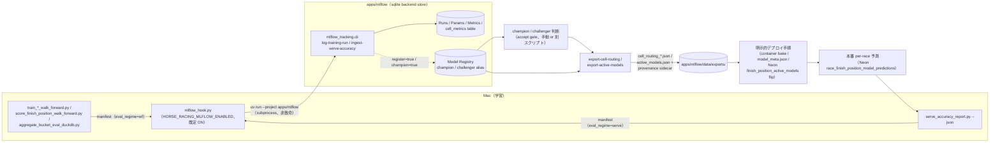

# MLflow トラッキング基盤 仕様書

最終更新: 2026-07-08

本書は、着順予測（finish-position）と脚質予測（running-style）モデルを cell 単位（`category × class × venue × distance_band × season_band × surface × field_size_band`）で管理・評価するための MLflow 基盤（`apps/mlflow` / `apps/mlflow-ui`）の仕様を記述する。

> **実装ステータスに関する注記**: `apps/mlflow` と `apps/mlflow-ui` は本書と並行して実装中である。CLI のサブコマンド名・引数・戻り値の正確な仕様は各パッケージの実装コードを source of truth とし、本書の記述と食い違う場合は実装を正とする。実装完了後、必要に応じて本書を追記修正すること。

---

## 0. 30 秒サマリ

- **目的**: 着順予測・脚質予測モデルの学習 run / cell 単位の評価結果 / model artifact 参照を、cell 粒度（`category × class × venue × distance_band × season_band × surface × field_size_band`）で一元管理する。
- **`apps/mlflow`**: `mlflow-skinny[db]` を使った tracking client library + CLI（`uv run python -m mlflow_tracking.cli ...`）。sqlite backend store（`apps/mlflow/data/mlflow.db`、WAL）に直書きし、`mlflow server` プロセスは不要。
- **`apps/mlflow-ui`**: `mlflow server` launcher CLI（`uv run python -m mlflow_ui.cli start|stop|status|plist`）。既定バインドは `127.0.0.1:5252`（macOS の AirPlay Receiver が既定ポート 5000 を占有するため回避）。launchd plist 生成にも対応する。
- **Artifact store**: 既定は local（`apps/mlflow/data/mlartifacts/`）。Cloudflare R2 は opt-in（S3 互換 API 経由）。
- **Model Registry**: `{jra,nar,banei}-finish-position` / `{jra,nar,banei}-running-style` の 6 registered model。alias は `champion`（現行 serving） / `challenger`（staged）の 2 種のみ、legacy stage は使わない。
- **非侵襲設計**: ingestion は既存パイプラインの出力ファイル（metadata.json / manifest / duckdb / json）を読むだけで、Neon への直接接続や既存の学習・推論コードへの変更は不要。

---

## 1. 目的

着順予測・脚質予測は JRA / NAR / Ban-ei の 3 カテゴリで独立したモデル・学習窓・アーキテクチャを持ち（詳細は [`docs/finish-position-prediction-system.md`](./finish-position-prediction-system.md) を参照）、評価は cell 単位（`category × class × venue × distance_band × season_band × surface × field_size_band`）で行う運用が定着している。これまで各 cell の accept/reject 判断は walk-forward 結果の JSON / DuckDB registry（`trial_registry_{category}.duckdb`）や `docs/` 配下の履歴記述に散在しており、run 間の比較や model artifact の由来追跡が手作業に依存していた。

MLflow を導入し、以下を一元化する。

- 学習 run のハイパーパラメータ・aggregate metrics・cell 単位の詳細メトリクスの記録
- model artifact の参照登録（バイナリは既存の配置場所に置いたまま、MLflow は URI 参照のみ持つ）
- champion / challenger の model version 管理

---

## 2. 構成

### 2.1 `apps/mlflow`（tracking client library + CLI）

- 依存: `mlflow-skinny[db]`（フル `mlflow` ではなく skinny + db extra、server 機能は不要なため）。
- Backend store: sqlite、`apps/mlflow/data/mlflow.db`。WAL モードで開き、単一プロセスからの直書きを前提とする（§8 の注意を参照）。
- 呼び出し: `uv run python -m mlflow_tracking.cli <subcommand> ...`。サブコマンド一覧は §7 を参照。
- server は起動しない。CLI は `MlflowClient` / tracking API を直接 sqlite に対して呼ぶ。

### 2.2 `apps/mlflow-ui`（mlflow server launcher）

- `mlflow server --backend-store-uri sqlite:///.../mlflow.db --default-artifact-root ...` を起動する薄いラッパー。
- 呼び出し: `uv run python -m mlflow_ui.cli start|stop|status|plist`。
- 既定バインド: `127.0.0.1:5252`。macOS では AirPlay Receiver が既定ポート 5000 を占有するため、MLflow のデフォルトポートではなくこのポートを使う。
- `plist` サブコマンドは launchd の plist ファイルを生成する（`--output` でファイル出力）。常駐 UI が必要な場合にこれを `launchctl load` する運用を想定するが、本書では手順の提示のみに留め、自動登録は行わない（§8）。

---

## 3. Artifact store

### 3.1 既定（local）

`apps/mlflow/data/mlartifacts/` にモデル・cell メトリクス parquet などの artifact を保存する。`apps/mlflow/data/` は gitignore 済み（tmp 系ディレクトリを git 管理しない既存ルールに従う、[[feedback_no_tmp_git_tracking]]）。

### 3.2 Cloudflare R2 対応（opt-in）

R2 は S3 互換 API を持つため、以下の環境変数を設定することで artifact store を R2 に切り替えられる。

| 変数                                          | 用途                                                                                         |
| --------------------------------------------- | -------------------------------------------------------------------------------------------- |
| `HORSE_RACING_MLFLOW_ARTIFACTS_MODE=r2`       | artifact store を R2 に切り替えるフラグ                                                      |
| `HORSE_RACING_MLFLOW_R2_BUCKET`               | R2 バケット名                                                                                |
| `HORSE_RACING_MLFLOW_R2_PREFIX`               | バケット内 prefix                                                                            |
| `MLFLOW_S3_ENDPOINT_URL`                      | `https://<account_id>.r2.cloudflarestorage.com`（R2 の S3 互換エンドポイント）               |
| `AWS_ACCESS_KEY_ID` / `AWS_SECRET_ACCESS_KEY` | R2 API token をマップした資格情報（MLflow の S3 artifact repository がこの変数名を読むため） |

モデルバイナリそのものは MLflow 経由でアップロードしない。`create_model_version(source=<URI>)` により既存の配置場所（例: `apps/finish-position-predict-container/models/finish-position/{category}/{version}/model.json`）への参照のみを登録する。local URI（`file://`）を model version source として使う場合は `MLFLOW_ALLOW_FILE_URI_AS_MODEL_VERSION_SOURCE=true` が必要。R2 上に置く場合は `s3://` URI を使う。

---

## 4. Model Registry 規約

- registered model 名: `{jra,nar,banei}-finish-position` / `{jra,nar,banei}-running-style`（計 6 種）。
- alias: `champion`（現行 serving が参照する version） / `challenger`（staged、検証中の version）の 2 種のみを使う。MLflow legacy stage（Production/Staging/Archived）は使わない。
- per-class ensemble（例: NAR の旧 per-class routing、[[project_nar_etop2_perclass_routing_2026_06_19]] 参照）は version 単位ではなく version tags（`class_code` など）と manifest artifact（routing JSON）の組み合わせで表現する。1 class = 1 registered model version にはしない。

---

## 5. Experiments

以下の experiment を既定で用意する。

- `finish-position/registry-backfill`
- `finish-position/wf-eval`
- `finish-position/serve-accuracy`
- `running-style/registry-backfill`
- `running-style/eval`

---

## 6. Cell 評価の記録形式

cell 単位の評価は 1 レース分・1 cell 分の粒度になると数が多く（[[feedback_eval_class_subgroup_mandatory]] の cell 定義に従うと class × subgroup × racetrack × season × surface の組み合わせが多数生じる）、run の metrics として素朴に全件 `log_metric` すると API 呼び出し数が膨れる。そのため以下の二重化を行う。

- **aggregate metrics（~20〜50 件）**: cell を横断した集計値（category 全体の top1 / place2 / place3 / top3_box など、[[feedback_eval_rank_1_to_6]] の rank 1〜6 集計を含む）を `log_batch`（1 回あたり最大 1000 件）で chunk して記録する。
- **全 cell table**: `mlflow.log_table` で `cell_metrics.json` として記録する（MLflow UI の Evaluation タブで閲覧可能）。加えて `cell_metrics.parquet` を artifact として同時に保存し、後段の分析（DuckDB からの直接読み込みなど）に使えるようにする。

---

## 7. Ingestion

Ingestion は既存パイプラインが出力するファイルを読むだけの非侵襲設計であり、Neon への直接接続は行わない。

| CLI サブコマンド（想定名）       | 入力                                                                                                                                                               | 用途                                                         |
| -------------------------------- | ------------------------------------------------------------------------------------------------------------------------------------------------------------------ | ------------------------------------------------------------ |
| `backfill-finish-position`       | `apps/finish-position-predict-container/models/finish-position/**/metadata.json` + per-class manifest + `model_meta.json`（champion 同期用） + `cell_routing.json` | 既存の着順予測 model artifact 群を registry に一括登録       |
| `ingest-trial-registry <duckdb>` | `trial_registry_{category}.duckdb`                                                                                                                                 | walk-forward trial 履歴を run として取り込み                 |
| `ingest-serve-accuracy <json>`   | `serve_accuracy_report.py --json` の出力                                                                                                                           | 本番 serve 精度レポートを run として取り込み                 |
| `log-eval <path>`                | `retest_wf.py` 系の汎用 cell-metrics レポート（parquet または json）                                                                                               | 任意の cell 単位評価結果を run として取り込み                |
| `backfill-running-style`         | 脚質予測側の model artifact / cell routing                                                                                                                         | running-style 版の backfill（finish-position と同じ CLI 内） |

上記のサブコマンド名・引数は実装中の暫定名であり、§0 の注記の通り実装コードを正とする。

---

## 8. 運用

- 初回セットアップ: `init` サブコマンド（experiment 作成・backend store 初期化）を実行する。
- 日次の serve-accuracy ingest は、既存の Mac launchd cron（[[project_finish_position_local_cron_macos_launchd]]）に呼び出しを追加することで自動化できる。本書では手順の提示に留め、自動登録は行わない。
- UI を常駐させる場合は `mlflow-ui start` を都度実行するか、`mlflow-ui plist --output <path>` で生成した plist を `launchctl load` して launchd 常駐化する。

---

## 9. 注意点

- `apps/mlflow/data/` は gitignore 済み（sqlite backend store・artifact store・ログ・pid ファイルを含む）。tmp 系ディレクトリを git 管理しない既存ルール（[[feedback_no_tmp_git_tracking]]）に従う。
- sqlite backend store は単一 writer を前提とする。複数プロセスから並列に大量ログを書く場合は、書き込みを 1 プロセスに集約すること（同時書き込みによる sqlite ロック競合を避けるため）。

---

## 10. local ↔ 本番ループ（実装・検証済み）

§7〜9 で説明した ingestion は個別 CLI の直接実行を前提としていたが、学習・評価パイプライン側には常時 ON の hook を追加し、export 側には本番投入直前までの生成物を作る CLI を追加した。以下はこの両端を実装・検証済みの状態として記述する（§0 の実装ステータス注記のとおり、コードと食い違えば実装を正とする）。

### 10.1 学習側 hook（pc-keiba-viewer → MLflow）

`apps/pc-keiba-viewer/src/scripts/mlflow_hook.py` は、pc-keiba-viewer に MLflow（や他の）依存を一切追加せずに `apps/mlflow` へ結果を転送するための薄いアダプタである。学習・評価スクリプトの完了地点で呼び出され、以下の 5 スクリプトに hook が組み込み済み:

| スクリプト                                       | `eval_regime` |
| ------------------------------------------------ | ------------- |
| `train_finish_position_catboost_walk_forward.py` | `wf`          |
| `train_finish_position_xgboost_walk_forward.py`  | `wf`          |
| `score_finish_position_walk_forward.py`          | `wf`          |
| `aggregate_bucket_eval_duckdb.py`                | `wf`          |
| `serve_accuracy_report.py`                       | `serve`       |

動作は以下の通り:

1. 呼び出し元は `mlflow_hook.safe_emit_training_run(task=..., category=..., model_version=..., eval_regime=..., aggregate_metrics=..., ...)` を呼ぶ。これが内部で `hr-mlflow-training-run/v1` manifest（スキーマは `apps/mlflow/src/mlflow_tracking/training_run.py` のモジュール docstring が正）を一時ファイルに書き、`uv run --project apps/mlflow python -m mlflow_tracking.cli log-training-run <manifest.json>` を subprocess 実行する。
2. **既定で有効、`HORSE_RACING_MLFLOW_ENABLED=0` で無効化**（`mlflow_hook.mlflow_enabled()`）。パッケージ側のテストスイートは `tests/conftest.py` の autouse fixture で全体を無効化しており、実際に subprocess を叩くテストだけが `monkeypatch.setenv` で個別に再有効化して `subprocess.run` をモックする。
3. **非致命**: env 無効化・`uv` 未検出（`FileNotFoundError`）・CLI 非 0 終了・タイムアウト（180 秒）・その他の例外は全て握り潰され、stderr へ warning を出すのみで `False` を返す。呼び出し元スクリプトの exit code / stdout には一切影響しない。
4. `eval_regime` タグ（`wf` / `oos` / `serve` / `self-consistency` / `unspecified`）は全 manifest で必須（これから記録する数値がどの regime のものかを CLI 側の `ingest_eval.validate_eval_regime` が強制する。§7 で述べた `ingest-serve-accuracy` / `log-eval` の `--eval-regime` required と同じ制約）。
5. `manifest["artifact_dir"]` を渡すと、その配下の `metadata.json` を backfill 系モジュールと同じ key routing ロジック（`route_json_fields`）で params / tags / artifact に振り分けて追加記録する。`manifest["cell_report"]` を渡すと parquet/JSON の cell table を `log_table` + headline metrics として同じ run に記録する。`register=true` を渡すと registry へバージョン登録、`champion=true` を追加すると champion alias も同時に張り替える（これらは既存の手動 backfill と同じ副作用であり、hook からの自動昇格は現状使っていない）。

**未実装（フォローアップ予定）**: `running_style_lightgbm.py` への hook 組み込みは、同ファイルを触っている別セッションの WIP と競合するため見送っている。脚質（running-style）側は当面 `backfill-running-style` / `log-training-run` の手動実行で記録する。

### 10.2 本番側 export（MLflow Registry → 本番投入候補）

`apps/mlflow/src/mlflow_tracking/export_production.py`（CLI: `export-cell-routing` / `export-active-models`）は、Registry に溜まった champion / challenger alias・version tags・eval run を、本番の per-race serving が読む形式に変換する。

- `export-cell-routing --category <jra|nar|banei|ban-ei> [--output PATH] [--upload-r2 s3://bucket/key]`
  各カテゴリの `{category}-finish-position` registered model から champion version を `default_variant` とし、`routing_scope="class:<code>"` タグを持つ version を `class-<code>` variant + `kyoso_joken_code` 条件の rule として展開した、`cell_routing.json` 互換の 1 category 分フラグメントを書く。それ以外の `routing_scope` を持つ version は variant としては含めるが rule は再構成できない（元の cell 条件は tag に残っておらず、元の `cell_routing.json` の rules にしかないため）ので、その場合は運用者が手で rule を補完する必要がある。
- `export-active-models [--output PATH] [--upload-r2 s3://bucket/key]`
  jra/nar/banei 3 カテゴリそれぞれの champion version から `model_versions` を、`routing_scope="class:<code>"` タグを持つ version から `subclass_overrides` を組み立てた、`model_meta.json` 隣接の active-model pointer 形式を書く。
- 既定の出力先は `apps/mlflow/data/exports/`。`--upload-r2` は opt-in。
- **provenance は本体に埋め込まず sidecar** `<output>.provenance.json`（`exported_at` / `registry_versions_used` / `run_ids`）に書く。理由: `apps/finish-position-predict-container/src/predict_lib/cell_router.py` の `load_cell_router()` は `cell_routing.json` のトップレベルキー全てを category routing エントリとしてパースし、未知キーへの許容度がない（読み取り専用で検証済み）ため、`_mlflow` のような余計なキーを本体に足すと本番パーサが壊れる。
- **export はあくまで drop-in 候補の生成まで**。実際の container image bake・`model_meta.json` の更新・Neon `finish_position_active_models` の flip は、従来どおり明示的な人間 / orchestrated なデプロイ手順として export の外側に残る（本モジュールは `apps/finish-position-predict-container` 配下に一切書き込まない）。
- export した routing / active-models JSON が実際に `predict_lib.cell_router.load_cell_router()` でパース可能であることは検証済み。

### 10.3 ループ全体図

この図の要点は、**export から先（champion/challenger 判断・デプロイ）は自動化しない**という境界線である。MLflow 基盤は「学習結果の記録」と「本番投入候補の生成」までを担い、実際に本番へ反映するかどうかの判断と実行は人間 / 既存の orchestrated 手順に残す。ループの最後（`serve_accuracy_report.py --json` → hook → `eval_regime=serve` の run）で本番の実測精度が MLflow に還流し、次の学習・判断サイクルの入力になる。
